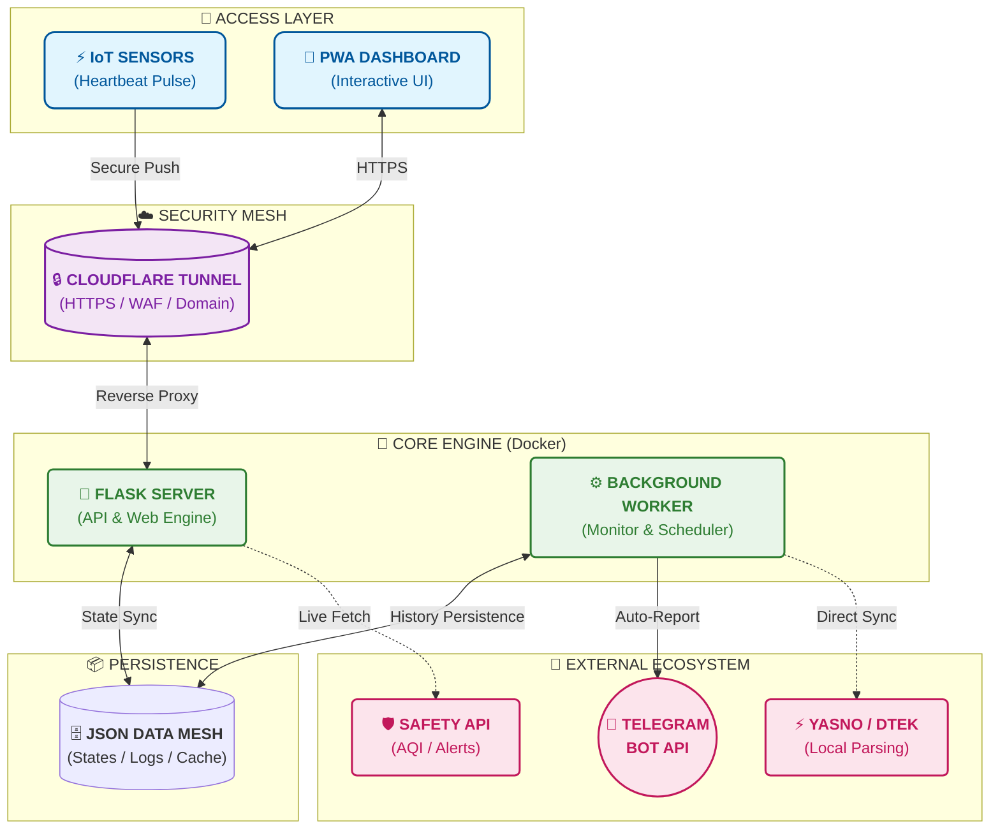

<p align="center">
  <a href="README_ENG.md">
    
  </a>
  <a href="README.md">
    
  </a>
</p>

<br>

# СВІТЛО⚡БЕЗПЕКА (v1.4.9 Autonomous Edition)

<p align="center">
  
</p>

**Автономна Docker-система моніторингу електропостачання та безпеки Києва.**

Останні виправлення та покращення:
- **Тижневі графіки:** Виправлено логіку відображення планів (тепер використовується `last_schedules.json` для актуальних днів).
- **Синхронізація:** Дозволено синхронізацію з локальним хостом (`127.0.0.1`) для гнучкого налаштування в оточенні з кількома сервісами.
- **Стабільність:** Додано `shutil` у `generate_weekly_report.py` та підвищено стійкість до різних форматів даних історії.
- **Оптимізація:** Усунено проблему з дублями фонових процесів при перезапуску.

**Проект забезпечує** повний контроль над енергетичною та безпековою ситуацією, аналізуючи реальні дані мережі та офіційні графіки Yasno/ДТЕК локально.

🔗 **Живий моніторинг:** [flash.srvrs.top](https://flash.srvrs.top/)

📖 **Інструкція:** [Встановлення та налаштування з нуля](INSTRUCTIONS_INSTALL.md)

---

## 🚀 Основні можливості

### 💡 Розумний Енергомоніторинг
- **Heartbeat Tracking:** Моніторинг світла в реальному часі через IoT-сигнали (Push API).
- **Аналітика «План vs Факт»:** Автоматичне порівняння реальних вимкнень із запланованими графіками прямо на дашборді.
- **Точність графіка:** Розрахунок відхилень (запізнення або раннє ввімкнення) для кожної події та показ наступного планового інтервалу.
- **Візуалізація:** Генерація денних та тижневих чартів у фірмовому стилі.
- **UI/UX Дизайн:** Адаптивна тема Amethyst Mist (Аметистова Мла) з підтримкою автоматичного вибору світлого/темного режиму та ефектом Glassmorphism.

### 🛡️ Безпека та Екологія
- **Повітряні тривоги:** Миттєвий статус та сповіщення у Telegram про початок та відбій тривоги в м. Київ.
- **Live-карта:** Інтегрована мапа тривог Києва та області.
- **Якість повітря (AQI):** Моніторинг PM2.5, PM10 та радіаційного фону (локація: Симиренка).
- **Погода:** Актуальна температура, вологість та параметри вітру.

### 🔔 Сповіщення у Telegram
- **Інтелектуальні звіти:** Текстові графіки, що оновлюються динамічно.
- **Merge Logic:** Розумне об'єднання інтервалів світла, що переходять через північ.
- **Автоматика:** Ранкові примусові звіти та миттєві сповіщення про зміну статусу.

---

## 🏗 Архітектура Системи (v1.2)



---

## 🐳 Швидкий запуск через Docker

**Офіційний образ:** `webyhomelab/flash-monitor:latest`

### Docker Compose
```yaml
services:
  web:
    image: webyhomelab/flash-monitor:latest
    container_name: flash-monitor-web
    ports: ["5050:5050"]
    volumes: ["./data:/app/data"]
    environment:
      - TELEGRAM_BOT_TOKEN=your_token
      - TELEGRAM_CHANNEL_ID=your_channel_id
      - DATA_DIR=/app/data

  worker:
    image: webyhomelab/flash-monitor:latest
    container_name: flash-monitor-worker
    command: python run_background.py
    volumes: ["./data:/app/data"]
    environment:
      - TELEGRAM_BOT_TOKEN=your_token
      - TELEGRAM_CHANNEL_ID=your_channel_id
      - DATA_DIR=/app/data
```

---

## 💡 Порада для IoT-датчиків (Heartbeat)

Для надсилання Push-сигналів рекомендується використовувати **HTTPS-адресу вашого домену** (наприклад, через Cloudflare Tunnel) замість прямої IP-адреси:

*   **🛡️ Безпека:** HTTPS шифрує ваш секретний ключ під час передачі.
*   **🧩 Гнучкість:** При зміні сервера вам не потрібно перепрошивати датчики — достатньо змінити налаштування тунелю.

**Приклад:** `https://flash.srvrs.top/api/push/ваш_ключ`

---

## 🛠 Технологічний стек
- **Backend:** Python 3.11, Flask, Gunicorn.
- **Analytics:** Matplotlib, BeautifulSoup4.
- **Infra:** Docker, PWA (Progressive Web App).

---

## 📜 Ліцензія
Розповсюджується під ліцензією **MIT**.

<p align="center">
  © 2026 <a href="https://github.com/weby-homelab/flash-monitor-kyiv">Weby Homelab</a><br>
  Made with ❤️ in Kyiv under air raid sirens and blackouts
</p>
