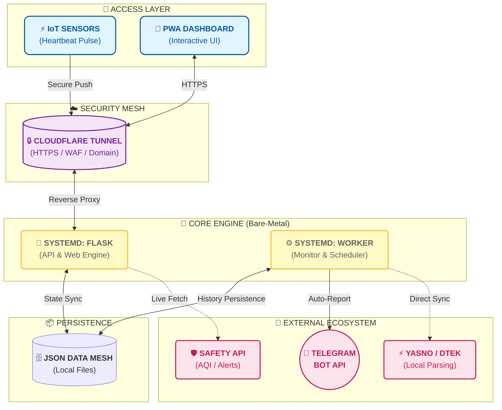

# СВІТЛО⚡БЕЗПЕКА (v1.2 Classic — Bare-Metal Edition)

<p align="center">
  
</p>

**Автономна bare-metal система моніторингу електропостачання та безпеки Києва.**

Гілка **Classic** розроблена спеціально для прямого встановлення на Linux-сервер. Це надійна реалізація, яка працює як системний сервіс та забезпечує повний контроль над даними.

🔗 **Живий моніторинг:** [flash.srvrs.top](https://flash.srvrs.top/)

---

## 🚀 Основні можливості

### 💡 Розумний Енергомоніторинг
- **Heartbeat Tracking:** Відстеження світла в реальному часі через IoT-сигнали (Push API).
- **Аналітика «План vs Факт»:** Автоматичне порівняння реальних вимкнень із запланованими графіками.
- **Точність графіка:** Розрахунок відхилень (запізнення/раннє ввімкнення) для кожної події.
- **Візуалізація:** Генерація денних та тижневих чартів у темній темі.

### 🛡️ Безпека та Екологія
- **Повітряні тривоги:** Миттєвий статус та інтегрована live-карта Києва.
- **Якість повітря (AQI):** Рівень PM2.5, PM10 та радіаційний фон.

---

## 🏗 Архітектура Системи (v1.2 Classic)



---

## 💡 Порада для IoT-датчиків (Heartbeat)

Для надсилання Push-сигналів рекомендується використовувати **HTTPS-адресу вашого домену** (наприклад, через Cloudflare Tunnel) замість прямої IP-адреси:

*   **🛡️ Безпека:** HTTPS шифрує ваш секретний ключ під час передачі.
*   **🧩 Гнучкість:** При зміні сервера вам не потрібно перепрошивати датчики — достатньо змінити налаштування тунелю.

**Приклад:** `https://flash.srvrs.top/api/push/ваш_ключ`

---

## 📦 Встановлення та запуск (Bare-Metal)

### 1. Клонування та налаштування:
```bash
git clone https://github.com/weby-homelab/flash-monitor-kyiv.git
cd flash-monitor-kyiv
git checkout classic
python3 -m venv venv
source venv/bin/activate
pip install -r requirements.txt
```

### 2. Налаштування середовища:
Створіть файл `.env`:
```env
TELEGRAM_BOT_TOKEN=ваш_токен
TELEGRAM_CHANNEL_ID=ваш_id_каналу
DATA_DIR=.
```

---

## 📜 Ліцензія
Розповсюджується під ліцензією **MIT**.

<p align="center">
  ✦ 2026 WEBy Home Lab ✦<br>
  <i>Автоматизуй усе, що робиш двічі. Монітор усе, що має значення.</i>
</p>
