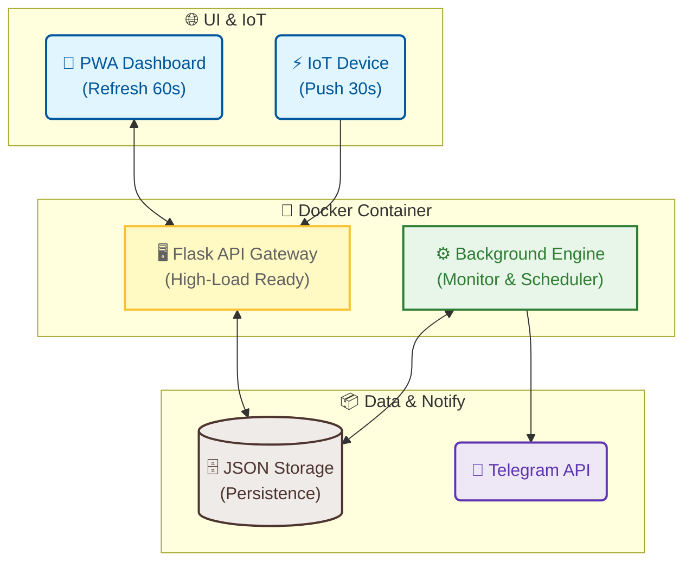

# СВІТЛО⚡БЕЗПЕКА

<p align="center">
  
</p>

<p align="center">
  <a href="https://hub.docker.com/r/webyhomelab/flash-monitor"></a>
  <a href="https://hub.docker.com/r/webyhomelab/flash-monitor"></a>
  
  
  
</p>

---

**СВІТЛО⚡БЕЗПЕКА** — це сучасна екосистема для моніторингу енергосистеми та безпекової ситуації в Києві. Проєкт об'єднує в собі heartbeat-трекінг електромережі, аналітику відповідності графікам Yasno/DTEK, систему сповіщення про повітряні тривоги та моніторинг якості повітря.

🔗 **Живий моніторинг:** [flash.srvrs.top](https://flash.srvrs.top/)

---

## 🚀 Ключові Особливості

### 💡 Енергомоніторинг 2.0
- **Heartbeat Tracking:** Моніторинг наявності світла в реальному часі через IoT-сигнали.
- **Accuracy Analytics:** Розрахунок точності відключень відносно офіційних графіків у хвилинах.
- **Visual Statistics:** Автоматична генерація денних та тижневих графіків «План vs Факт».

### 🛡️ Безпека та Екологія (Борщагівка)
- **Air Alerts:** Миттєвий статус тривог для Києва та області з інтегрованою картою.
- **AQI Monitor:** Моніторинг якості повітря (PM2.5, PM10) та радіаційного фону (локація: Симиренка).
- **Weather Insights:** Актуальна температура, вологість та вітер.

### 🔔 Розумні Сповіщення
- **Dynamic Reports:** Одне повідомлення в Telegram на добу, що оновлюється кожні 10 хвилин.
- **Smart Logic:** Текстові графіки оновлюються в Telegram тільки при зміні офіційних даних.
- **Quiet Mode:** Текстові алерти про зміну статусу мережі без зайвого спаму.

---

## 🏗 Архітектура Системи



---

## 🐳 Швидкий запуск (Docker Compose)

Найсучасніший спосіб розгорнути систему — використовувати готовий Docker-образ.

1. **Створіть файл `docker-compose.yml`**:
```yaml
services:
  web:
    image: webyhomelab/flash-monitor:latest
    container_name: flash-monitor-web
    restart: unless-stopped
    ports:
      - "5050:5050"
    volumes:
      - ./data:/app/data
    environment:
      - TELEGRAM_BOT_TOKEN=your_token
      - TELEGRAM_CHANNEL_ID=your_channel_id
      - DATA_DIR=/app/data

  worker:
    image: webyhomelab/flash-monitor:latest
    container_name: flash-monitor-worker
    restart: unless-stopped
    command: python run_background.py
    volumes:
      - ./data:/app/data
    environment:
      - TELEGRAM_BOT_TOKEN=your_token
      - TELEGRAM_CHANNEL_ID=your_channel_id
      - DATA_DIR=/app/data
```

2. **Запустіть систему**:
```bash
docker compose up -d
```

---

## 🛠 Технологічний Стек

*   **Backend:** Python 3.11, Flask, Gunicorn.
*   **Data:** Pandas, Matplotlib, BeautifulSoup4.
*   **Containerization:** Docker, Docker Compose.
*   **Infrastructure:** Cloudflare Tunnels, Systemd.

---

## 📜 Ліцензія

Розповсюджується під ліцензією **MIT**. 

<p align="center">
  2026 Розроблено з ❤️ під час блекаутів у Києві.
</p>
