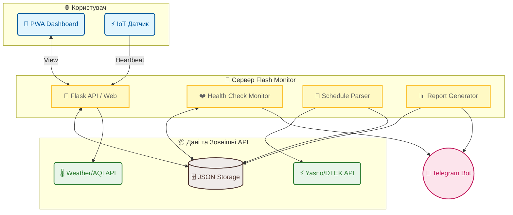

# СВІТЛО⚡БЕЗПЕКА (v1.2 Classic)

<p align="center">
  
</p>

**Повністю автономна система моніторингу електропостачання та безпеки Києва.**

---

## 🆕 Що нового у v1.2 Classic?

Версія **Classic** — це повернення до максимальної надійності та автономності. Тепер проект не залежить від зовнішніх API інших сервісів для отримання графіків.

- **Вбудований парсер графіків:** Пряма інтеграція з джерелами Yasno та ДТЕК.
- **Аналітика «План vs Факт»:** Автоматичне порівняння реальних вимкнень із запланованими графіками.
- **Розумні звіти:** Алгоритм об'єднання інтервалів через північ для Telegram-звітів.
- **Повна автономність:** Всі сервіси працюють в єдиному контурі проекту.

---

## 🚀 Ключові можливості

### 💡 Моніторинг світла
- **Real-time Heartbeat:** Відстеження наявності світла за допомогою IoT-сигналів (Push API).
- **Точність перемикань:** Розрахунок відхилень від графіка (запізнення/раннє ввімкнення).
- **Візуалізація:** Генерація денних та тижневих чартів у темній темі.

### 🛡️ Безпека та Екологія
- **Повітряні тривоги:** Моментальний статус та інтегрована live-карта.
- **Якість повітря (AQI):** Рівень PM2.5, PM10 та радіаційний фон (локація: Борщагівка).
- **Погода:** Актуальна температура, вологість та параметри вітру.

---

## 🏗 Архітектура Системи



---

## 📦 Встановлення та запуск

### 1. Клонування репозиторію:
```bash
git clone https://github.com/weby-homelab/flash-monitor-kyiv.git
cd flash-monitor-kyiv
git checkout classic
```

### 2. Налаштування середовища:
Створіть файл `.env`:
```env
TELEGRAM_BOT_TOKEN=ваш_токен
TELEGRAM_CHANNEL_ID=ваш_id_каналу
DATA_DIR=.
```

### 3. Запуск через Docker Compose:
```bash
docker compose up -d
```

---

## 📜 Ліцензія
Розповсюджується під ліцензією **MIT**.

<p align="center">
  ✦ 2026 WEBy Home Lab ✦<br>
  <i>Автоматизуй усе, що робиш двічі. Монітор усе, що має значення.</i>
  2026 Розроблено з ❤️ під час блекаутів у Києві.
</p>
