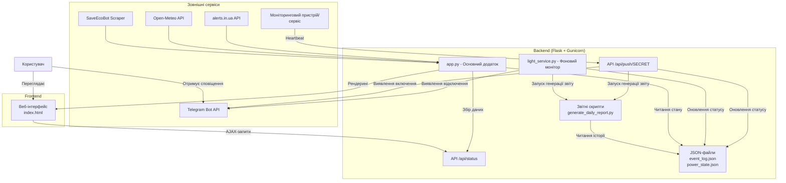

# ⚡️ Flash Monitor Kyiv (2026)

Сучасна, легка та багатофункціональна система для моніторингу безпекової та енергетичної ситуації в Києві в реальному часі. Проект об'єднує дані про наявність електроенергії, повітряні тривоги, якість повітря та радіаційний фон в єдиний, зручний веб-інтерфейс.

**Посилання на робочу версію:** [flash.srvrs.top](https://flash.srvrs.top/)


---

## 🚀 Основні можливості

*   **💡 Моніторинг електроенергії:**
    *   Відстеження статусу (Є світло / Немає світла) в реальному часі.
    *   Автоматичний розрахунок тривалості відключень та періодів з електроенергією.
    *   Історія останніх подій з детальним таймлайном.
    *   Аналіз відповідності до офіційних графіків відключень та розрахунок відхилень (запізнення/раннє включення).
    *   Візуалізація статистики у вигляді денних та тижневих графіків.
*   **🛡️ Безпековий моніторинг:**
    *   **Повітряні тривоги:** Миттєве відображення статусу тривоги для м. Києва та області.
    *   **Карта тривог:** Інтегрована інтерактивна карта з `alerts.in.ua`.
    *   **Якість повітря (AQI):** Комплексний моніторинг з показниками PM2.5, PM10, температури, вологості та вітру.
    *   **Радіаційний фон:** Відображення актуального рівня радіації (мкЗв/год).
*   **🔔 Розумні сповіщення:**
    *   Надсилання детальних звітів у Telegram про кожне відключення та включення.
    *   Звіти містять статистику тривалості, аналіз графіків та інформацію про можливі відхилення.
*   **📱 Сучасний інтерфейс:**
    *   Легкий та адаптивний дизайн.
    *   Підтримка **PWA (Progressive Web App)**, що дозволяє встановити монітор як додаток на смартфон.
    *   Звукові та push-сповіщення у браузері.

---

## 🏗️ Архітектура системи

Система побудована на мікросервісній ідеології, де кожен компонент виконує свою задачу. Взаємодія між ними показана на діаграмі нижче.



---

## 🛠️ Технології та залежності

*   **Мова:** Python 3
*   **Фреймворк:** Flask
*   **WSGI сервер:** Gunicorn
*   **Бібліотеки:**
    *   `requests` - для роботи з API.
    *   `beautifulsoup4` - для веб-скрейпінгу.
    *   `matplotlib`, `pandas`, `numpy` - для генерації графіків.
    *   `python-dotenv` - для управління змінними оточення.
*   **Фронтенд:** HTML5, CSS3, JavaScript (Vanilla JS).

---

## ⚙️ Встановлення та запуск

1.  **Клонуйте репозиторій:**
    ```bash
    git clone https://github.com/weby-homelab/flash-monitor-kyiv.git
    cd flash-monitor-kyiv
    ```

2.  **Створіть та активуйте віртуальне оточення:**
    ```bash
    python3 -m venv venv
    source venv/bin/activate
    ```

3.  **Встановіть залежності:**
    ```bash
    pip install -r requirements.txt
    ```

4.  **Налаштуйте змінні оточення:**
    Створіть файл `.env` та додайте до нього токен вашого Telegram-бота та ID каналу:
    ```env
    TELEGRAM_BOT_TOKEN="ВАШ_ТОКЕН"
    TELEGRAM_CHANNEL_ID="ВАШ_ID_КАНАЛУ"
    ```

5.  **Запустіть додаток:**
    *   **Для розробки:**
        ```bash
        python app.py
        ```
        Додаток буде доступний за адресою `http://127.0.0.1:5050`.

    *   **Для продакшену (рекомендовано):**
        ```bash
        gunicorn --workers 2 --threads 4 -b 0.0.0.0:5050 app:app
        ```
---

## 🔌 Принцип роботи моніторингу світла

Система працює за принципом "heartbeat". Зовнішній пристрій (наприклад, роутер або Raspberry Pi в цільовій локації) періодично надсилає GET-запит на ендпоінт `/api/push/<SECRET_KEY>`.

*   Якщо запити надходять, `light_service.py` вважає, що світло **є**.
*   Якщо запити припиняються на 3 хвилини, сервіс фіксує **відключення**, розраховує час події та надсилає сповіщення.
*   Коли перший запит після перерви знову надходить, сервіс фіксує **включення**, розраховує тривалість відключення та надсилає звіт.

Такий підхід не потребує складного обладнання і може бути реалізований за допомогою простого `cron` завдання.
