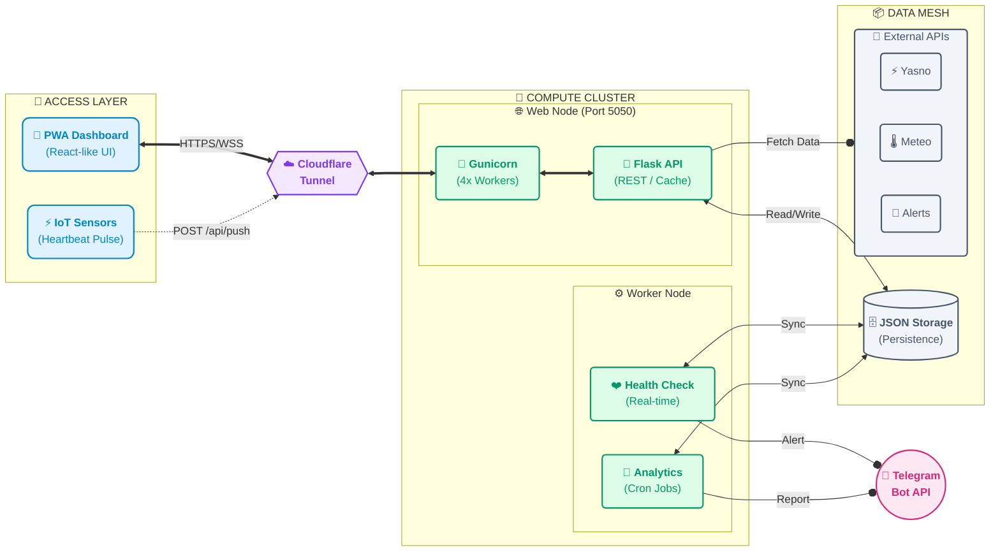

# СВІТЛО⚡БЕЗПЕКА

<p align="center">
  
</p>

<p align="center">
  <a href="https://hub.docker.com/r/webyhomelab/flash-monitor"></a>
  <a href="https://hub.docker.com/r/webyhomelab/flash-monitor"></a>
  
  
  
</p>

---

## 📖 Про проєкт

**СВІТЛО⚡БЕЗПЕКА** (Flash Monitor Kyiv) — це інтелектуальна open-source екосистема, розроблена для киян, щоб забезпечити максимальну прозорість та передбачуваність у складних енергетичних умовах. 

Проєкт не просто моніторить світло — він аналізує поведінку енергомережі, порівнює її з офіційними планами Yasno/DTEK та надає користувачу миттєву, візуалізовану картину безпекової ситуації в місті.

🔗 **Живий моніторинг:** [flash.srvrs.top](https://flash.srvrs.top/)

---

## 🚀 Ключові Особливості

### 💡 Розумний Енергомоніторинг 2.0
- **Heartbeat Tracking:** Використання IoT-сигналів для відстеження наявності світла в реальному часі з точністю до секунд.
- **Accuracy Analytics:** Інтелектуальний розрахунок відхилень. Система знає, на скільки хвилин раніше чи пізніше графіку відбулося перемикання.
- **Visual Statistics:** Автоматична генерація та оновлення (кожні 10 хв) денних та тижневих графіків «План vs Факт» прямо у ваш Telegram.

### 🛡️ Безпека та Екологія (Борщагівка)
- **Air Alerts:** Миттєвий статус та інтегрована карта повітряних тривог для Києва та області.
- **AQI Monitor:** Моніторинг якості повітря (PM2.5, PM10) та радіаційного фону в реальному часі (локація: Борщагівка, Симиренка).
- **Weather Insights:** Актуальна температура, вологість та параметри вітру для повного розуміння екологічної ситуації.

### 🔔 Smart Telegram Reporting
- **Dynamic Live Reports:** Одне повідомлення на добу, яке постійно оновлюється, зберігаючи історію чистою.
- **Change-Driven Updates:** Текстові графіки оновлюються лише тоді, коли змінюються дані від Yasno або ДТЕК.
- **Quiet Mode:** Розумні текстові сповіщення про зміну статусу без зайвого інформаційного шуму.

---

## 🐳 Docker версія

Для забезпечення максимальної портативності та стабільності, проєкт повністю докерезовано. Ви можете розгорнути власну інстанцію системи на будь-якому сервері за лічені секунди.

**Офіційний реєстр:** [webyhomelab/flash-monitor](https://hub.docker.com/r/webyhomelab/flash-monitor)

### Теги:
- `latest` — найсвіжіша стабільна версія.
- `v1.0.0` — перший офіційний стабільний реліз.

---

## 🏗 Архітектура Системи

Система базується на принципі розділення обов'язків (Separation of Concerns) та оптимізована для роботи в контейнеризованому середовищі:



---

## 🐳 Швидкий запуск (Docker Compose)

Найсучасніший спосіб розгорнути систему — використовувати готовий Docker-образ.

1. **Створіть файл `docker-compose.yml`**:
```yaml
services:
  web:
    image: webyhomelab/flash-monitor:latest
    container_name: flash-monitor-web
    restart: unless-stopped
    ports:
      - "5050:5050"
    volumes:
      - ./data:/app/data
    environment:
      - TELEGRAM_BOT_TOKEN=your_token
      - TELEGRAM_CHANNEL_ID=your_channel_id
      - DATA_DIR=/app/data

  worker:
    image: webyhomelab/flash-monitor:latest
    container_name: flash-monitor-worker
    restart: unless-stopped
    command: python run_background.py
    volumes:
      - ./data:/app/data
    environment:
      - TELEGRAM_BOT_TOKEN=your_token
      - TELEGRAM_CHANNEL_ID=your_channel_id
      - DATA_DIR=/app/data
```

2. **Запустіть систему**:
```bash
docker compose up -d
```

---

## 🛠 Технологічний Стек

*   **Backend:** Python 3.11, Flask, Gunicorn (4 воркери для високої продуктивності).
*   **Data Science:** Pandas, Matplotlib (рендер графіків у темній темі).
*   **Containerization:** Docker, Docker Compose (ізоляція даних через volumes).
*   **Infrastructure:** Cloudflare Tunnels (безпечний доступ), Systemd (менеджмент сервісів).

---

## 📜 Ліцензія

Розповсюджується під ліцензією **MIT**. 

<p align="center">
  2026 Розроблено з ❤️ під час блекаутів у Києві.
</p>
