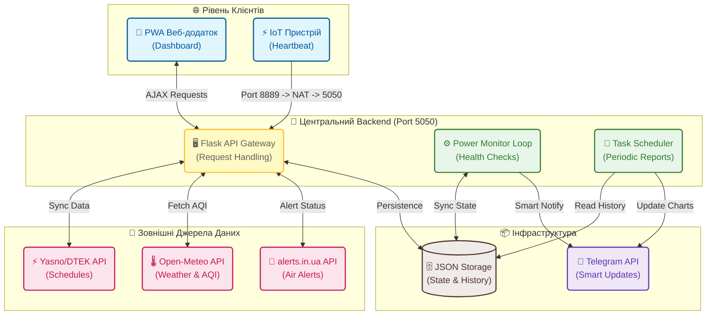

# ⚡️ Flash Monitor Kyiv

<p align="center">
  
</p>

<p align="center">
  
  
  
  
  
</p>

---

**Flash Monitor Kyiv** — це інтелектуальна система моніторингу енергосистеми та безпекової ситуації в Києві. Проєкт автоматизує збір даних про відключення світла, повітряні тривоги та екологічний стан, об'єднуючи їх у єдиний PWA-додаток та розумний Telegram-канал.

🔗 **Живий моніторинг:** [flash.srvrs.top](https://flash.srvrs.top/)

---

## 🚀 Ключові Особливості

### 💡 Енергомоніторинг 2.0
- **Heartbeat-технологія:** Відстеження наявності світла в реальному часі через систему пінгування.
- **Розумні звіти:** Автоматичне порівняння фактичних відключень з офіційними графіками (Yasno/DTEK).
- **Аналіз точності:** Розрахунок відхилень у хвилинах («Світло зникло на 5 хв раніше графіка»).

### 🛡️ Безпека та Екологія
- **Air Alert:** Миттєвий статус тривог для Києва та області з інтегрованою картою.
- **AQI Monitor:** Моніторинг якості повітря (PM2.5, PM10) та радіаційного фону.
- **Weather Insights:** Актуальна температура, вологість та напрямок вітру.

### 🔔 Smart Notifications
- **Live Reports:** Telegram-повідомлення, що оновлюються динамічно протягом дня (одне повідомлення — повна історія доби).
- **Visual Analytics:** Генерація денних та тижневих графіків «План vs Факт».

---

## 🛠 Технологічний Стек

*   **Backend:** Python 3, Flask, Gunicorn.
*   **Data Processing:** Pandas, Matplotlib, BeautifulSoup4.
*   **Frontend:** HTML5, CSS3 (Vanilla CSS), JavaScript.
*   **DevOps:** Systemd, Nftables (Port Redirection), Cloudflare Tunnels.

---

## 🏗 Архітектура Системи

Система побудована на мікросервісній ідеології, де кожен компонент виконує свою задачу. Взаємодія між ними показана на діаграмі нижче:



---

## ⚙️ Швидкий Старт

1. **Клонування та налаштування:**
   ```bash
   git clone https://github.com/weby-homelab/flash-monitor-kyiv.git
   cd flash-monitor-kyiv
   python3 -m venv venv
   source venv/bin/activate
   pip install -r requirements.txt
   ```

2. **Налаштування `.env`:**
   ```env
   TELEGRAM_BOT_TOKEN="your_bot_token"
   TELEGRAM_CHANNEL_ID="your_test_channel_id"
   ```

3. **Запуск:**
   ```bash
   ./start.sh
   ```

---

## 📜 Ліцензія

Цей проєкт розповсюджується під ліцензією **MIT**. Ви можете вільно використовувати, копіювати та модифікувати код.

<p align="center">
  ✦ 2026 WEBy Home Lab ✦
</p>
