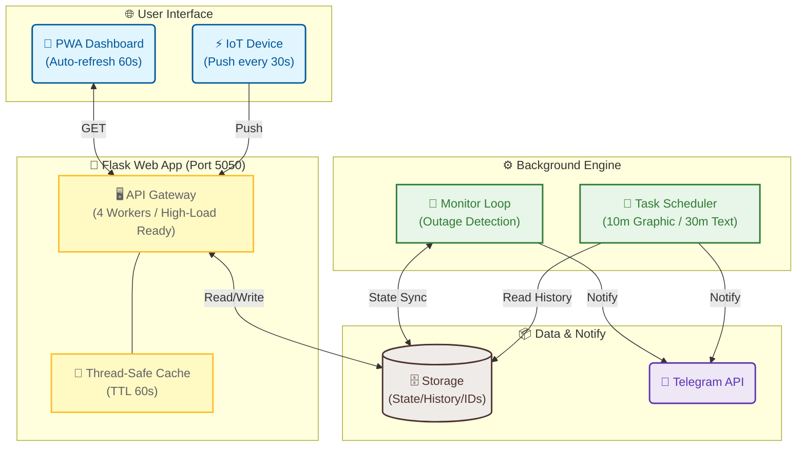

# СВІТЛО⚡БЕЗПЕКА

<p align="center">
  
</p>

<p align="center">
  
  
  
  
</p>

---

**СВІТЛО⚡БЕЗПЕКА** — це уніфікована інтелектуальна екосистема для моніторингу енергопостачання та безпекової ситуації в Києві. Проєкт поєднує в собі heartbeat-моніторинг електромережі, аналітику відповідності графікам відключень, систему раннього сповіщення про тривоги та екологічний моніторинг.

🔗 **Живий дашборд:** [flash.srvrs.top](https://flash.srvrs.top/)

---

## 🚀 Ключові Особливості

### 💡 Розумний Енергомоніторинг
- **Reliable Heartbeat:** Обробка сигналів від IoT-пристроїв на порту `5050` з підтримкою високого навантаження.
- **Accuracy Tracking:** Автоматичний розрахунок точності відключень/включень відносно офіційних графіків у хвилинах.
- **Event Timeline:** Детальна історія подій з підрахунком тривалості кожного періоду.

### 🛡️ Безпека та AQI (Борщагівка)
- **Air Alerts:** Моніторинг статусу повітряних тривог (Київ/Область) з інтегрованою живою картою.
- **Ecological Monitor:** Дані в реальному часі про AQI, PM2.5, PM10, температуру та вологість (локація: Симиренка).
- **Radiation Background:** Постійний контроль радіаційного фону (мкЗв/год).

### 🔔 Інтелектуальні Telegram-звіти
- **Live Graphic Report:** Денний графік «План vs Факт», що оновлюється кожні 10 хвилин у тому самому повідомленні.
- **Smart Text Schedules:** Текстові розклади (Yasno/DTEK) оновлюються кожні 30 хвилин у період з 06:00 до 22:30. Повідомлення редагується лише за наявності реальних змін у даних.
- **Instant Alerts:** Миттєві текстові сповіщення про зміну статусу мережі з аналізом наступних подій за графіком.

---

## 🏗 Архітектура Системи

Система базується на принципі розділення обов'язків (Separation of Concerns) для забезпечення максимальної стабільності:



---

## 🛠 Технологічний Стек

*   **Runtime:** Python 3.10+
*   **Web Server:** Flask, Gunicorn (Multi-worker configuration)
*   **Graphics:** Matplotlib (Custom dark-theme renders)
*   **PWA:** Service Worker v4 (Aggressive caching with force-update)
*   **Security:** Systemd isolation, Cloudflare Tunneling

---

## ⚙️ Розгортання (Deployment)

1. **Системні сервіси:**
   Проєкт потребує запуску двох незалежних сервісів:
   - `flash-monitor.service`: Обробка HTTP-запитів та Dashboard.
   - `flash-background.service`: Моніторинг та оновлення звітів.

2. **Налаштування `.env`:**
   ```env
   TELEGRAM_BOT_TOKEN="bot_token"
   TELEGRAM_CHANNEL_ID="channel_id"
   ```

3. **Запуск:**
   ```bash
   chmod +x start.sh
   ./start.sh
   ```

---

## 📜 Ліцензія

Розповсюджується під ліцензією **MIT**. 

<p align="center">
  2026 Розроблено з ❤️ під час блекаутів у Києві.
</p>
