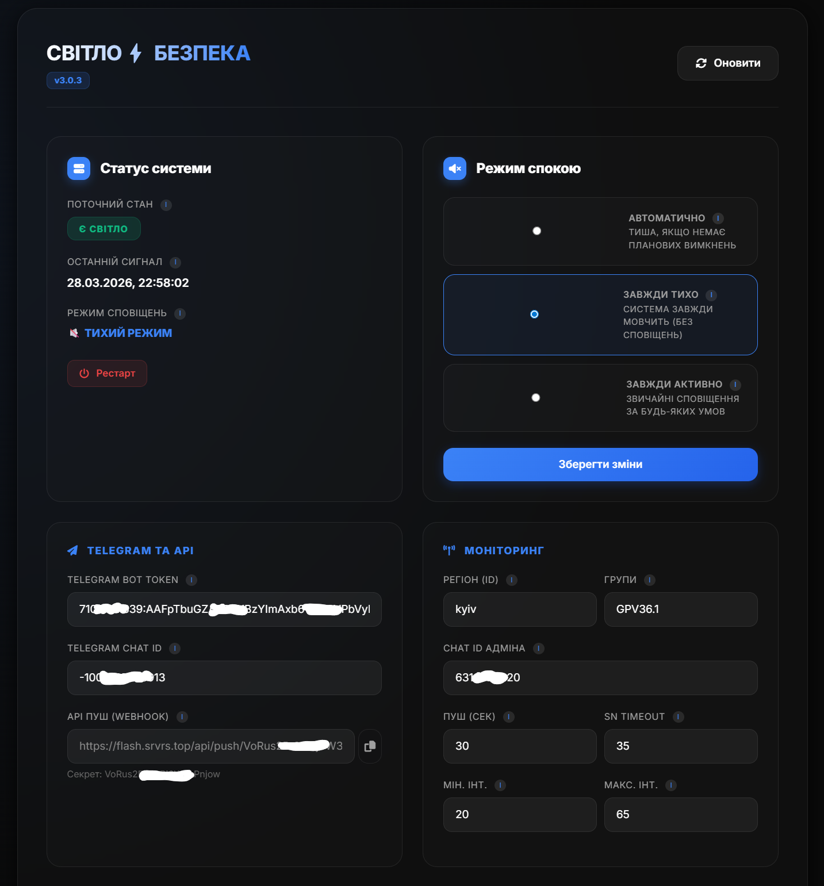
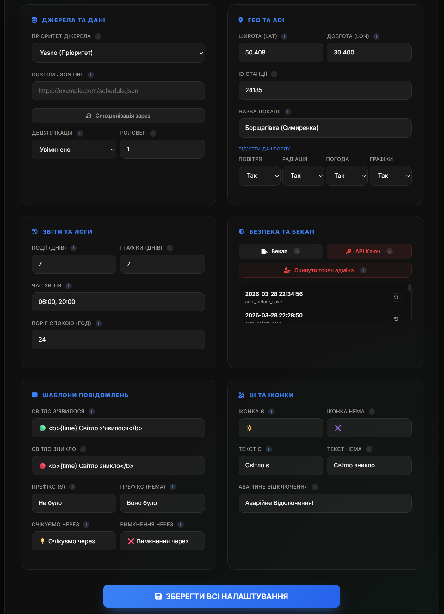
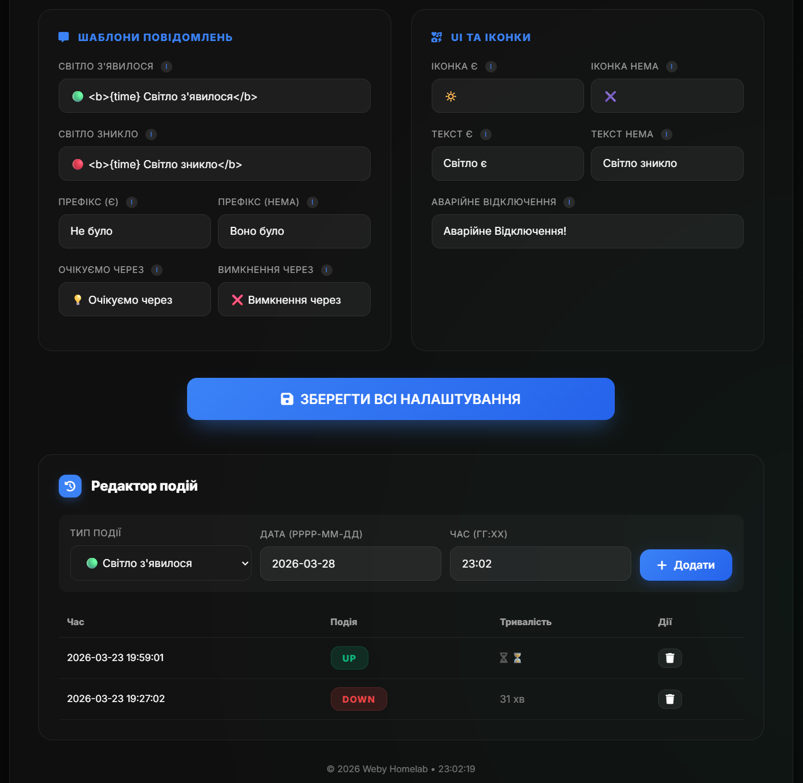
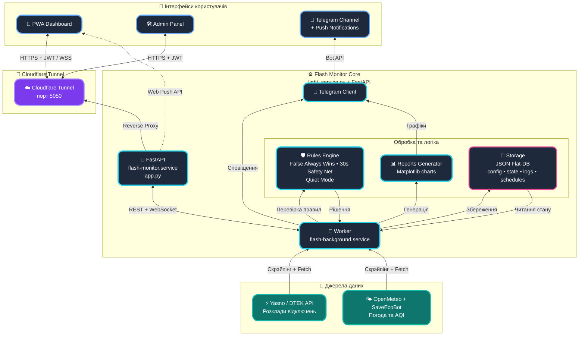

  
  

 

  
  
  
  

  

# СВІТЛО⚡️ БЕЗПЕКА (FLASH MONITOR KYIV) - Docker Edition 

**Flash Monitor Kyiv** — це професійна автономна система моніторингу критичної інфраструктури та екологічної безпеки. Проєкт забезпевує прецизійний моніторинг електропостачання в реальному часі, інтелектуальну обробку графіків відключень (DTEK/Yasno), відстеження повітряних тривог, якості повітря (AQI) та радіаційного фону.

Ця гілка (`main`) містить **Docker Edition** проєкту, призначену для швидкого, портативного та ізольованого розгортання в будь-якому середовищі. Це повністю контейнеризована версія, яка є стандартом для сучасних серверів.

> **Статус проєкту:** Stable v3.4.0 (Docker Optimized)
> **Архітектура:** FastAPI + Docker Compose + JSON Flat-DB
> **Бренд:** Weby Homelab

---

## 🛠 Технологічний стек (Docker Edition)
- **Runtime:** Python 3.12 (slim-bookworm) у контейнері.
- **Backend:** FastAPI (Async) для миттєвої реакції на Push-сигнали та SSE.
- **Isolation:** Повна ізоляція залежностей, що унеможливлює конфлікти з системними пакетами.
- **Persistence:** Використання Docker Volumes для збереження бази даних (`data/`) та логів.

---

## 🚀 Ключові інновації та алгоритми

### 🎛 Панель Керування (Admin Panel)
Повністю автономний веб-інтерфейс у стилі **Glassmorphism** для керування всіма аспектами системи без необхідності редагування конфігураційних файлів через SSH.

  
  
  

*   **Асинхронна швидкодія:** Новий асинхронний кеш унеможливлює дедлоки при одночасній роботі воркера та користувача.
*   **Інтелектуальні бекапи:** Створення ручних та автоматичних точок відновлення конфігурації.
*   **Безпека (Zero-Trust):** Усунуто LFI (Path Traversal) вразливості, забезпечено строгу перевірку шляхів.

### 🤫 Режим «Інформаційний спокій» (Quiet Mode)
Унікальний алгоритм, що мінімізує "інформаційний шум". Система автоматично переходить у стан спокою, якщо за останні 24 години не було відключень, а в планах на завтра немає обмежень.

### ⚖️ Логіка «False Always Wins»
Гібридна система обробки графіків. Якщо хоча б одне джерело вказує на відключення, система відображає його як пріоритетне. Старі записи ніколи не затираються "чистими" планами.

---

### 📱 Приклади реальних повідомлень (Telegram)
- 📊 **[Щоденний графік "План vs Факт" (Smart Daily Report)](https://t.me/svitlobot_Symyrenka22B/1230)**
- 📈 **[Тижнева аналітика відключень](https://t.me/svitlobot_Symyrenka22B/1192)**
- 🔴 **[Сповіщення про відключення світла з точністю до графіка](https://t.me/svitlobot_Symyrenka22B/1209)**
- 🟢 **[Сповіщення про увімкнення світла з точністю до графіка](https://t.me/svitlobot_Symyrenka22B/1212)**
- ⚠️ **[Миттєвий алерт про зміну графіків від ДТЕК](https://t.me/svitlobot_Symyrenka22B/1222)**
- 📈 **[Публікація графіків від ДТЕК та YASNO](https://t.me/svitlobot_Symyrenka22B/1219)**
- 🚨 **[Сповіщення про повітряну тривогу в Києві](https://t.me/svitlobot_Symyrenka22B/1196)**
- ✅ **[Сповіщення про відбій повітряної тривоги](https://t.me/svitlobot_Symyrenka22B/1197)**

## 🏗️ Архітектура системи

```mermaid
flowchart BT
    %% ================================================
    %% НОВА КОНЦЕПЦІЯ 2026 для README.md
    %% "End-to-End Pipeline" — динамічний потік даних
    %% Замість шарів — горизонтальний pipeline з чітким напрямком руху
    %% Ідеально виглядає в GitHub (темна/світла тема), чистий, сучасний, легко читається
    %% ================================================

    classDef external fill:#0f766e,stroke:#14b8a6,stroke-width:3px,color:#fff,rx:16px,ry:16px
    classDef core fill:#1e293b,stroke:#22d3ee,stroke-width:3.5px,color:#fff,rx:14px,ry:14px
    classDef gateway fill:#7c3aed,stroke:#a78bfa,stroke-width:3px,color:#fff,rx:16px,ry:16px
    classDef client fill:#1e293b,stroke:#60a5fa,stroke-width:3px,color:#fff,rx:16px,ry:16px
    classDef db fill:#1e293b,stroke:#ec4899,stroke-width:3px,color:#fff,rx:12px,ry:12px

    %% ====================== ЛІВА ЧАСТИНА: ДЖЕРЕЛА ДАНИХ ======================
    subgraph External ["🔌 Джерела даних"]
        direction TB
        Energy["⚡ Yasno / DTEK API<br>Розклади відключень"]:::external
        Meteo["🌤️ OpenMeteo + SaveEcoBot<br>Погода та AQI"]:::external
    end

    %% ====================== ЦЕНТР: CORE PIPELINE ======================
    subgraph Core ["⚙️ Flash Monitor Core<br>light_service.py + FastAPI"]
        direction TB

        Worker["🔄 Worker<br>flash-background.service"]:::core

        subgraph Processing ["Обробка та логіка"]
            direction LR
            Rules["🛡️ Rules Engine<br>False Always Wins • 30s Safety Net<br>Quiet Mode"]:::core
            Reports["📊 Reports Generator<br>Matplotlib charts"]:::core
            Storage["💾 Storage<br>JSON Flat-DB<br>config • state • logs • schedules"]:::db
        end

        API["🔌 FastAPI<br>flash-monitor.service<br>app.py"]:::core
        TgClient["🤖 Telegram Client"]:::core
    end

    %% ====================== ШЛЮЗ ======================
    subgraph Gateway ["🔐 Cloudflare Tunnel<br>Zero Trust + Reverse Proxy"]
        CF["☁️ Cloudflare Tunnel<br>порт 5050"]:::gateway
    end

    %% ====================== ПРАВА ЧАСТИНА: КЛІЄНТИ ======================
    subgraph Clients ["👥 Інтерфейси користувачів"]
        direction TB
        PWA["📱 PWA Dashboard"]:::client
        Admin["🛠️ Admin Panel"]:::client
        Telegram["📨 Telegram Channel<br>+ Push Notifications"]:::client
    end

    %% ====================== ПОТІК ДАНИХ (головна магістраль) ======================
    Energy & Meteo -->|Скрэйпінг + Fetch| Worker

    Worker -->|Перевірка правил| Rules
    Rules -->|Рішення| Worker

    Worker -->|Збереження| Storage
    Storage -->|Читання стану| Worker

    Worker -->|Генерація| Reports
    Worker -->|Сповіщення| TgClient
    Reports -->|Графіки| TgClient

    Worker <-->|REST + WebSocket| API

    API -->|Reverse Proxy| CF
    CF <-->|HTTPS + JWT / WSS| PWA
    CF <-->|HTTPS + JWT| Admin
    TgClient -->|Bot API| Telegram

    %% Додаткові push-сповіщення
    API -.->|Web Push API| PWA

    %% ====================== Стиль для заголовків підграфів ======================
    classDef subgraphTitle fill:#0f172a,stroke:none,color:#64748b,font-size:15px
```

---

## 📥 Встановлення

Для отримання детальної покрокової інструкції з розгортання проєкту за допомогою Docker та Docker Compose, перейдіть за посиланням нижче:

📖 **[ПОВНА ІНСТРУКЦІЯ З ВСТАНОВЛЕННЯ (DOCKER EDITION)](docs/INSTRUCTIONS_INSTALL.md)**

---

📖 **Додаткова документація:**
* [⚙️ Налаштування Telegram та IoT](docs/INSTRUCTIONS.md)
* [📝 Історія змін (CHANGELOG.md)](docs/CHANGELOG.md)

---
**✦ 2026 Weby Homelab ✦**
