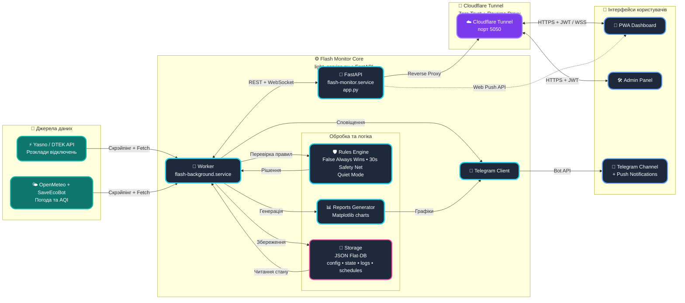

<p align="center">
  <a href="README_ENG.md">
    
  </a>
  <a href="README.md">
    
  </a>
</p>

<br>

<p align="center">
  
  
  
  
</p>

<p align="center">
  
</p>

# СВІТЛО⚡️ БЕЗПЕКА (FLASH MONITOR KYIV) - Bare-metal Edition [](https://github.com/weby-homelab/flash-monitor-kyiv/releases/latest)

**Flash Monitor Kyiv** — це професійна автономна система моніторингу критичної інфраструктури та екологічної безпеки. Проєкт забезпечує прецизійний моніторинг електропостачання в реальному часі, інтелектуальну обробку графіків відключень (DTEK/Yasno), відстеження повітряних тривог, якості повітря (AQI) та радіаційного фону.

Ця гілка (`classic`) містить **Bare-metal версію** проєкту, розроблену для прямого встановлення на сервер (Ubuntu/Debian) з використанням `systemd`. Це вибір для тих, хто цінує максимальну продуктивність та повний контроль над системними ресурсами.

> **Статус проєкту:** Stable v3.4.0 (Bare-metal Optimized)
> **Архітектура:** Asynchronous FastAPI + systemd services + venv + JSON Flat-DB
> **Бренд:** Weby Homelab

---

## 🛠 Технологічний стек (Bare-metal Edition)
- **Runtime:** Python 3.10+ (рекомендовано 3.12) безпосередньо на хост-системі.
- **Process Management:** Керування через `systemd` (окремі unit-файли для API та фонового воркера), що забезпечує автоматичний рестарт та моніторинг через `journalctl`.
- **Web-Core:** FastAPI з асинхронним обробником подій для мінімальних затримок при роботі з WebSockets та SSE.
- **Data Persistence:** Пряма робота з файловою системою для JSON-бази даних, що мінімізує I/O overhead.
- **Performance:** Максимальна швидкість відгуку завдяки відсутності додаткових мережевих рівнів віртуалізації.

---

## 🚀 Ключові інновації та алгоритми

### 🎛 Панель Керування (Admin Panel)
Повністю автономний веб-інтерфейс у стилі **Glassmorphism** для керування всіма аспектами системи без необхідності редагування конфігураційних файлів через SSH.
<p align="center">
  
  
  
</p>

*   **Асинхронна швидкодія:** Новий асинхронний кеш унеможливлює дедлоки та "зависання" при одночасному записі даних фоновими воркерами та зверненнях користувачів.
*   **Інтелектуальні бекапи:** Створення ручних та автоматичних точок відновлення конфігурації. Миттєве відновлення системи в один клік з автоматичним рестартом systemd-служб.
*   **Гнучке налаштування джерел:** Зміна пріоритету між Yasno, GitHub або підключення власного Custom JSON URL. Кнопка примусової синхронізації графіків з миттєвим оновленням Telegram-звітів.
*   **Повна Гео-адаптація:** Налаштування координат (Lat/Lon) для точної локальної погоди, ID станції SaveEcoBot та вибіркове керування відображенням віджетів.
*   **Безпека (Zero-Trust):** Впроваджено строгу валідацію шляхів (Path Traversal Protection) та безпечну генерацію Access Keys при першому старті.

### 🤫 Режим «Інформаційний спокій» (Quiet Mode)
Унікальний алгоритм, що мінімізує "інформаційний шум" у стабільні періоди. Система автоматично переходить у стан спокою, якщо за останні 24 години не було відключень, а в отриманих планах на наступну добу немає жодних обмежень. Це позбавляє канал непотрібних щоденних звітів, коли енергосистема працює без збоїв.

### 🚨 Safety Net (Мережа безпеки)
Інтерактивний механізм швидкого реагування на втрату зв'язку з пристроєм моніторингу. Якщо затримка вхідного Push-сигналу перевищує 35 секунд, адміністратор отримує запит у Telegram з інтерактивними кнопками (`🔴 Світло зникло`, `🛠 Технічний збій`, `🤷‍♂️ Не знаю`). Це запобігає публікації хибних алертів у публічному каналі при проблемах з інтернет-з'єднанням.

### ⚖️ Логіка «False Always Wins»
Гібридна система обробки графіків відключень. Якщо хоча б одне з джерел (Yasno або GitHub-mirror) вказує на ймовірне відключення, система відображає його як пріоритетне. Старі записи про реальні відключення ніколи не затираються новими "чистими" планами, що забезпечує 100% чесну історію подій у базі даних.

---

## 📱 Приклади реальних сповіщень у Telegram

*   📊 **[Щоденний графік "План vs Факт" (Smart Daily Report)](https://t.me/svitlobot_Symyrenka22B/1230)** — інтелектуальна візуалізація збігів графіка з реальністю.
*   📈 **[Тижнева аналітика відключень](https://t.me/svitlobot_Symyrenka22B/1192)** — автоматична агрегація даних про тривалість та частоту відключень.
*   🔴 **[Сповіщення про відключення світла](https://t.me/svitlobot_Symyrenka22B/1209)** — миттєві алерти з точністю до графіка.
*   🟢 **[Сповіщення про увімкнення світла](https://t.me/svitlobot_Symyrenka22B/1212)** — підтвердження подачі напруги.
*   ⚠️ **[Миттєвий алерт про зміну графіків](https://t.me/svitlobot_Symyrenka22B/1222)** — сповіщення при виявленні змін у базах ДТЕК.
*   🚨 **[Сповіщення про повітряну тривогу](https://t.me/svitlobot_Symyrenka22B/1196)** — інтеграція з офіційними джерелами.

---

## 📊 Можливості дашборду (PWA)

Сучасний інтерфейс у стилі **Glassmorphism**, оптимізований для мобільних пристроїв:
*   **Live Status:** Візуалізація "Пульсу" системи (Світло Є! / Світло зникло!).
*   **Екологічний моніторинг:** Температура, вологість, PM2.5/PM10 (OpenMeteo/SaveEcoBot) та радіаційний фон з інтерактивними графіками.
*   **Графік-бар:** Компактна 24-годинна шкала планових відключень для швидкого планування дня.

---

## 🏗️ Архітектура системи


```mermaid
flowchart LR
    %% ================================================
    %% НОВА КОНЦЕПЦІЯ 2026 для README.md
    %% "End-to-End Pipeline" — динамічний потік даних
    %% Замість шарів — горизонтальний pipeline з чітким напрямком руху
    %% Ідеально виглядає в GitHub (темна/світла тема), чистий, сучасний, легко читається
    %% ================================================

    classDef external fill:#0f766e,stroke:#14b8a6,stroke-width:3px,color:#fff,rx:16px,ry:16px
    classDef core fill:#1e293b,stroke:#22d3ee,stroke-width:3.5px,color:#fff,rx:14px,ry:14px
    classDef gateway fill:#7c3aed,stroke:#a78bfa,stroke-width:3px,color:#fff,rx:16px,ry:16px
    classDef client fill:#1e293b,stroke:#60a5fa,stroke-width:3px,color:#fff,rx:16px,ry:16px
    classDef db fill:#1e293b,stroke:#ec4899,stroke-width:3px,color:#fff,rx:12px,ry:12px

    %% ====================== ЛІВА ЧАСТИНА: ДЖЕРЕЛА ДАНИХ ======================
    subgraph External ["🔌 Джерела даних"]
        direction TB
        Energy["⚡ Yasno / DTEK API<br>Розклади відключень"]:::external
        Meteo["🌤️ OpenMeteo + SaveEcoBot<br>Погода та AQI"]:::external
    end

    %% ====================== ЦЕНТР: CORE PIPELINE ======================
    subgraph Core ["⚙️ Flash Monitor Core<br>light_service.py + FastAPI"]
        direction TB

        Worker["🔄 Worker<br>flash-background.service"]:::core

        subgraph Processing ["Обробка та логіка"]
            direction LR
            Rules["🛡️ Rules Engine<br>False Always Wins • 30s Safety Net<br>Quiet Mode"]:::core
            Reports["📊 Reports Generator<br>Matplotlib charts"]:::core
            Storage["💾 Storage<br>JSON Flat-DB<br>config • state • logs • schedules"]:::db
        end

        API["🔌 FastAPI<br>flash-monitor.service<br>app.py"]:::core
        TgClient["🤖 Telegram Client"]:::core
    end

    %% ====================== ШЛЮЗ ======================
    subgraph Gateway ["🔐 Cloudflare Tunnel<br>Zero Trust + Reverse Proxy"]
        CF["☁️ Cloudflare Tunnel<br>порт 5050"]:::gateway
    end

    %% ====================== ПРАВА ЧАСТИНА: КЛІЄНТИ ======================
    subgraph Clients ["👥 Інтерфейси користувачів"]
        direction TB
        PWA["📱 PWA Dashboard"]:::client
        Admin["🛠️ Admin Panel"]:::client
        Telegram["📨 Telegram Channel<br>+ Push Notifications"]:::client
    end

    %% ====================== ПОТІК ДАНИХ (головна магістраль) ======================
    Energy & Meteo -->|Скрэйпінг + Fetch| Worker

    Worker -->|Перевірка правил| Rules
    Rules -->|Рішення| Worker

    Worker -->|Збереження| Storage
    Storage -->|Читання стану| Worker

    Worker -->|Генерація| Reports
    Worker -->|Сповіщення| TgClient
    Reports -->|Графіки| TgClient

    Worker <-->|REST + WebSocket| API

    API -->|Reverse Proxy| CF
    CF <-->|HTTPS + JWT / WSS| PWA
    CF <-->|HTTPS + JWT| Admin
    TgClient -->|Bot API| Telegram

    %% Додаткові push-сповіщення
    API -.->|Web Push API| PWA

    %% ====================== Стиль для заголовків підграфів ======================
    classDef subgraphTitle fill:#0f172a,stroke:none,color:#64748b,font-size:15px
```

---

## 📥 Встановлення (Bare-metal)

1. **Клонування та перехід на гілку:**
```bash
git clone https://github.com/weby-homelab/flash-monitor-kyiv.git
cd flash-monitor-kyiv
git checkout classic
```

2. **Підготовка середовища:**
```bash
python3 -m venv venv
source venv/bin/activate
pip install -r requirements.txt
```

3. **Створення конфігурації:**
Скопіюйте `.env.example` в `.env` та заповніть необхідні токени.

4. **Запуск служб:**
Використовуйте надані в директорії `scripts/` unit-файли для налаштування `systemd`.

📖 **Документація:**
* [Покрокова інструкція Linux](docs/INSTRUCTIONS_INSTALL.md)
* [Правила розробки (DEVELOPMENT.md)](docs/DEVELOPMENT.md)

---
**✦ 2026 Weby Homelab ✦**
