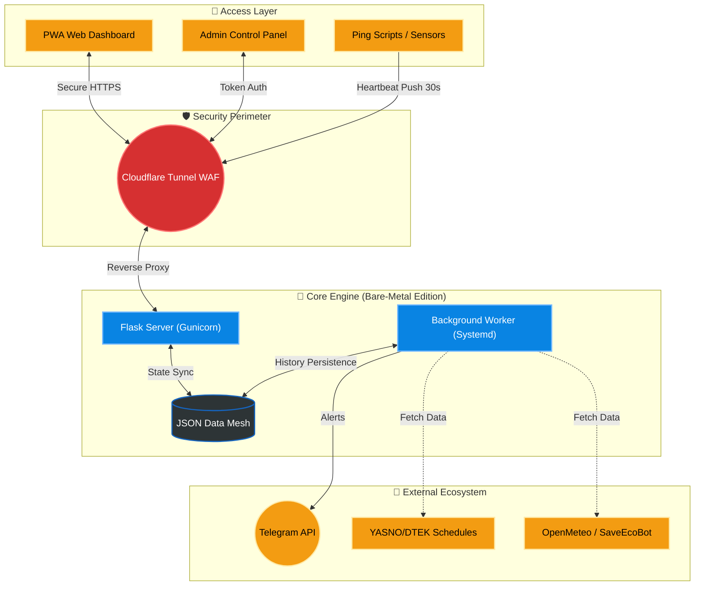

<p align="center">
  <a href="README_ENG.md">
    
  </a>
  <a href="README.md">
    
  </a>
</p>

<br>

<p align="center">
  
  
</p>

<p align="center">
  
</p>

# СВІТЛО⚡️ БЕЗПЕКА (FLASH MONITOR KYIV) - Bare-Metal Edition [](https://github.com/weby-homelab/flash-monitor-kyiv/releases/latest)

**Flash Monitor Kyiv** — це професійна автономна система моніторингу критичної інфраструктури та екологічної безпеки. Проєкт забезпечує моніторинг електропостачання в реальному часі, відстеження повітряних тривог, якості повітря (AQI) та радіаційного фону.

Ця гілка (`classic`) містить **Bare-Metal Edition** проєкту, призначену для роботи безпосередньо в системі (наприклад, через `systemd`), без використання Docker.

> **Статус проєкту:** Stable v3.0.3 (Total Control & Safety Edition)
> **Архітектура:** Python Flask + Background Workers + JSON Flat-DB + Systemd
> **Бренд:** Weby Homelab

---

## 🚀 Ключові інновації (v3.0+)

### 🎛 Панель Керування (Admin Panel)
Повністю автономний веб-інтерфейс у стилі Glassmorphism для керування всіма аспектами системи без необхідності редагування конфігураційних файлів через SSH.

<p align="center">
  
  
  
</p>

*   **Інтелектуальні бекапи:** Створення ручних та автоматичних точок відновлення конфігурації. Миттєве відновлення системи в один клік з авто-рестартом служб.
*   **Гнучке налаштування джерел:** Зміна пріоритету між Yasno, GitHub або підключення власного Custom JSON URL. Кнопка примусової синхронізації графіків.
*   **Повна Гео-адаптація:** Налаштування координат (Lat/Lon) для точної погоди, ID станції SaveEcoBot та керування відображенням віджетів на головній сторінці під будь-який регіон.
*   **Редактор Шаблонів:** Повний контроль над текстами сповіщень у Telegram, префіксами та зміна іконок статусів безпосередньо в UI.
*   **Безпека:** Можливість миттєвої регенерації API-ключів та токенів адміністратора з безпечним перенаправленням.

### 🤫 Режим «Інформаційний спокій» (Quiet Mode)
Унікальний алгоритм, що мінімізує "інформаційний шум". Система автоматично переходить у стан спокою, якщо за останні 24 години не було відключень, а в планах на завтра немає обмежень. 

### 🚨 Safety Net (Мережа безпеки)
Інтерактивний механізм швидкого реагування: при затримці сигналу (Push) понад 35 секунд адміністратор отримує запит у Telegram з варіантами дій (`🔴 Світло зникло`, `🛠 Технічний збій`, `🤷‍♂️ Не знаю`).

### ⚖️ Логіка «False Always Wins»
Гібридна система обробки графіків. Якщо хоча б одне джерело вказує на відключення, система відображає його як пріоритетне. Старі записи про відключення ніколи не затираються "чистими" планами.

---

## 📱 Приклади реальних сповіщень у Telegram

*   📊 **[Щоденний графік "План vs Факт" (Smart Daily Report)](https://t.me/svitlobot_Symyrenka22B/1230)**
*   📈 **[Тижнева аналітика відключень](https://t.me/svitlobot_Symyrenka22B/1192)**
*   🔴 **[Сповіщення про відключення світла з точністю до графіка](https://t.me/svitlobot_Symyrenka22B/1209)**
*   🟢 **[Сповіщення про увімкнення світла з точністю до графіка](https://t.me/svitlobot_Symyrenka22B/1212)**
*   ⚠️ **[Миттєвий алерт про зміну графіків від ДТЕК](https://t.me/svitlobot_Symyrenka22B/1222)**
*   📋 **[Публікація графіків від ДТЕК та YASNO](https://t.me/svitlobot_Symyrenka22B/1219)**
*   🚨 **[Сповіщення про повітряну тривогу в місті](https://t.me/svitlobot_Symyrenka22B/1196)**
*   ✅ **[Сповіщення про відбій повітряної тривоги](https://t.me/svitlobot_Symyrenka22B/1197)**

---

## 📊 Можливості дашборду (PWA)

Сучасний інтерфейс у стилі **Glassmorphism**, оптимізований для мобільних пристроїв:
*   **Live Status:** Візуалізація "Пульсу" системи (Світло Є! / Світло зникло!).
*   **Екологічний моніторинг:** Температура, вологість, PM2.5/PM10 (OpenMeteo/SaveEcoBot) та радіація з інтерактивними графіками за 24 години.
*   **Графік-бар:** Компактна 24-годинна шкала планових відключень.
*   **Аналітика:** Автоматична генерація щоденних та щотижневих графічних звітів прямо в Telegram та на сайт.

---

## 🏗 Архітектура Системи


```mermaid
graph TD
    %% -- Styles --
    classDef cloud fill:#2d3436,stroke:#7b1fa2,stroke-width:2px,color:#fff
    classDef local fill:#2d3436,stroke:#1565c0,stroke-width:2px,color:#fff
    classDef service fill:#0984e3,stroke:#74b9ff,stroke-width:2px,color:#fff
    classDef security fill:#d63031,stroke:#ff7675,stroke-width:2px,color:#fff
    classDef network fill:#00b894,stroke:#81ecec,stroke-width:2px,color:#fff
    classDef external fill:#f39c12,stroke:#ffeaa7,stroke-width:2px,color:#000

    %% -- External & Access Layer --
    subgraph Access ["📱 Access Layer"]
        direction LR
        PWA["PWA Web Dashboard"]:::external
        ADM["Admin Control Panel"]:::external
        IoT["Ping Scripts / Sensors"]:::external
    end

    %% -- Security Perimeter --
    subgraph Security ["🛡️ Security Perimeter"]
        direction TB
        CF(("Cloudflare Tunnel WAF")):::security
    end

    %% -- Core Application (Bare-Metal) --
    subgraph Core ["🚀 Core Engine (Bare-Metal Edition)"]
        direction TB
        WEB["Flask Server (Gunicorn)"]:::service
        WORKER["Background Worker (Systemd)"]:::service
        JSON[("JSON Data Mesh")]:::local
    end

    %% -- External APIs --
    subgraph API ["🔗 External Ecosystem"]
        direction TB
        TG(("Telegram API")):::external
        YASNO["YASNO/DTEK Schedules"]:::external
        WEATHER["OpenMeteo / SaveEcoBot"]:::external
    end

    %% -- Relationships --
    IoT -->|Heartbeat Push 30s| CF
    PWA <-->|Secure HTTPS| CF
    ADM <-->|Token Auth| CF

    CF <-->|Reverse Proxy| WEB
    
    WEB <-->|State Sync| JSON
    
    WORKER <-->|History Persistence| JSON
    WORKER -->|Alerts| TG
    WORKER -.->|Fetch Data| YASNO
    WORKER -.->|Fetch Data| WEATHER

    %% Layout adjustments
    CF ~~~ WEB
    JSON ~~~ TG
```

---

## 🛠 Технічний стек (Bare-Metal Edition)
- **Backend:** Python 3.12, **Flask**, Gunicorn.
- **Analytics:** Matplotlib, BeautifulSoup4.
- **Infra:** Systemd, Nginx / Cloudflare Tunnel.

### 💡 Чому Flask та Sync I/O? (Архітектура гілки Classic)
В основі проєкту лежить **JSON Data Mesh** — легка файлова база даних. У класичному розгортанні "на голому залізі" ми маємо розкіш покладатися на надійні механізми операційної системи (Linux OS-level file locking) та менеджери процесів, такі як **Systemd**.
Синхронний стек **Flask + Gunicorn** ідеально підходить для цього середовища:
1. Якщо один воркер (Background Script) утримує блокування файлу для запису, інші процеси Gunicorn продовжують стабільно обслуговувати веб-клієнтів.
2. Жодних проблем із багатопоточністю, властивих контейнерам Docker з обмеженими ресурсами.
*(Для розгортання в ізольованому середовищі **Docker**, де I/O-конфлікти можуть призвести до жорстких дедлоків (Deadlocks), ми створили асинхронну версію проєкту на базі FastAPI — вона розміщена в гілці `main`).*

---

## 📥 Встановлення та розгортання (Bare-Metal)

Ця гілка (`classic`) призначена для встановлення безпосередньо в ОС Ubuntu/Debian за допомогою **Systemd**. Це забезпечує максимальну стабільність та контроль над ресурсами сервера.

### 1. Попередні вимоги
*   Python 3.12 або новіше
*   Git, Pip, Venv
*   Права sudo на сервері

### 2. Клонування та підготовка
```bash
# Клонування репозиторію
git clone https://github.com/weby-homelab/flash-monitor-kyiv.git
cd flash-monitor-kyiv

# Перехід на гілку classic
git checkout classic

# Створення віртуального середовища
python3 -m venv venv
source venv/bin/activate

# Встановлення залежностей
pip install --upgrade pip
pip install -r requirements.txt
```

### 3. Налаштування середовища
Створіть файл `.env` у корені проєкту:
```bash
cp .env.example .env
nano .env
```
Заповніть `TELEGRAM_BOT_TOKEN`, `TELEGRAM_CHANNEL_ID` та інші параметри.

### 4. Налаштування Systemd (Автозапуск)
Для стабільної роботи потрібно створити два сервіси:

**А) Веб-панель (Dashboard):**
`/etc/systemd/system/flash-monitor.service`
```ini
[Unit]
Description=Flash Monitor Kyiv (Dashboard)
After=network.target

[Service]
User=root
WorkingDirectory=/path/to/flash-monitor-kyiv
EnvironmentFile=/path/to/flash-monitor-kyiv/.env
ExecStart=/path/to/flash-monitor-kyiv/venv/bin/gunicorn -k uvicorn.workers.UvicornWorker --workers 4 -b 0.0.0.0:5050 app:app
Restart=always

[Install]
WantedBy=multi-user.target
```

**Б) Фоновий воркер (Background Services):**
`/etc/systemd/system/flash-background.service`
```ini
[Unit]
Description=Flash Monitor Kyiv Background
After=network.target

[Service]
User=root
WorkingDirectory=/path/to/flash-monitor-kyiv
EnvironmentFile=/path/to/flash-monitor-kyiv/.env
ExecStart=/path/to/flash-monitor-kyiv/venv/bin/python run_background.py
Restart=always
RestartSec=10

[Install]
WantedBy=multi-user.target
```

### 5. Запуск та активація
```bash
sudo systemctl daemon-reload
sudo systemctl enable --now flash-monitor.service flash-background.service

# Перевірка статусу
sudo systemctl status flash-monitor.service
```

📖 **Додаткова документація:**
*   [Детальне налаштування та конфігурація](INSTRUCTIONS.md)
*   [Правила розробки (Development Rules)](DEVELOPMENT.md)

### Швидкий старт (Smart Bootstrap):
Система автоматично ініціалізується при першому запуску:
1.  Генерує унікальні `SECRET_KEY` та `ADMIN_TOKEN`.
2.  Створює структуру папок у `data/` з дефолтними налаштуваннями v3.
3.  Завантажує актуальні графіки для вашої групи.

---

## 🤝 Контакти та розробка
Розробка ведеться **Weby Homelab**. 
Всі зміни вносяться згідно з **"Протоколом нульової толерантності до регресій"**.

© 2026 Weby Homelab.