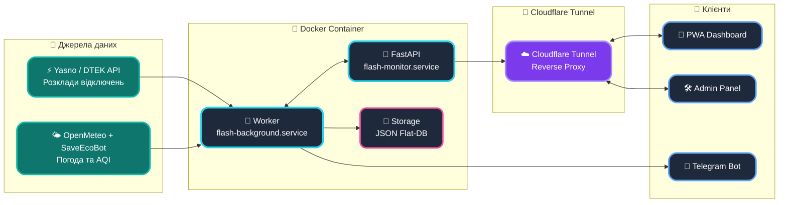

<p align="center">
  <a href="README_ENG.md">
    
  </a>
  <a href="README.md">
    
  </a>
</p>

<br>

<p align="center">
  
  
  
  
</p>

<p align="center">
  
</p>

# СВІТЛО⚡️ БЕЗПЕКА (FLASH MONITOR KYIV) - Docker Edition [](https://github.com/weby-homelab/flash-monitor-kyiv/releases/latest)

**Flash Monitor Kyiv** — це професійна автономна система моніторингу критичної інфраструктури та екологічної безпеки. Проєкт забезпечує прецизійний моніторинг електропостачання в реальному часі, інтелектуальну обробку графіків відключень (DTEK/Yasno), відстеження повітряних тривог, якості повітря (AQI) та радіаційного фону.

Ця гілка (`main`) містить **Docker Edition** проєкту — максимально ізольовану версію, оптимізовану для швидкого розгортання в будь-якому оточенні за один крок.

> **Статус проєкту:** Stable v3.4.0 (Docker Optimized)
> **Архітектура:** Asynchronous FastAPI + Docker Compose + JSON Flat-DB
> **Бренд:** Weby Homelab

---

## 🛠 Технологічний стек (Docker Edition)
- **Runtime:** Python 3.12 (slim-bookworm) у контейнері.
- **Web-Core:** FastAPI з підтримкою WebSockets та SSE.
- **Containerization:** Docker Compose з автоматичним монтуванням volume для збереження стану (`data/`).
- **CI/CD:** Multi-arch збірки (`amd64`/`arm64`) для підтримки Raspberry Pi та Cloud-серверів.

---

## 🚀 Ключові інновації та алгоритми

### 🎛 Панель Керування (Admin Panel)
Повністю автономний веб-інтерфейс у стилі **Glassmorphism** для керування всіма аспектами системи без необхідності редагування конфігураційних файлів через SSH.
<p align="center">
  
  
  
</p>

*   **Асинхронна швидкодія:** Новий асинхронний кеш унеможливлює дедлоки при одночасній роботі воркера та користувача.
*   **Інтелектуальні бекапи:** Миттєве відновлення системи в один клік з автоматичним рестартом внутрішніх служб.
*   **Безпека (Zero-Trust):** Усунуто LFI (Path Traversal) вразливості, забезпечено строгу перевірку шляхів.

### 🤫 Режим «Інформаційний спокій» (Quiet Mode)
Унікальний алгоритм, що мінімізує "інформаційний шум". Система автоматично переходить у стан спокою, якщо за останні 24 години не було відключень, а в планах на завтра немає обмежень.

### ⚖️ Логіка «False Always Wins»
Гібридна система обробки графіків. Якщо хоча б одне джерело вказує на відключення, система відображає його як пріоритетне. Старі записи ніколи не затираються "чистими" планами.

---

## 🏗️ Архітектура системи


```mermaid
flowchart LR
    classDef external fill:#0f766e,stroke:#14b8a6,stroke-width:3px,color:#fff,rx:16px,ry:16px
    classDef core fill:#1e293b,stroke:#22d3ee,stroke-width:3.5px,color:#fff,rx:14px,ry:14px
    classDef gateway fill:#7c3aed,stroke:#a78bfa,stroke-width:3px,color:#fff,rx:16px,ry:16px
    classDef client fill:#1e293b,stroke:#60a5fa,stroke-width:3px,color:#fff,rx:16px,ry:16px
    classDef db fill:#1e293b,stroke:#ec4899,stroke-width:3px,color:#fff,rx:12px,ry:12px

    subgraph External ["🔌 Джерела даних"]
        direction TB
        Energy["⚡ Yasno / DTEK API<br>Розклади відключень"]:::external
        Meteo["🌤️ OpenMeteo + SaveEcoBot<br>Погода та AQI"]:::external
    end

    subgraph Docker ["🐳 Docker Container"]
        direction TB
        Worker["🔄 Worker<br>flash-background.service"]:::core
        API["🔌 FastAPI<br>flash-monitor.service"]:::core
        Storage["💾 Storage<br>JSON Flat-DB"]:::db
    end

    subgraph Gateway ["🔐 Cloudflare Tunnel"]
        CF["☁️ Cloudflare Tunnel<br>Reverse Proxy"]:::gateway
    end

    subgraph Clients ["👥 Клієнти"]
        direction TB
        PWA["📱 PWA Dashboard"]:::client
        Admin["🛠️ Admin Panel"]:::client
        Telegram["📨 Telegram Bot"]:::client
    end

    Energy & Meteo --> Worker
    Worker --> Storage
    Worker <--> API
    API --> CF
    CF <--> PWA & Admin
    Worker --> Telegram
```

---

## 📥 Встановлення (Docker Edition)

### 1. Завантаження конфігурації
```bash
curl -O https://raw.githubusercontent.com/weby-homelab/flash-monitor-kyiv/main/docker-compose.yml
```

### 2. Запуск
```bash
docker-compose up -d
```

### 3. Конфігурація
Після запуску відкрийте браузер: `http://localhost:5050`. Система попросить налаштувати `TELEGRAM_BOT_TOKEN` та `TELEGRAM_CHANNEL_ID` через веб-інтерфейс (або ви можете створити `.env` файл заздалегідь).

🔑 **Отримання доступу:**
```bash
docker exec -it flash-monitor-kyiv cat data/power_monitor_state.json | grep admin_token
```

---

💡 **Потрібен максимальний контроль?** Використовуйте [Bare-metal версію (гілка classic)](https://github.com/weby-homelab/flash-monitor-kyiv/tree/classic).

📖 **Документація:**
* [Повна інструкція встановлення Docker](docs/INSTRUCTIONS_INSTALL.md)
* [Історія змін (CHANGELOG.md)](docs/CHANGELOG.md)

---
**✦ 2026 Weby Homelab ✦**
