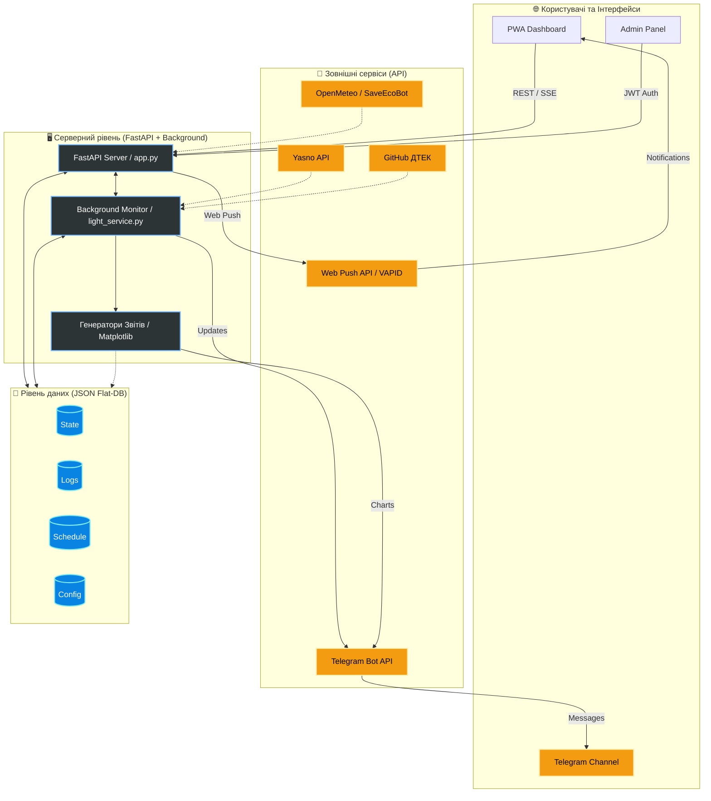

<p align="center">
  <a href="README_ENG.md">
    
  </a>
  <a href="README.md">
    
  </a>
</p>

<br>

<p align="center">
  
  
</p>

<p align="center">
  
</p>

# СВІТЛО⚡️ БЕЗПЕКА (FLASH MONITOR KYIV) - Docker Edition [](https://github.com/weby-homelab/flash-monitor-kyiv/releases/latest)

**Flash Monitor Kyiv** — це професійна автономна система моніторингу критичної інфраструктури та екологічної безпеки. Проєкт забезпевує моніторинг електропостачання в реальному часі, відстеження повітряних тривог, якості повітря (AQI) та радіаційного фону.

Ця гілка (`main`) містить **Docker Edition** проєкту, призначену для швидкого розгортання через Docker Compose.

> **Статус проєкту:** Stable v3.3.0 (Core Refactoring & Fail-Safe Architecture)
> **Архітектура:** Python FastAPI + Background Workers + JSON Flat-DB + Docker / Docker Compose
> **Бренд:** Weby Homelab

---

## 🛡 Оновлення v3.3.0
*   **Data Access Layer (`storage.py`):** Впроваджено централізований модуль роботи з файловою системою. Усі операції читання/запису тепер атомарні та захищені `asyncio.Lock()` і `fcntl.flock`, що повністю усуває стан гонитви (Race Conditions) та пошкодження JSON-баз.
*   **Notification Service (`telegram_client.py`):** Створено єдиний клієнт для взаємодії з Telegram API з розумною резильєнтністю (автоматичні повторні спроби та відправка нового повідомлення при неможливості редагування старого через таймаути).
*   **Fail-Safe Quiet Mode:** Якщо під час "Інформаційного спокою" зникає зв'язок і адміністратор не відповідає протягом 5 хвилин, система автоматично "ігнорує" збій, щоб унеможливити хибні тривоги в каналі вночі.
*   **Modular State Machine:** Нескінченні цикли розщеплено на незалежні асинхронні blocks з глобальним перехопленням виключень `try...except`, завдяки чому моніторинг ніколи не зупиняється через зовнішні збої.


## 🚀 Ключові інновації (v3.2+)

### 🎛 Панель Керування (Admin Panel)
Повністю автономний веб-інтерфейс у стилі Glassmorphism для керування всіма аспектами системи без необхідності редагування конфігураційних файлів через SSH.

<p align="center">
  
  
  
</p>

*   **Асинхронна швидкодія:** Новий асинхронний кеш (FastAPI) унеможливлює дедлоки та "зависання" при одночасному записі даних різними фоновими воркерами.
*   **Інтелектуальні бекапи:** Створення ручних та автоматичних точок відновлення конфігурації. Миттєве відновлення системи в один клік з авто-рестартом служб.
*   **Гнучке налаштування джерел:** Зміна пріоритету між Yasno, GitHub або підключення власного Custom JSON URL. Кнопка примусової синхронізації графіків.
*   **Повна Гео-адаптація:** Налаштування координат (Lat/Lon) для точної погоди, ID станції SaveEcoBot та керування відображенням віджетів.
*   **Безпека (Zero-Trust):** Усунуто LFI (Path Traversal) вразливості, забезпечено строгу перевірку шляхів до файлів. Ключі доступу генеруються безпечно при першому старті.

### 🤫 Режим «Інформаційний спокій» (Quiet Mode)
Унікальний алгоритм, що мінімізує "інформаційний шум". Система автоматично переходить у стан спокою, якщо за останні 24 години не було відключень, а в планах на завтра немає обмежень.

### 🚨 Safety Net (Мережа безпеки)
Інтерактивний механізм швидкого реагування: при затримці сигналу (Push) понад 35 секунд адміністратор отримує запит у Telegram з варіантами дій (`🔴 Світло зникло`, `🛠 Технічний збій`, `🤷‍♂️ Не знаю`).

### ⚖️ Логіка «False Always Wins»
Гібридна система обробки графіків. Якщо хоча б одне джерело вказує на відключення, система відображає його як пріоритетне. Старі записи про відключення ніколи не затираються "чистими" планами.

---

## 📱 Приклади реальних сповіщень у Telegram

*   📊 **[Щоденний графік "План vs Факт" (Smart Daily Report)](https://t.me/svitlobot_Symyrenka22B/1230)**
*   📈 **[Тижнева аналітика відключень](https://t.me/svitlobot_Symyrenka22B/1192)**
*   🔴 **[Сповіщення про відключення світла з точністю до графіка](https://t.me/svitlobot_Symyrenka22B/1209)**
*   🟢 **[Сповіщення про увімкнення світла з точністю до графіка](https://t.me/svitlobot_Symyrenka22B/1212)**
*   ⚠️ **[Миттєвий алерт про зміну графіків від ДТЕК](https://t.me/svitlobot_Symyrenka22B/1222)**
*   🚨 **[Сповіщення про повітряну тривогу в місті](https://t.me/svitlobot_Symyrenka22B/1196)**

---

## 📊 Можливості дашборду (PWA)

Сучасний інтерфейс у стилі **Glassmorphism**, оптимізований для мобільних пристроїв:
*   **Live Status:** Візуалізація "Пульсу" системи (Світло Є! / Світло зникло!).
*   **Екологічний моніторинг:** Температура, вологість, PM2.5/PM10 (OpenMeteo/SaveEcoBot) та радіація з інтерактивними графіками за 24 години.
*   **Графік-бар:** Компактна 24-годинна шкала планових відключень.

---

## 🏗 Архітектура Системи


```mermaid
graph TD
    %% -- Styles --
    classDef external fill:#f39c12,stroke:#ffeaa7,stroke-width:2px,color:#000
    classDef layer fill:#2d3436,stroke:#74b9ff,stroke-width:2px,color:#fff
    classDef data fill:#0984e3,stroke:#81ecec,stroke-width:2px,color:#fff

    subgraph Users ["🌐 Користувачі та Інтерфейси"]
        direction TB
        WEB[PWA Dashboard]
        ADMIN[Admin Panel]
        TG[Telegram Channel]
    end

    subgraph External ["📡 Зовнішні сервіси (API)"]
        direction LR
        YASNO[Yasno API]
        DTEK[GitHub ДТЕК]
        METEO[OpenMeteo / SaveEcoBot]
        PUSH[Web Push API / VAPID]
        BOT[Telegram Bot API]
    end

    subgraph App ["🖥️ Серверний рівень (FastAPI + Background)"]
        direction TB
        API[FastAPI Server / app.py]
        LMN[Background Monitor / light_service.py]
        REP[Генератори Звітів / Matplotlib]
        
        API <--> LMN
        LMN ---> REP
    end

    subgraph Data ["💾 Рівень даних (JSON Flat-DB)"]
        direction LR
        STATE[(State)]
        LOGS[(Logs)]
        SCHED[(Schedule)]
        CFG[(Config)]
    end

    %% Connections
    WEB --->|REST / SSE| API
    ADMIN --->|JWT Auth| API
    
    API --->|Web Push| PUSH
    PUSH --->|Notifications| WEB
    
    LMN --->|Updates| BOT
    REP --->|Charts| BOT
    BOT --->|Messages| TG
    
    YASNO -.-> LMN
    DTEK -.-> LMN
    METEO -.-> API
    
    API <--> Data
    LMN <--> Data
    REP -.-> Data

    class TG,YASNO,DTEK,METEO,PUSH,BOT external
    class API,LMN,REP layer
    class STATE,LOGS,SCHED,CFG data
```

---

## 📥 Встановлення та розгортання

Проєкт має дві основні гілки:

1.  **`main` (Docker Edition):** Рекомендовано для швидкого старту.
    ```bash
    # 1. Завантажте docker-compose.yml
    curl -O https://raw.githubusercontent.com/weby-homelab/flash-monitor-kyiv/main/docker-compose.yml

    # 2. Запустіть систему (образи автоматично стягнуться з Docker Hub)
    docker-compose up -d
    ```
2.  **`classic` (Bare-Metal Edition):** Для роботи безпосередньо в системі через `systemd`.

📖 **Повні інструкції:**
*   [Інструкція зі встановлення (Installation Guide)](INSTRUCTIONS_INSTALL.md)
*   [Детальне налаштування та конфігурація](INSTRUCTIONS.md)
*   [Правила розробки (Development Rules)](DEVELOPMENT.md)

---
**✦ 2026 Weby Homelab ✦**
