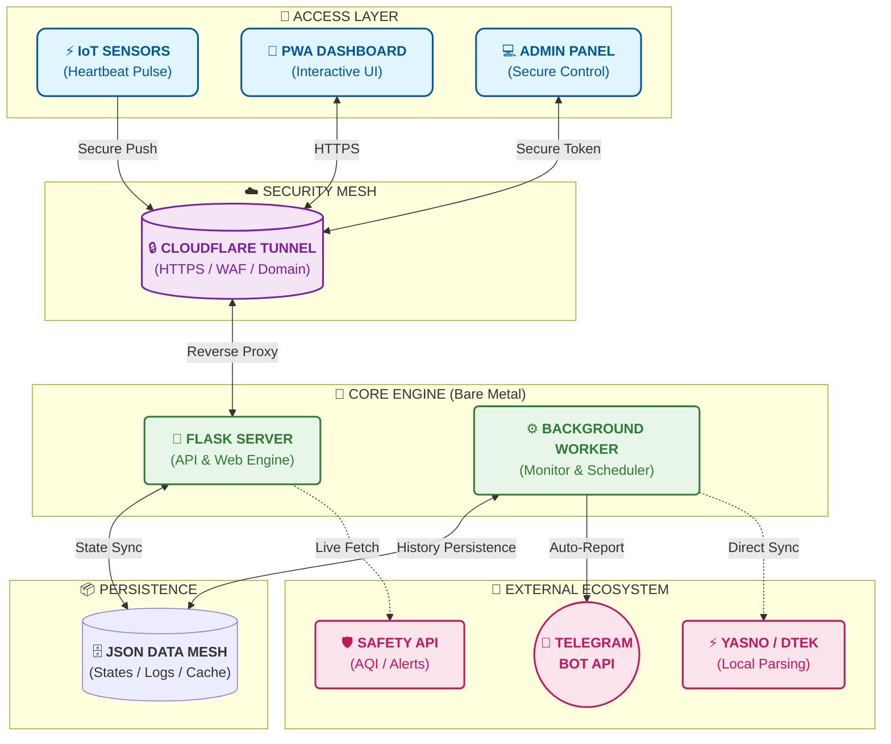

  
  

 

# СВІТЛО⚡️ БЕЗПЕКА  BARE METAL Edition

  
  
  
  

  

**Автономна система моніторингу електропостачання та безпеки Києва.**

Проект забезпечує повний контроль над енергетичною та безпековою ситуацією, аналізуючи реальні дані мережі та офіційні графіки Yasno/ДТЕК локально.

🔗 **Живий моніторинг:** [flash.srvrs.top](https://flash.srvrs.top/)

## 📚 Документація проєкту
| Файл | Опис |
| :--- | :--- |
| 📖 **[Встановлення та налаштування](INSTRUCTIONS_INSTALL.md)** | Головна інструкція з розгортання системи (змінні, API). |
| 🔌 **[Робота з IoT-платами](INSTRUCTIONS.md)** | Скетчі та інструкції для мікроконтролерів ESP8266/ESP32 (фізичні датчики світла). |
| 🛠️ **[Посібник розробника](DEVELOPMENT.md)** | Архітектурні правила, протоколи безпеки та інструкції з деплою коду. |

---

## 🚀 Основні можливості

### 💡 Розумний Енергомоніторинг
- **Smart Bootstrap:** Автоматичне розгортання актуальних планових графіків для вашої групи та регіону при першому запуску.
- **Heartbeat Tracking & Manual Trigger:** Моніторинг світла в реальному часі через IoT-сигнали (`/api/push`) та миттєве ручне керування статусом (`/api/down`).
- **Стійкість до збоїв API:** Надійне локальне кешування графіків, що захищає від падіння серверів DTEK/Yasno.
- **Аналітика «План vs Факт»:** Автоматичне порівняння реальних вимкнень із запланованими графіками прямо на дашборді.
- **Точність графіка:** Розрахунок відхилень (запізнення або раннє ввімкнення) для кожної події.
- **Візуалізація:** Генерація денних та тижневих чартів у фірмовому стилі.
- **UI/UX Дизайн:** Тема "Black-and-White" з ефектом Glassmorphism та моноширинними шрифтами для чітких звітів.

### 🛡️ Безпека та Екологія
- **Повітряні тривоги:** Миттєвий статус та сповіщення у Telegram про початок та відбій тривоги в м. Київ.
- **Live-карта:** Інтегрована мапа тривог Києва та області.
- **Якість повітря (AQI):** Моніторинг PM2.5, PM10 та радіаційного фону (локація: Симиренка).
- **Погода:** Актуальна температура, вологість та параметри вітру.

### 🔔 Сповіщення у Telegram
- **Інтелектуальні звіти:** Текстові графіки з вирівнюванням тривалості по правому краю (tabular-nums).
- **Morning Report (06:00):** Повний огляд ситуації на сьогодні та завтра (якщо доступно).
- **Evening/Instant Update:** Автоматичне надсилання завтрашнього графіка одразу після його публікації ДТЕК.
- **Smart Merge:** Коректне об'єднання нічних інтервалів.

### 💻 Адмін-панель
- **Секретний URL:** При кожному запуску система генерує унікальний випадковий шлях для адміністрування. Його можна знайти в логах сервісу (`journalctl -u flash-monitor`).
- **Керування статусом:** Можливість миттєво змінювати статус світла (Ввімкнено / Вимкнено / Невідомо) вручну, якщо автоматика не впоралася.
- **Редагування подій:** Повний доступ до історії подій для корекції зафіксованих інтервалів.

### 🔇 Інформаційний спокій (Quiet Mode)
- **24/24 Logic:** Система автоматично переходить у "режим спокою", якщо останні **24 години** не було фактичних відключень, і в найближчі **24 години** за графіком їх теж не планується. Це дозволяє уникнути зайвого шуму в Telegram, коли ситуація в енергосистемі стабільна.
- **Confirmation Safety Net:** Якщо світло зникне під час режиму спокою, система не відправить сповіщення в канал миттєво, а зачекає на ваше підтвердження через приватні повідомлення (Inline-кнопки).
- **Автовихід:** Режим спокою автоматично вимикається, як тільки в графіку з'являється будь-яке обмеження або фіксується підтверджене відключення.

#### 📱 Приклади реальних повідомлень
- 📊 **[Щоденний графік "План vs Факт" (Smart Daily Report)](https://t.me/svitlobot_Symyrenka22B/1230)**
- 📈 **[Тижнева аналітика відключень](https://t.me/svitlobot_Symyrenka22B/1192)**
- 🔴 **[Сповіщення про відключення світла з точністю до графіка](https://t.me/svitlobot_Symyrenka22B/1209)**
- 🟢 **[Сповіщення про увімкненя світла з точністю до графіка](https://t.me/svitlobot_Symyrenka22B/1212)**
- ⚠️ **[Миттєвий алерт про зміну графіків від ДТЕК](https://t.me/svitlobot_Symyrenka22B/1222)**
- 📈 **[Публікація графіків від ДТЕК та YASNO](https://t.me/svitlobot_Symyrenka22B/1219)**
- 🚨 **[Сповіщення про повітряну тривогу в Києві](https://t.me/svitlobot_Symyrenka22B/1196)**
- ✅ **[Сповіщення про відбій повітряної тривоги](https://t.me/svitlobot_Symyrenka22B/1197)**

---

## 🏗 Архітектура Системи

```mermaid
flowchart TD
    %% -- Style Definitions --
    classDef access fill:#e1f5fe,stroke:#01579b,stroke-width:2px,color:#01579b,rx:10,ry:10
    classDef network fill:#f3e5f5,stroke:#7b1fa2,stroke-width:2px,color:#7b1fa2,rx:5,ry:5
    classDef core fill:#e8f5e9,stroke:#2e7d32,stroke-width:2px,color:#2e7d32,rx:5,ry:5
    classDef data fill:#fff3e0,stroke:#e65100,stroke-width:2px,color:#e65100,rx:10,ry:10
    classDef external fill:#fce4ec,stroke:#c2185b,stroke-width:2px,color:#c2185b,rx:5,ry:5

    %% -- Access Layer --
    subgraph Access ["📡 ACCESS LAYER"]
        IoT["⚡ <b>IoT SENSORS</b><br/>(Heartbeat Pulse)"]
        PWA["📱 <b>PWA DASHBOARD</b><br/>(Interactive UI)"]
        ADM["💻 <b>ADMIN PANEL</b><br/>(Secure Control)"]
    end

    %% -- Network Layer --
    subgraph Network ["☁️ SECURITY MESH"]
        CF[("🔒 <b>CLOUDFLARE TUNNEL</b><br/>(HTTPS / WAF / Domain)")]
    end

    %% -- Core Engine --
    subgraph Core ["🚀 CORE ENGINE (Bare Metal)"]
        direction TB
        WEB["🧪 <b>FLASK SERVER</b><br/>(API & Web Engine)"]
        WORKER["⚙️ <b>BACKGROUND WORKER</b><br/>(Monitor & Scheduler)"]
    end

    %% -- Data Layer --
    subgraph Storage ["📦 PERSISTENCE"]
        JSON[("🗄️ <b>JSON DATA MESH</b><br/>(States / Logs / Cache)")]
    end

    %% -- External Ecosystem --
    subgraph Integration ["🔗 EXTERNAL ECOSYSTEM"]
        direction LR
        TG(("💬 <b>TELEGRAM<br/>BOT API</b>"))
        DTEK["⚡ <b>YASNO / DTEK</b><br/>(Local Parsing)"]
        SAFE["🛡️ <b>SAFETY API</b><br/>(AQI / Alerts)"]
    end

    %% -- Connections --
    IoT -->|Secure Push| CF
    PWA <-->|HTTPS| CF
    ADM <-->|Secure Token| CF
    CF <-->|Reverse Proxy| WEB
    
    WEB <-->|State Sync| JSON
    WORKER <-->|History Persistence| JSON
    
    WORKER -->|Auto-Report| TG
    WORKER -.->|Direct Sync| DTEK
    WEB -.->|Live Fetch| SAFE

    %% -- Applying Styles --
    class IoT,PWA,ADM access
    class CF network
    class WEB,WORKER core
    class JSON storage
    class TG,DTEK,SAFE external
```

---

## 💡 Порада для IoT-датчиків (Heartbeat)
Для надсилання Push-сигналів рекомендується використовувати HTTPS-адресу вашого домену (наприклад, через Cloudflare Tunnel) замість прямої IP-адреси:

- 🛡️ **Безпека:** HTTPS шифрує ваш секретний ключ під час передачі.
- 🧩 **Гнучкість:** При зміні сервера вам не потрібно перепрошивати датчики — достатньо змінити налаштування тунелю.

**Приклад:** `https://flash.srvrs.top/api/push/ваш_ключ`

---

## 🛠 Технологічний стек
- **Backend:** Python 3.11, Flask, Gunicorn.
- **Analytics:** Matplotlib, BeautifulSoup4.
- **Infra:** Systemd, PWA (Progressive Web App).

---

## 📜 Ліцензія
Розповсюджується під ліцензією **MIT**.

 

  ✦ 2026 Weby Homelab ✦  
  Made with ❤️ in Kyiv under air raid sirens and blackouts

