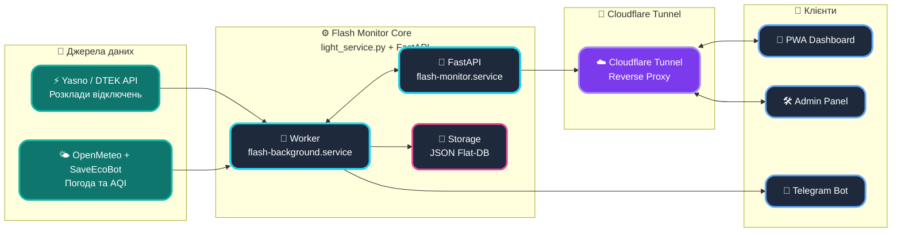

<p align="center">
  <a href="README_ENG.md">
    
  </a>
  <a href="README.md">
    
  </a>
</p>

<br>

<p align="center">
  
  
  
  
</p>

<p align="center">
  
</p>

# СВІТЛО⚡️ БЕЗПЕКА (FLASH MONITOR KYIV) - Bare-metal Edition [](https://github.com/weby-homelab/flash-monitor-kyiv/releases/latest)

**Flash Monitor Kyiv** — це професійна автономна система моніторингу критичної інфраструктури та екологічної безпеки. Проєкт забезпечує прецизійний моніторинг електропостачання в реальному часі, інтелектуальну обробку графіків відключень (DTEK/Yasno), відстеження повітряних тривог, якості повітря (AQI) та радіаційного фону.

Ця гілка (`classic`) містить **Bare-metal версію** проєкту, розроблену для прямого розгортання на сервер під керуванням **Ubuntu 24.04 LTS** (або Debian 12) як набір системних служб `systemd`.

> **Статус проєкту:** Stable v3.4.0 (Bare-metal Optimized)
> **Архітектура:** FastAPI + Gunicorn (Uvicorn Workers) + Background Services + Systemd
> **Бренд:** Weby Homelab

---

## 🛠 Технологічний стек (Bare-metal Edition)
- **Runtime:** Python 3.12+ безпосередньо на хост-системі.
- **Process Management:** Подвійний стек `systemd`:
    *   `flash-monitor.service` — асинхронний веб-інтерфейс та API.
    *   `flash-background.service` — фоновий моніторинг, парсинг Yasno та Telegram-воркер.
- **Web-Core:** FastAPI з підтримкою WebSockets та SSE через `gunicorn`.
- **Data Persistence:** Пряма робота з JSON Flat-DB, оптимізована для низьких затримок I/O.

---

## 🚀 Ключові інновації та алгоритми

### 🎛 Панель Керування (Admin Panel)
Повністю автономний веб-інтерфейс у стилі **Glassmorphism** для керування всіма аспектами системи без необхідності редагування конфігураційних файлів через SSH.
<p align="center">
  
  
  
</p>

*   **Асинхронна швидкодія:** Новий асинхронний кеш унеможливлює дедлоки при одночасній роботі воркера та користувача.
*   **Інтелектуальні бекапи:** Миттєве відновлення системи в один клік з автоматичним рестартом системних служб.
*   **Безпека (Zero-Trust):** Усунуто LFI (Path Traversal) вразливості, забезпечено строгу перевірку шляхів.

### 🤫 Режим «Інформаційний спокій» (Quiet Mode)
Унікальний алгоритм, що мінімізує "інформаційний шум". Система автоматично переходить у стан спокою, якщо за останні 24 години не було відключень, а в планах на завтра немає обмежень.

### ⚖️ Логіка «False Always Wins»
Гібридна система обробки графіків. Якщо хоча б одне джерело вказує на відключення, система відображає його як пріоритетне. Старі записи ніколи не затираються "чистими" планами.

---

## 🏗️ Архітектура системи


```mermaid
flowchart LR
    classDef external fill:#0f766e,stroke:#14b8a6,stroke-width:3px,color:#fff,rx:16px,ry:16px
    classDef core fill:#1e293b,stroke:#22d3ee,stroke-width:3.5px,color:#fff,rx:14px,ry:14px
    classDef gateway fill:#7c3aed,stroke:#a78bfa,stroke-width:3px,color:#fff,rx:16px,ry:16px
    classDef client fill:#1e293b,stroke:#60a5fa,stroke-width:3px,color:#fff,rx:16px,ry:16px
    classDef db fill:#1e293b,stroke:#ec4899,stroke-width:3px,color:#fff,rx:12px,ry:12px

    subgraph External ["🔌 Джерела даних"]
        direction TB
        Energy["⚡ Yasno / DTEK API<br>Розклади відключень"]:::external
        Meteo["🌤️ OpenMeteo + SaveEcoBot<br>Погода та AQI"]:::external
    end

    subgraph Core ["⚙️ Flash Monitor Core<br>light_service.py + FastAPI"]
        direction TB
        Worker["🔄 Worker<br>flash-background.service"]:::core
        API["🔌 FastAPI<br>flash-monitor.service"]:::core
        Storage["💾 Storage<br>JSON Flat-DB"]:::db
    end

    subgraph Gateway ["🔐 Cloudflare Tunnel"]
        CF["☁️ Cloudflare Tunnel<br>Reverse Proxy"]:::gateway
    end

    subgraph Clients ["👥 Клієнти"]
        direction TB
        PWA["📱 PWA Dashboard"]:::client
        Admin["🛠️ Admin Panel"]:::client
        Telegram["📨 Telegram Bot"]:::client
    end

    Energy & Meteo --> Worker
    Worker --> Storage
    Worker <--> API
    API --> CF
    CF <--> PWA & Admin
    Worker --> Telegram
```

---

## 📥 Встановлення (Bare-metal Edition)

### 1. Підготовка системи
```bash
sudo apt-get update && sudo apt-get upgrade -y
sudo apt-get install -y python3.12 python3.12-venv python3-pip git nano
```

### 2. Клонування та середовище
```bash
git clone https://github.com/weby-homelab/flash-monitor-kyiv.git
cd flash-monitor-kyiv
git checkout classic

python3.12 -m venv venv
source venv/bin/activate
pip install --upgrade pip
pip install -r requirements.txt
```

### 3. Конфігурація
Створіть `.env` та заповніть токени:
```bash
cp .env.example .env
nano .env
```

### 4. Налаштування Systemd (Unit-файли)
Створіть `/etc/systemd/system/flash-monitor.service` (Dashboard):
```ini
[Service]
ExecStart=/path/to/project/venv/bin/gunicorn -k uvicorn.workers.UvicornWorker --workers 4 -b 0.0.0.0:5050 app.main:app
```
Створіть `/etc/systemd/system/flash-background.service` (Worker):
```ini
[Service]
ExecStart=/path/to/project/venv/bin/python -m app.run_background
```

### 5. Активація
```bash
sudo systemctl daemon-reload
sudo systemctl enable --now flash-monitor.service flash-background.service
```

🔑 **Доступ до Admin Panel:**
Після старту отримайте токен:
```bash
cat data/power_monitor_state.json | grep admin_token
```
URL: `http://IP:5050/admin?t=ВАШ_ТОКЕН`

---
**✦ 2026 Weby Homelab ✦**
