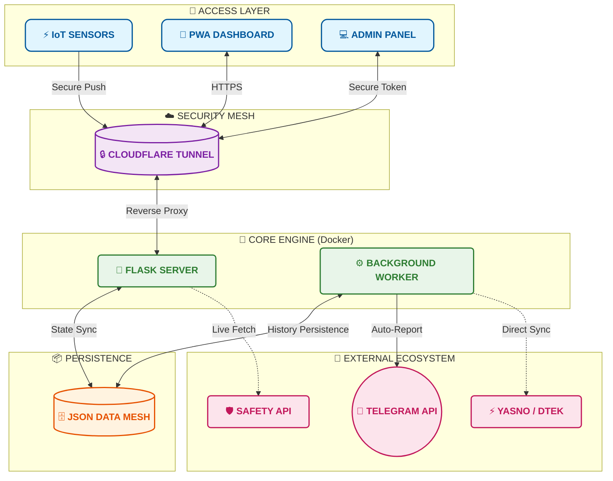

<p align="center">
  <a href="#-українська-версія">
    
  </a>
  <a href="#-english-version">
    
  </a>
</p>

<br>

# СВІТЛО⚡️ БЕЗПЕКА [](https://github.com/weby-homelab/flash-monitor-kyiv/releases/latest) DOCKER Edition

<p align="center">
  <a href="https://hub.docker.com/r/webyhomelab/flash-monitor-kyiv"></a>
  <a href="https://github.com/weby-homelab/flash-monitor-kyiv/commits/main"></a>
  <a href="https://github.com/weby-homelab/flash-monitor-kyiv/issues"></a>
  
</p>

<p align="center">
  
</p>

---

## 🇺🇦 Українська версія

**Автономна система моніторингу електропостачання та безпеки Києва (Docker Edition).**

Проєкт забезпечує повний контроль над енергетичною та безпековою ситуацією, аналізуючи реальні дані мережі та офіційні графіки Yasno/ДТЕК локально.

🔗 **Живий моніторинг:** [flash.srvrs.top](https://flash.srvrs.top/)

### 🚀 Швидкий старт (Docker Compose)

Найпростіший спосіб запустити систему — використовувати Docker Compose.

#### 1. Створіть файл `.env`:
```env
TELEGRAM_BOT_TOKEN=ваш_токен
TELEGRAM_CHANNEL_ID=ваш_id_каналу
ADMIN_CHAT_ID=ваш_id_адміна
SECRET_KEY=ваш_секретний_ключ
```

#### 2. Створіть файл `docker-compose.yml`:
```yaml
services:
  flash-monitor:
    image: webyhomelab/flash-monitor-kyiv:latest
    container_name: flash-monitor
    restart: unless-stopped
    ports:
      - "5050:5050"
    volumes:
      - ./data:/app/data
      - ./config.json:/app/config.json:ro
    env_file:
      - .env
    environment:
      - TZ=Europe/Kyiv

  background-worker:
    image: webyhomelab/flash-monitor-kyiv:latest
    container_name: flash-monitor-worker
    restart: unless-stopped
    command: python run_background.py
    volumes:
      - ./data:/app/data
      - ./config.json:/app/config.json:ro
    env_file:
      - .env
    environment:
      - TZ=Europe/Kyiv
```

#### 3. Запустіть систему:
```bash
docker compose up -d
```

---

### 🚀 Основні можливості
- **Smart Bootstrap:** Автоматичне розгортання графіків при першому запуску.
- **Heartbeat Tracking:** Моніторинг світла в реальному часі через IoT (`/api/push`).
- **Стійкість до збоїв API:** Локальне кешування графіків DTEK/Yasno.
- **Аналітика «План vs Факт»:** Порівняння реальних вимкнень із запланованими.
- **Історія AQI (v2.4.3):** 24-годинна історія якості повітря з інтерактивними графіками.
- **Quiet Mode:** Розумний режим спокою в стабільні періоди (24/24 Logic).

---

## 🇬🇧 English Version

**Autonomous power & safety monitoring system for Kyiv (Docker Edition).**

The project provides full control over the energy and security situation by analyzing real network data and official Yasno/DTEK schedules locally.

🔗 **Live monitoring:** [flash.srvrs.top](https://flash.srvrs.top/)

### 🚀 Quick Start (Docker Compose)

The easiest way to deploy the system is using Docker Compose.

#### 1. Create a `.env` file:
```env
TELEGRAM_BOT_TOKEN=your_token
TELEGRAM_CHANNEL_ID=your_channel_id
ADMIN_CHAT_ID=your_admin_id
SECRET_KEY=your_secret_key
```

#### 2. Create a `docker-compose.yml` file:
```yaml
services:
  flash-monitor:
    image: webyhomelab/flash-monitor-kyiv:latest
    container_name: flash-monitor
    restart: unless-stopped
    ports:
      - "5050:5050"
    volumes:
      - ./data:/app/data
      - ./config.json:/app/config.json:ro
    env_file:
      - .env
    environment:
      - TZ=Europe/Kyiv

  background-worker:
    image: webyhomelab/flash-monitor-kyiv:latest
    container_name: flash-monitor-worker
    restart: unless-stopped
    command: python run_background.py
    volumes:
      - ./data:/app/data
      - ./config.json:/app/config.json:ro
    env_file:
      - .env
    environment:
      - TZ=Europe/Kyiv
```

#### 3. Start the system:
```bash
docker compose up -d
```

---

### 🚀 Main Features
- **Smart Bootstrap:** Automatic deployment of current schedules upon first launch.
- **Heartbeat Tracking:** Real-time light monitoring via IoT signals (`/api/push`).
- **API Resilience:** Reliable local caching of schedules, protecting against server failures.
- **"Plan vs Fact" Analytics:** Automatic comparison of real outages with planned schedules.
- **AQI History (v2.4.3):** 24-hour air quality and weather history with interactive graphs.
- **Quiet Mode:** Intelligent notification suppression during stable periods (24/24 Logic).

---

## 🏗 Архітектура / Architecture


```mermaid
flowchart TD
    %% -- Style Definitions --
    classDef access fill:#e1f5fe,stroke:#01579b,stroke-width:2px,color:#01579b,rx:10,ry:10
    classDef network fill:#f3e5f5,stroke:#7b1fa2,stroke-width:2px,color:#7b1fa2,rx:5,ry:5
    classDef core fill:#e8f5e9,stroke:#2e7d32,stroke-width:2px,color:#2e7d32,rx:5,ry:5
    classDef storage fill:#fff3e0,stroke:#e65100,stroke-width:2px,color:#e65100,rx:10,ry:10
    classDef external fill:#fce4ec,stroke:#c2185b,stroke-width:2px,color:#c2185b,rx:5,ry:5

    subgraph Access ["📡 ACCESS LAYER"]
        IoT["⚡ <b>IoT SENSORS</b>"]
        PWA["📱 <b>PWA DASHBOARD</b>"]
        ADM["💻 <b>ADMIN PANEL</b>"]
    end

    subgraph Network ["☁️ SECURITY MESH"]
        CF[("🔒 <b>CLOUDFLARE TUNNEL</b>")]
    end

    subgraph Core ["🚀 CORE ENGINE (Docker)"]
        direction TB
        WEB["🧪 <b>FLASK SERVER</b>"]
        WORKER["⚙️ <b>BACKGROUND WORKER</b>"]
    end

    subgraph Storage ["📦 PERSISTENCE"]
        JSON[("🗄️ <b>JSON DATA MESH</b>")]
    end

    subgraph Integration ["🔗 EXTERNAL ECOSYSTEM"]
        direction LR
        TG(("💬 <b>TELEGRAM API</b>"))
        DTEK["⚡ <b>YASNO / DTEK</b>"]
        SAFE["🛡️ <b>SAFETY API</b>"]
    end

    IoT -->|Secure Push| CF
    PWA <-->|HTTPS| CF
    ADM <-->|Secure Token| CF
    CF <-->|Reverse Proxy| WEB
    WEB <-->|State Sync| JSON
    WORKER <-->|History Persistence| JSON
    WORKER -->|Auto-Report| TG
    WORKER -.->|Direct Sync| DTEK
    WEB -.->|Live Fetch| SAFE

    class IoT,PWA,ADM access
    class CF network
    class WEB,WORKER core
    class JSON storage
    class TG,DTEK,SAFE external
```

---

## 🛠 Технологічний стек / Tech Stack
- **Backend:** Python 3.11, Flask, Gunicorn.
- **Analytics:** Matplotlib, BeautifulSoup4, Pandas.
- **Infra:** Docker & Docker Compose, Cloudflare Tunnel.

---

## 📜 Ліцензія / License
Distributed under the **MIT** license.

<br>
<p align="center">
  ✦ 2026 Weby Homelab ✦ <br>
  Made with ❤️ in Kyiv under air raid sirens and blackouts
</p>
