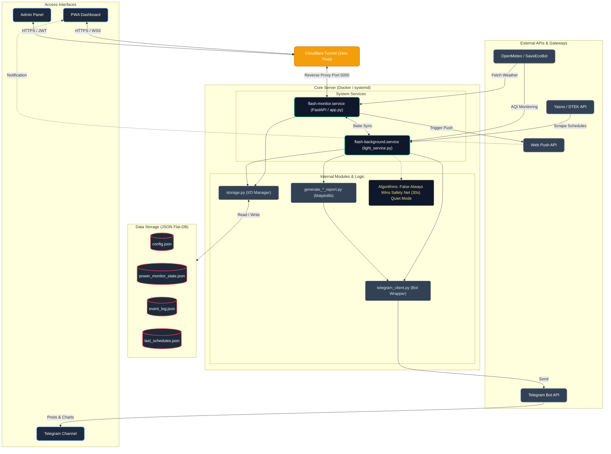

  
  

 

  
  

  

# СВІТЛО⚡️ БЕЗПЕКА (FLASH MONITOR KYIV) - Bare-metal Edition 

**Flash Monitor Kyiv** — це професійна автономна система моніторингу критичної інфраструктури та екологічної безпеки. Проєкт забезпевує моніторинг електропостачання в реальному часі, відстеження повітряних тривог, якості повітря (AQI) та радіаційного фону.

> **Статус проєкту:** Stable v3.3.6 (Stable & Test-Covered)
Ця гілка (`classic`) містить **Bare-metal версію** проєкту, яка розроблена для роботи як systemd служба.

> **Статус проєкту:** Stable v3.3.7 (Stable & Test-Covered)
> **Архітектура:** Python FastAPI + Background Workers + JSON Flat-DB + Bare Metal / systemd
> **Бренд:** Weby Homelab

## 📜 Основні характеристики
- **Admin Panel:** Веб-інтерфейс у стилі Glassmorphism.
- **Quiet Mode:** Інтелектуальне придушення сповіщень.
- **Safety Net:** Захист від втрати зв'язку.
- **Analytics:** Автоматичні графічні звіти (Matplotlib).
- **Security:** Zero-Trust політика, повний аудит.

## 🏗 System Architecture

```mermaid
flowchart TB
 %% Colors & Styles
 classDef client fill:#1e293b,stroke:#3b82f6,stroke-width:2px,color:#fff,rx:8px,ry:8px
 classDef cloudflare fill:#f59e0b,stroke:#d97706,stroke-width:2px,color:#fff,rx:8px,ry:8px
 classDef server fill:#0f172a,stroke:#10b981,stroke-width:2px,color:#fff,rx:8px,ry:8px
 classDef module fill:#334155,stroke:#475569,stroke-width:1px,color:#e2e8f0,rx:5px,ry:5px
 classDef db fill:#1e293b,stroke:#ef4444,stroke-width:2px,color:#fff,rx:8px,ry:8px
 classDef ext_api fill:#334155,stroke:#64748b,stroke-width:2px,color:#fff,rx:8px,ry:8px
 classDef logic fill:#0f172a,stroke:#eab308,stroke-width:1px,color:#fde68a,rx:5px,ry:5px,stroke-dasharray: 5 5

 subgraph TopLayer [" Access Interfaces"]
 direction LR
 PWA[" PWA Dashboard"]:::client
 Admin[" Admin Panel"]:::client
 Subscribers[" Telegram Channel"]:::client
 end

 CF[" Cloudflare Tunnel (Zero Trust)"]:::cloudflare

 PWA <-->|HTTPS / WSS| CF
 Admin <-->|HTTPS / JWT| CF

 subgraph CoreLayer [" Core Server (Docker / systemd)"]
 direction TB

 subgraph Services [" System Services"]
 direction LR
 API[" flash-monitor.service (FastAPI / app.py)"]:::server
 Worker[" flash-background.service (light_service.py)"]:::server
 end

 subgraph Modules [" Internal Modules & Logic"]
 direction LR
 Storage["storage.py (I/O Manager)"]:::module
 Reports["generate_*_report.py (Matplotlib)"]:::module
 TgClient["telegram_client.py (Bot Wrapper)"]:::module
 Rules[" Algorithms: False Always Wins Safety Net (30s) Quiet Mode"]:::logic
 end

 API <-->|State Sync| Worker
 Worker -.-> Rules
 Worker --> Reports
 Worker --> TgClient
 Reports --> TgClient
 API --> Storage
 Worker --> Storage
 end

 CF <-->|Reverse Proxy Port 5050| API

 subgraph DataLayer [" Data Storage (JSON Flat-DB)"]
 direction LR
 Config[("config.json")]:::db
 State[("power_monitor_state.json")]:::db
 Logs[("event_log.json")]:::db
 Sched[("last_schedules.json")]:::db
 end

 Storage <-->|Read / Write| DataLayer

 subgraph ExternalLayer [" External APIs & Gateways"]
 direction LR
 PushAPI[" Web Push API"]:::ext_api
 TgAPI[" Telegram Bot API"]:::ext_api
 Energy[" Yasno / DTEK API"]:::ext_api
 Meteo[" OpenMeteo / SaveEcoBot"]:::ext_api
 end

 API -->|Trigger Push| PushAPI
 PushAPI -.->|Notification| PWA
 
 TgClient -->|Send| TgAPI
 TgAPI -->|Posts & Charts| Subscribers
 
 Energy -->|Scrape Schedules| Worker
 Meteo -->|Fetch Weather| API
 Meteo -->|AQI Monitoring| Worker
```

## 📥 Встановлення
Див. [INSTRUCTIONS_INSTALL.md](INSTRUCTIONS_INSTALL.md).

## 📝 Історія змін
Повна історія змін доступна у [CHANGELOG.md](CHANGELOG.md).

---
**✦ 2026 Weby Homelab ✦**
