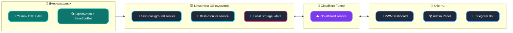

<p align="center">
  <a href="README_ENG.md">
    
  </a>
  <a href="README.md">
    
  </a>
</p>

<br>

<p align="center">
  
  
  
  
</p>

<p align="center">
  
</p>

# СВІТЛО⚡️ БЕЗПЕКА (FLASH MONITOR KYIV) - Bare-metal Edition [](https://github.com/weby-homelab/flash-monitor-kyiv/releases/latest)

**Flash Monitor Kyiv** — це професійна автономна система моніторингу критичної інфраструктури та екологічної безпеки. Проєкт забезпевує моніторинг електропостачання в реальному часі, відстеження повітряних тривог, якості повітря (AQI) та радіаційного фону.

Ця гілка (`classic`) містить **Bare-metal версію** проєкту, розроблену для прямого встановлення на сервер (Ubuntu/Debian) з використанням `systemd`.

> **Статус проєкту:** Stable v3.4.0 (Bare-metal Optimized)
> **Архітектура:** Python FastAPI + systemd services + venv + JSON Flat-DB
> **Бренд:** Weby Homelab

## 📜 Основні характеристики
- **High Performance:** Прямий доступ до ресурсів ОС.
- **Admin Panel:** Веб-інтерфейс у стилі Glassmorphism.
- **Quiet Mode:** Інтелектуальне придушення сповіщень.
- **Safety Net:** Захист від втрати зв'язку.
- **Analytics:** Автоматичні графічні звіти (Matplotlib).

---

## 🚀 Ключові інновації (v3.2+)

### 🎛 Панель Керування (Admin Panel)
Повністю автономний веб-інтерфейс у стилі **Glassmorphism** для керування всіма аспектами системи без необхідності редагування конфігураційних файлів через SSH.

<p align="center">
  
  
  
</p>

*   **Асинхронна швидкодія:** Новий асинхронний кеш (FastAPI) унеможливлює дедлоки та "зависання" при одночасному записі даних фоновими воркерами.
*   **Інтелектуальні бекапи:** Створення ручних та автоматичних точок відновлення конфігурації. Миттєве відновлення системи в один клік з авто-рестартом служб.
*   **Гнучке налаштування джерел:** Зміна пріоритету між Yasno, GitHub або підключення власного Custom JSON URL. Кнопка примусової синхронізації графіків.
*   **Повна Гео-адаптація:** Налаштування координат (Lat/Lon) для точної погоди, ID станції SaveEcoBot та керування відображенням віджетів.
*   **Безпека (Zero-Trust):** Усунуто LFI (Path Traversal) вразливості, забезпечено строгу перевірку шляхів до файлів.

---

## 🏗️ Архітектура системи (Bare-metal Pipeline)


```mermaid
flowchart LR
    classDef external fill:#0f766e,stroke:#14b8a6,stroke-width:3px,color:#fff,rx:16px,ry:16px
    classDef core fill:#1e293b,stroke:#22d3ee,stroke-width:3.5px,color:#fff,rx:14px,ry:14px
    classDef gateway fill:#7c3aed,stroke:#a78bfa,stroke-width:3px,color:#fff,rx:16px,ry:16px
    classDef client fill:#1e293b,stroke:#60a5fa,stroke-width:3px,color:#fff,rx:16px,ry:16px
    classDef db fill:#1e293b,stroke:#ec4899,stroke-width:3px,color:#fff,rx:12px,ry:12px

    subgraph External ["🔌 Джерела даних"]
        direction TB
        Energy["⚡ Yasno / DTEK API"]:::external
        Meteo["🌤️ OpenMeteo + SaveEcoBot"]:::external
    end

    subgraph Host ["💻 Linux Host OS (systemd)"]
        direction TB
        Worker["🔄 flash-background.service"]:::core
        API["🔌 flash-monitor.service"]:::core
        Storage["💾 Local Storage: /data"]:::db
    end

    subgraph Gateway ["🔐 Cloudflare Tunnel"]
        CF["☁️ cloudflared service"]:::gateway
    end

    subgraph Clients ["👥 Клієнти"]
        direction TB
        PWA["📱 PWA Dashboard"]:::client
        Admin["🛠️ Admin Panel"]:::client
        Telegram["📨 Telegram Bot"]:::client
    end

    External --> Host
    Host <--> Gateway
    Gateway <--> Clients
```

---

## 📥 Встановлення (Bare-metal)

1. **Клонуйте репозиторій та перейдіть на гілку classic:**
```bash
git clone https://github.com/weby-homelab/flash-monitor-kyiv.git
cd flash-monitor-kyiv
git checkout classic
```

2. **Створіть віртуальне середовище та встановіть залежності:**
```bash
python3 -m venv venv
source venv/bin/activate
pip install -r requirements.txt
```

3. **Налаштуйте systemd служби:**
Проєкт постачається з готовими `.service` файлами. Використовуйте інструкцію нижче для їх активації.

📖 **Документація:**
* [Покрокова інструкція з встановлення на Linux](docs/INSTRUCTIONS_INSTALL.md)
* [Детальне налаштування конфігурації](docs/INSTRUCTIONS.md)
* [Правила розробки (v3.2+)](docs/DEVELOPMENT.md)

---
**✦ 2026 Weby Homelab ✦**
