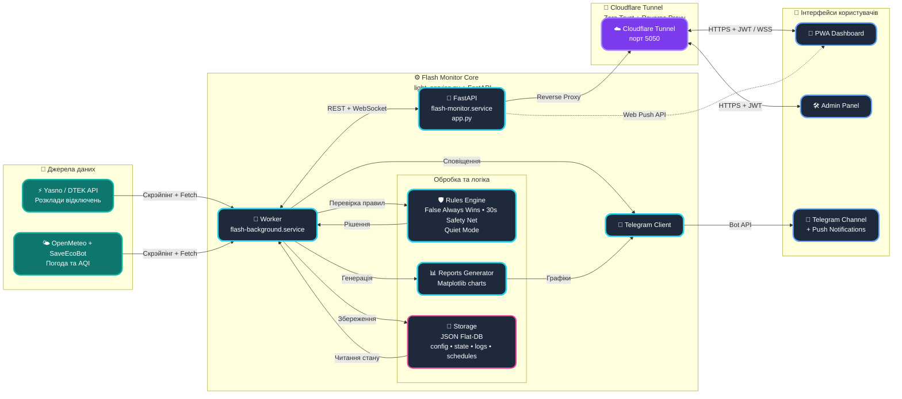

  
  

 

  
  

  

# СВІТЛО⚡️ БЕЗПЕКА (FLASH MONITOR KYIV) - Docker Edition 

**Flash Monitor Kyiv** — це професійна автономна система моніторингу критичної інфраструктури та екологічної безпеки. Проєкт забезпевує моніторинг електропостачання в реальному часі, відстеження повітряних тривог, якості повітря (AQI) та радіаційного фону.

> **Статус проєкту:** Stable v3.3.8 (Stable & Test-Covered)
> **Архітектура:** Python FastAPI + Background Workers + JSON Flat-DB + Docker / Docker Compose
> **Бренд:** Weby Homelab

## 📜 Основні характеристики
- **Admin Panel:** Веб-інтерфейс у стилі Glassmorphism.
- **Quiet Mode:** Інтелектуальне придушення сповіщень.
- **Safety Net:** Захист від втрати зв'язку.
- **Analytics:** Автоматичні графічні звіти (Matplotlib).
- **Security:** Zero-Trust політика, повний аудит.

## 🏗️ Архітектура системи

Flash Monitor — це система моніторингу відключень електрики з автоматичними сповіщеннями.

```mermaid
flowchart LR
    %% ================================================
    %% НОВА КОНЦЕПЦІЯ 2026 для README.md
    %% "End-to-End Pipeline" — динамічний потік даних
    %% Замість шарів — горизонтальний pipeline з чітким напрямком руху
    %% Ідеально виглядає в GitHub (темна/світла тема), чистий, сучасний, легко читається
    %% ================================================

    classDef external fill:#0f766e,stroke:#14b8a6,stroke-width:3px,color:#fff,rx:16px,ry:16px
    classDef core fill:#1e293b,stroke:#22d3ee,stroke-width:3.5px,color:#fff,rx:14px,ry:14px
    classDef gateway fill:#7c3aed,stroke:#a78bfa,stroke-width:3px,color:#fff,rx:16px,ry:16px
    classDef client fill:#1e293b,stroke:#60a5fa,stroke-width:3px,color:#fff,rx:16px,ry:16px
    classDef db fill:#1e293b,stroke:#ec4899,stroke-width:3px,color:#fff,rx:12px,ry:12px

    %% ====================== ЛІВА ЧАСТИНА: ДЖЕРЕЛА ДАНИХ ======================
    subgraph External ["🔌 Джерела даних"]
        direction TB
        Energy["⚡ Yasno / DTEK API<br>Розклади відключень"]:::external
        Meteo["🌤️ OpenMeteo + SaveEcoBot<br>Погода та AQI"]:::external
    end

    %% ====================== ЦЕНТР: CORE PIPELINE ======================
    subgraph Core ["⚙️ Flash Monitor Core<br>light_service.py + FastAPI"]
        direction TB

        Worker["🔄 Worker<br>flash-background.service"]:::core

        subgraph Processing ["Обробка та логіка"]
            direction LR
            Rules["🛡️ Rules Engine<br>False Always Wins • 30s Safety Net<br>Quiet Mode"]:::core
            Reports["📊 Reports Generator<br>Matplotlib charts"]:::core
            Storage["💾 Storage<br>JSON Flat-DB<br>config • state • logs • schedules"]:::db
        end

        API["🔌 FastAPI<br>flash-monitor.service<br>app.py"]:::core
        TgClient["🤖 Telegram Client"]:::core
    end

    %% ====================== ШЛЮЗ ======================
    subgraph Gateway ["🔐 Cloudflare Tunnel<br>Zero Trust + Reverse Proxy"]
        CF["☁️ Cloudflare Tunnel<br>порт 5050"]:::gateway
    end

    %% ====================== ПРАВА ЧАСТИНА: КЛІЄНТИ ======================
    subgraph Clients ["👥 Інтерфейси користувачів"]
        direction TB
        PWA["📱 PWA Dashboard"]:::client
        Admin["🛠️ Admin Panel"]:::client
        Telegram["📨 Telegram Channel<br>+ Push Notifications"]:::client
    end

    %% ====================== ПОТІК ДАНИХ (головна магістраль) ======================
    Energy & Meteo -->|Скрэйпінг + Fetch| Worker

    Worker -->|Перевірка правил| Rules
    Rules -->|Рішення| Worker

    Worker -->|Збереження| Storage
    Storage -->|Читання стану| Worker

    Worker -->|Генерація| Reports
    Worker -->|Сповіщення| TgClient
    Reports -->|Графіки| TgClient

    Worker <-->|REST + WebSocket| API

    API -->|Reverse Proxy| CF
    CF <-->|HTTPS + JWT / WSS| PWA
    CF <-->|HTTPS + JWT| Admin
    TgClient -->|Bot API| Telegram

    %% Додаткові push-сповіщення
    API -.->|Web Push API| PWA

    %% ====================== Стиль для заголовків підграфів ======================
    classDef subgraphTitle fill:#0f172a,stroke:none,color:#64748b,font-size:15px
```

## 📥 Встановлення
Див. [INSTRUCTIONS_INSTALL.md](docs/INSTRUCTIONS_INSTALL.md).

## 📝 Історія змін
Повна історія змін доступна у [CHANGELOG.md](docs/CHANGELOG.md).

---
**✦ 2026 Weby Homelab ✦**
