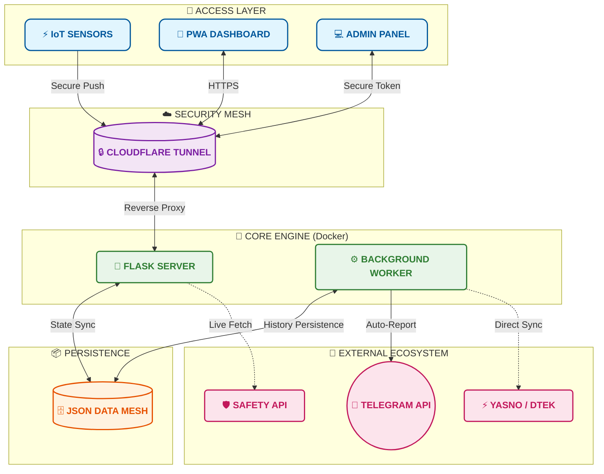

<p align="center">
  <a href="README_ENG.md">
    
  </a>
  <a href="README.md">
    
  </a>
</p>

<br>

<p align="center">
  
  
</p>

<p align="center">
  
</p>

# СВІТЛО⚡️ БЕЗПЕКА (FLASH MONITOR KYIV) [](https://github.com/weby-homelab/flash-monitor-kyiv/releases/latest)

**Flash Monitor Kyiv** — це професійна автономна система моніторингу критичної інфраструктури та екологічної безпеки м. Києва. Проєкт забезпечує моніторинг електропостачання в реальному часі, відстеження повітряних тривог, якості повітря (AQI) та радіаційного фону.

> **Статус проєкту:** Stable v2.4.8
> **Архітектура:** Python Flask + Background Workers + JSON Flat-DB
> **Бренд:** Weby Homelab

---

## 🚀 Ключові інновації (v2.0+)

### 1. Режим «Інформаційний спокій» (Quiet Mode)
Унікальний алгоритм, що мінімізує "інформаційний шум". Система автоматично переходить у стан спокою, якщо:
*   За останні **24 години** не було жодного відключення.
*   У графіках на наступні **24 години** не планується жодних обмежень.
У цьому режимі Telegram-сповіщення про втрату зв'язку спочатку надсилаються адміністратору для підтвердження, щоб не турбувати канал через технічні збої обладнання.

### 2. Safety Net (Мережа безпеки)
Інтерактивний механізм швидкого реагування:
*   При затримці сигналу (Push) понад **35 секунд**, адміністратор отримує запит у Telegram з варіантами дій: `🔴 Світло зникло`, `🛠 Технічний збій`, `🤷‍♂️ Не знаю`.
*   Це дозволяє зафіксувати аварію миттєво, не чекаючи стандартного 3-хвилинного таймауту.

### 3. Логіка «False Always Wins» (Захищене злиття)
Гібридна система обробки графіків (DTEK + Yasno):
*   **Пріоритет відключень:** Якщо хоча б одне джерело вказує на відключення (`False`), система відображає його як пріоритетне.
*   **Protective History Merge:** При оновленні даних старі записи про відключення ніколи не затираються "чистими" планами. Історична точність понад усе.

---

## 📊 Можливості дашборду (PWA)

Сучасний інтерфейс у стилі **Glassmorphism**, оптимізований для мобільних пристроїв:
*   **Live Status:** Візуалізація "Пульсу" системи (Світло Є! / Світло зникло!).
*   **Екологічний моніторинг:** Температура, вологість, PM2.5/PM10 (OpenMeteo/SaveEcoBot) та радіація з інтерактивними графіками за 24 години.
*   **Графік-бар:** Компактна 24-годинна шкала планових відключень.
*   **Аналітика:** Автоматична генерація щоденних та щотижневих графічних звітів прямо в Telegram та на сайт.

---

## 🎛 Панель Керування (Admin Panel)

Повністю автономний веб-інтерфейс для керування всіма аспектами системи без необхідності редагування конфігураційних файлів через SSH.

<p align="center">
  
  
  
</p>

### Основні функції:
*   **Інтелектуальні бекапи:** Створення ручних та автоматичних точок відновлення конфігурації. Миттєве відновлення системи в один клік з авто-рестартом.
*   **Гнучке налаштування джерел:** Зміна пріоритету між Yasno, GitHub або підключення власного Custom JSON URL. Кнопка примусової синхронізації.
*   **Гео-адаптація та Дашборд:** Налаштування координат (Lat/Lon) для точної погоди, ID станції SaveEcoBot та керування відображенням віджетів на головній сторінці.
*   **Повний контроль над Telegram:** Редактор шаблонів повідомлень, зміна іконок статусів, налаштування токенів бота та Chat ID безпосередньо в UI.
*   **Безпека:** Можливість миттєвої регенерації API-ключів та токенів адміністратора.

---

## 🏗 Архітектура / Architecture


```mermaid
flowchart TD
    %% -- Style Definitions --
    classDef access fill:#e1f5fe,stroke:#01579b,stroke-width:2px,color:#01579b,rx:10,ry:10
    classDef network fill:#f3e5f5,stroke:#7b1fa2,stroke-width:2px,color:#7b1fa2,rx:5,ry:5
    classDef core fill:#e8f5e9,stroke:#2e7d32,stroke-width:2px,color:#2e7d32,rx:5,ry:5
    classDef storage fill:#fff3e0,stroke:#e65100,stroke-width:2px,color:#e65100,rx:10,ry:10
    classDef external fill:#fce4ec,stroke:#c2185b,stroke-width:2px,color:#c2185b,rx:5,ry:5

    subgraph Access ["📡 ACCESS LAYER"]
        IoT["⚡ <b>IoT SENSORS</b>"]
        PWA["📱 <b>PWA DASHBOARD</b>"]
        ADM["💻 <b>ADMIN PANEL</b>"]
    end

    subgraph Network ["☁️ SECURITY MESH"]
        CF[("🔒 <b>CLOUDFLARE TUNNEL</b>")]
    end

    subgraph Core ["🚀 CORE ENGINE (Docker)"]
        direction TB
        WEB["🧪 <b>FLASK SERVER</b>"]
        WORKER["⚙️ <b>BACKGROUND WORKER</b>"]
    end

    subgraph Storage ["📦 PERSISTENCE"]
        JSON[("🗄️ <b>JSON DATA MESH</b>")]
    end

    subgraph Integration ["🔗 EXTERNAL ECOSYSTEM"]
        direction LR
        TG(("💬 <b>TELEGRAM API</b>"))
        DTEK["⚡ <b>YASNO / DTEK</b>"]
        SAFE["🛡️ <b>SAFETY API</b>"]
    end

    IoT -->|Secure Push| CF
    PWA <-->|HTTPS| CF
    ADM <-->|Secure Token| CF
    CF <-->|Reverse Proxy| WEB
    WEB <-->|State Sync| JSON
    WORKER <-->|History Persistence| JSON
    WORKER -->|Auto-Report| TG
    WORKER -.->|Direct Sync| DTEK
    WEB -.->|Live Fetch| SAFE

    class IoT,PWA,ADM access
    class CF network
    class WEB,WORKER core
    class JSON storage
    class TG,DTEK,SAFE external
```

---

## 🛠 Технічний стек / Tech Stack
- **Backend:** Python 3.12, Flask, Gunicorn.
- **Analytics:** Matplotlib, BeautifulSoup4.
- **Infra:** Docker & Docker Compose, Cloudflare Tunnel.

---

## 📥 Встановлення та розгортання

Проєкт має дві основні гілки:
1.  **`main` (Docker Edition):** Рекомендовано для швидкого старту.
    ```bash
    docker-compose up -d
    ```
2.  **`classic` (Bare-Metal Edition):** Для роботи безпосередньо в системі через `systemd`.

### Швидкий старт (Smart Bootstrap):
Система автоматично ініціалізується при першому запуску:
1.  Генерує унікальні `SECRET_KEY` та `ADMIN_TOKEN`.
2.  Створює структуру папок у `data/`.
3.  Завантажує актуальні графіки для вашої групи.

---

## 🛡 Безпека
*   Автентифікація через заголовки `X-Admin-Token` та `X-Secret-Key`.
*   Повна ізоляція середовищ (PROD/TEST).
*   Захист від маніпуляцій з URL в API запитах.

---

## 🤝 Контакти та розробка
Розробка ведеться **Weby Homelab**. 
Всі зміни вносяться згідно з **"Протоколом нульової толерантності до регресій"**.

© 2026 Weby Homelab.
