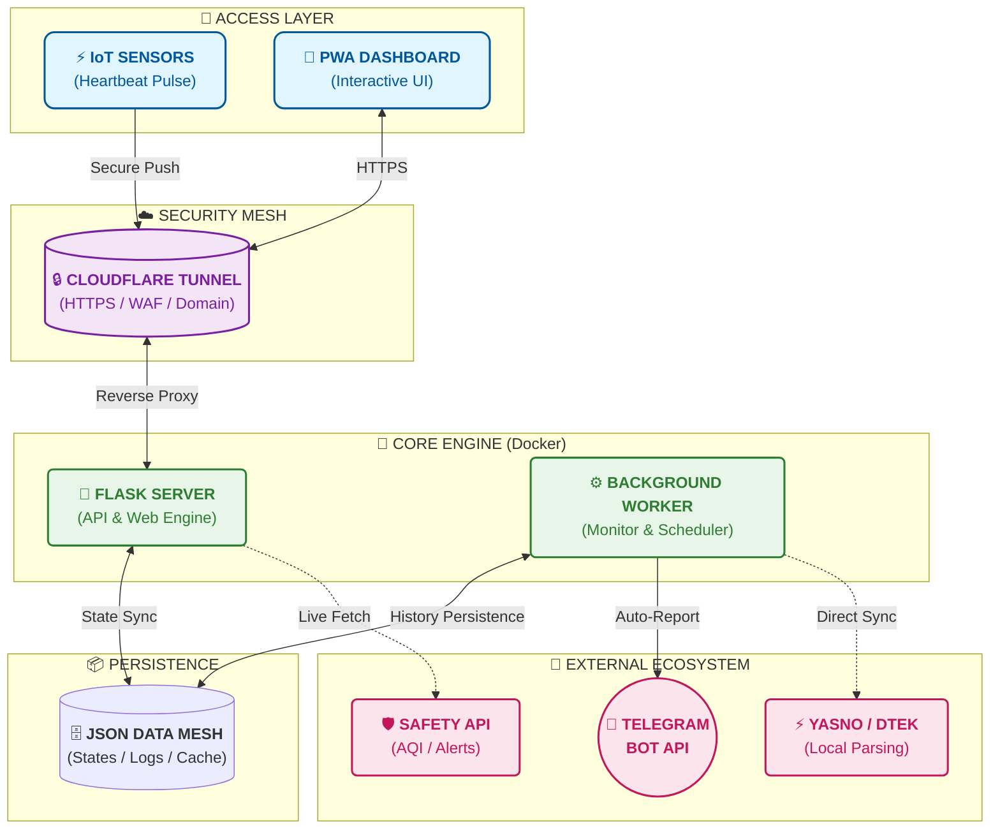

<p align="center">
  <a href="README_ENG.md">
    
  </a>
  <a href="README.md">
    
  </a>
</p>

<br>

# СВІТЛО⚡БЕЗПЕКА [](https://github.com/weby-homelab/flash-monitor-kyiv/releases/latest) Autonomous Edition

<p align="center">
  <a href="https://hub.docker.com/r/webyhomelab/flash-monitor-kyiv"></a>
  <a href="https://hub.docker.com/r/webyhomelab/flash-monitor-kyiv"></a>
  <a href="https://github.com/weby-homelab/flash-monitor-kyiv/commits/main"></a>
  <a href="https://github.com/weby-homelab/flash-monitor-kyiv/issues"></a>
  <a href="https://github.com/weby-homelab/flash-monitor-kyiv/blob/main/LICENSE"></a>
  
</p>

<p align="center">
  
</p>

**Автономна Docker-система моніторингу електропостачання та безпеки Києва.**

Останні виправлення та покращення:
- **v1.13.0:** Додано підтримку кастомних вібровідгуків (haptics) для PWA інтерфейсу (працює на Android та iOS 18+). Покращено тактильний досвід користувача при взаємодії зі сповіщеннями та графіками.
- **v1.12.3:** Консолідований реліз. Фіналізовано формат добових звітів («План vs Факт» в один рядок, `🕐 Оновлено`), повернуто оригінальний копірайт з посиланням на GitHub у футер дашборду, та стандартизовано оформлення документації.
- **v1.12.0:** Оновлено формат графічного добового звіту. Додано детальну аналітику "План vs Факт" з прямим порівнянням (`✅ Факт` vs `⚡️ План`), розрахунком відсотків виконання та міткою часу останнього оновлення (`🕐 Оновлено`).
- **v1.11.7:** Оновлено текстовий формат добового Telegram-звіту для кращого відображення аналітики "План vs Факт".
- **Forecast Logic:** Додано відображення часу наступного вимкнення/увімкнення в Telegram-повідомленнях навіть за відсутності точного графіка (показує 'невідомо').
- **Telegram Formatting:** Оновлено формат повідомлень про вимкнення світла. Тепер тривалість показується як "1д 5 год" (якщо >24г), додано детальний розрахунок відхилень від графіку ("На 1 год 8 хв пізніше") та прогнозу.
- **Alert Fix:** Виправлено помилку, через яку збої API або таймаути викликали хибні сповіщення про "Відбій тривоги".
- **Reporting Logic:** Новий інтелектуальний графік Telegram-звітів.
- **Performance:** Частоту фонового циклу оновлення даних збільшено до 10 хвилин.
- **Visual Style:** Впроваджено стиль "Black-and-White" (Glassmorphism, tabular-nums) для ідеального вирівнювання текстових графіків.
- **Merge Logic:** Виправлено розрахунок тривалості інтервалів, що переходять через північ, для коректного відображення в добових блоках.
- **Dashboard:** Додано відображення графіка на наступну добу з автоматичним розділенням днів та покращеною візуалізацією "План vs Факт".
- **Reliability:** Оптимізовано фонові процеси (run_background.py) для запобігання дублюванню потоків у Gunicorn.

**Проект забезпечує** повний контроль над енергетичною та безпековою ситуацією, аналізуючи реальні дані мережі та офіційні графіки Yasno/ДТЕК локально.

🔗 **Живий моніторинг:** [flash.srvrs.top](https://flash.srvrs.top/)

📖 **Інструкція:** [Встановлення та налаштування з нуля](INSTRUCTIONS_INSTALL.md)

---

## 🚀 Основні можливості

### 💡 Розумний Енергомоніторинг
- **Heartbeat Tracking:** Моніторинг світла в реальному часі через IoT-сигнали (Push API).
- **Аналітика «План vs Факт»:** Автоматичне порівняння реальних вимкнень із запланованими графіками прямо на дашборді.
- **Точність графіка:** Розрахунок відхилень (запізнення або раннє ввімкнення) для кожної події.
- **Візуалізація:** Генерація денних та тижневих чартів у фірмовому стилі.
- **UI/UX Дизайн:** Тема "Black-and-White" з ефектом Glassmorphism та моноширинними шрифтами для чітких звітів.

### 🛡️ Безпека та Екологія
- **Повітряні тривоги:** Миттєвий статус та сповіщення у Telegram про початок та відбій тривоги в м. Київ.
- **Live-карта:** Інтегрована мапа тривог Києва та області.
- **Якість повітря (AQI):** Моніторинг PM2.5, PM10 та радіаційного фону (локація: Симиренка).
- **Погода:** Актуальна температура, вологість та параметри вітру.

### 🔔 Сповіщення у Telegram
- **Інтелектуальні звіти:** Текстові графіки з вирівнюванням тривалості по правому краю (tabular-nums).
- **Morning Report (06:00):** Повний огляд ситуації на сьогодні та завтра (якщо доступно).
- **Evening/Instant Update:** Автоматичне надсилання завтрашнього графіка одразу після його публікації ДТЕК.
- **Smart Merge:** Коректне об'єднання нічних інтервалів.

---

## 🏗 Архітектура Системи [](https://github.com/weby-homelab/flash-monitor-kyiv/releases/latest)


```mermaid
flowchart TD
    %% -- Style Definitions --
    classDef access fill:#e1f5fe,stroke:#01579b,stroke-width:2px,color:#01579b,rx:10,ry:10
    classDef network fill:#f3e5f5,stroke:#7b1fa2,stroke-width:2px,color:#7b1fa2,rx:5,ry:5
    classDef core fill:#e8f5e9,stroke:#2e7d32,stroke-width:2px,color:#2e7d32,rx:5,ry:5
    classDef data fill:#fff3e0,stroke:#e65100,stroke-width:2px,color:#e65100,rx:10,ry:10
    classDef external fill:#fce4ec,stroke:#c2185b,stroke-width:2px,color:#c2185b,rx:5,ry:5

    %% -- Access Layer --
    subgraph Access ["📡 ACCESS LAYER"]
        IoT["⚡ <b>IoT SENSORS</b><br/>(Heartbeat Pulse)"]
        PWA["📱 <b>PWA DASHBOARD</b><br/>(Interactive UI)"]
    end

    %% -- Network Layer --
    subgraph Network ["☁️ SECURITY MESH"]
        CF[("🔒 <b>CLOUDFLARE TUNNEL</b><br/>(HTTPS / WAF / Domain)")]
    end

    %% -- Core Engine --
    subgraph Core ["🚀 CORE ENGINE (Docker)"]
        direction TB
        WEB["🧪 <b>FLASK SERVER</b><br/>(API & Web Engine)"]
        WORKER["⚙️ <b>BACKGROUND WORKER</b><br/>(Monitor & Scheduler)"]
    end

    %% -- Data Layer --
    subgraph Storage ["📦 PERSISTENCE"]
        JSON[("🗄️ <b>JSON DATA MESH</b><br/>(States / Logs / Cache)")]
    end

    %% -- External Ecosystem --
    subgraph Integration ["🔗 EXTERNAL ECOSYSTEM"]
        direction LR
        TG(("💬 <b>TELEGRAM<br/>BOT API</b>"))
        DTEK["⚡ <b>YASNO / DTEK</b><br/>(Local Parsing)"]
        SAFE["🛡️ <b>SAFETY API</b><br/>(AQI / Alerts)"]
    end

    %% -- Connections --
    IoT -->|Secure Push| CF
    PWA <-->|HTTPS| CF
    CF <-->|Reverse Proxy| WEB
    
    WEB <-->|State Sync| JSON
    WORKER <-->|History Persistence| JSON
    
    WORKER -->|Auto-Report| TG
    WORKER -.->|Direct Sync| DTEK
    WEB -.->|Live Fetch| SAFE

    %% -- Applying Styles --
    class IoT,PWA access
    class CF network
    class WEB,WORKER core
    class JSON storage
    class TG,DTEK,SAFE external
```

---

## 🐳 Швидкий запуск через Docker

**Офіційний образ:** `webyhomelab/flash-monitor-kyiv:latest`

### Docker Compose
```yaml
services:
  web:
    image: webyhomelab/flash-monitor-kyiv:latest
    container_name: flash-monitor-web
    ports: ["5050:5050"]
    volumes: ["./data:/app/data"]
    environment:
      - TELEGRAM_BOT_TOKEN=your_token
      - TELEGRAM_CHANNEL_ID=your_channel_id
      - DATA_DIR=/app/data

  worker:
    image: webyhomelab/flash-monitor-kyiv:latest
    container_name: flash-monitor-worker
    command: python run_background.py
    volumes: ["./data:/app/data"]
    environment:
      - TELEGRAM_BOT_TOKEN=your_token
      - TELEGRAM_CHANNEL_ID=your_channel_id
      - DATA_DIR=/app/data
```

---

## 💡 Порада для IoT-датчиків (Heartbeat)

Для надсилання Push-сигналів рекомендується використовувати **HTTPS-адресу вашого домену** (наприклад, через Cloudflare Tunnel) замість прямої IP-адреси:

*   **🛡️ Безпека:** HTTPS шифрує ваш секретний ключ під час передачі.
*   **🧩 Гнучкість:** При зміні сервера вам не потрібно перепрошивати датчики — достатньо змінити налаштування тунелю.

**Приклад:** `https://flash.srvrs.top/api/push/ваш_ключ`

---

## 🛠 Технологічний стек
- **Backend:** Python 3.11, Flask, Gunicorn.
- **Analytics:** Matplotlib, BeautifulSoup4.
- **Infra:** Docker, PWA (Progressive Web App).

---

## 🌐 Weby Homelab Ecosystem
[](https://github.com/weby-homelab/flash-monitor-kyiv)
[](https://github.com/weby-homelab/light-monitor-kyiv)
[](https://github.com/weby-homelab/security-monitor-kyiv)

---

## 📜 Ліцензія
Розповсюджується під ліцензією **MIT**.

<p align="center">
  ✦ 2026 Weby Homelab ✦<br>
  Made with ❤️ in Kyiv under air raid sirens and blackouts
</p>

---

### 📊 Історія оновлень

#### **v1.14.2** (2026-03-07)
- **Інтерфейс:** Оновлено фавікон та PWA-іконки дашборду на новий логотип СВІТЛО⚡️ БЕЗПЕКА.
- **Виправлення:** Виправлено тести `test_daily_report.py`.

#### **v1.14.1** (2026-03-06)
- **Безпека:** Виправлено конфігурацію ізоляції середовищ. Впроваджено жорсткий мандат ZERO-TOLERANCE DEPLOYMENT RULES для запобігання перехресному надсиланню сповіщень між тестовими та робочими серверами.

#### **v1.14.0** (2026-03-06)
- **Живий моніторинг:** Перехід на новий день тепер відбувається о **06:00** ранку.
- **Нічний буфер:** З 00:00 до 06:00 система продовжує оновлювати вчорашній звіт для повного підсумку доби.
- **Адаптивна термінологія:** Заголовок повідомлення змінюється автоматично: **"Моніторинг"** (до 12:00) та **"Звіт"** (після 12:00).
- **Оптимізація:** Покращено логіку перерахунку "План vs Факт" для коректного відображення статистики при переході через опівночі.

#### **v1.13.0** (2026-02-28)
- Додано підтримку кастомного тактильного відгуку (haptic feedback) для PWA-інтерфейсу (Android та iOS 18+).
- Покращено тактильну взаємодію з графіками та сповіщеннями.

