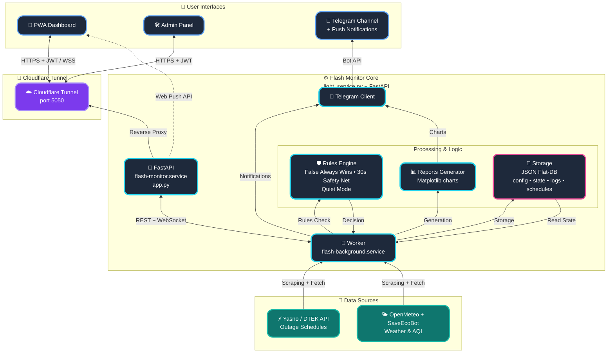

  
  

 

  
  
  
  

  

# POWER⚡️ SAFETY (FLASH MONITOR KYIV) - Bare-metal Edition 

**Flash Monitor Kyiv** is a professional autonomous monitoring system for critical infrastructure and environmental safety. The project provides precision real-time electricity monitoring, intelligent outage schedule processing (DTEK/Yasno), air raid alert tracking, air quality (AQI), and radiation background levels.

This branch (`classic`) contains the **Bare-Metal Edition** of the project, designed for direct deployment on a server running Ubuntu (or Debian) using `systemd` services, without Docker.

> **Project Status:** Stable v3.4.1 (Bare-metal Optimized)
> **Architecture:** FastAPI + Gunicorn (Uvicorn Workers) + Background Services + Systemd
> **Brand:** Weby Homelab

---

## 🛠 Technology Stack (Bare-metal Edition)
- **Runtime:** Python 3.12+ running directly on the host OS.
- **Process Management:** Dual-stack `systemd` setup:
    *   `flash-monitor.service` — asynchronous Dashboard and API.
    *   `flash-background.service` — background monitoring, schedule parsing, and Telegram worker.
- **Web-Core:** FastAPI with WebSocket and SSE support via `gunicorn`.
- **Data Persistence:** Direct filesystem access for JSON Flat-DB, optimized for low-latency I/O.

---

## 🚀 Core Innovations & Algorithms

### 🎛 Admin Control Panel
A fully autonomous **Glassmorphism** web interface to manage all system aspects without the need for SSH or direct configuration file editing.

  
  
  

*   **Asynchronous Performance:** A new async caching mechanism eliminates deadlocks between the background worker and user requests.
*   **Smart Backups:** Instant one-click system recovery with automatic system service restarts.
*   **Security (Zero-Trust):** Implements strict Path Traversal protection and secure path validation.

### 🤫 «Quiet Mode» (Information Calm)
A unique algorithm that minimizes "information noise." The system automatically enters a calm state if no outages occurred in the last 24 hours and no restrictions are planned for the upcoming day.

### ⚖️ «False Always Wins» Logic
A hybrid schedule processing system. If at least one source indicates an outage, the system prioritizes it. Historical records are never overwritten by "clean" plans.

---

### 📱 Real Message Examples (Telegram)
- 📊 **[Daily "Plan vs Fact" Chart (Smart Daily Report)](https://t.me/svitlobot_Symyrenka22B/1230)**
- 📈 **[Weekly outage analytics](https://t.me/svitlobot_Symyrenka22B/1192)**
- 🔴 **[Outage notification with schedule accuracy](https://t.me/svitlobot_Symyrenka22B/1209)**
- 🟢 **[Restoration notification with schedule accuracy](https://t.me/svitlobot_Symyrenka22B/1212)**
- ⚠️ **[Instant alert about DTEK schedule change](https://t.me/svitlobot_Symyrenka22B/1222)**
- 📈 **[Publication of DTEK and YASNO schedules](https://t.me/svitlobot_Symyrenka22B/1219)**
- 🚨 **[Air raid alert in Kyiv](https://t.me/svitlobot_Symyrenka22B/1196)**
- ✅ **[Air raid all-clear notification](https://t.me/svitlobot_Symyrenka22B/1197)**

## 🏗️ System Architecture

---

## 📥 Installation

For a detailed step-by-step guide on deploying the project on an Ubuntu/Debian server, please follow the link below:

📖 **[FULL INSTALLATION GUIDE (BARE-METAL)](docs/INSTRUCTIONS_INSTALL_ENG.md)**

---

📖 **Additional Documentation:**
* [⚙️ Telegram & IoT Setup](docs/INSTRUCTIONS_ENG.md)
* [📝 Change History (CHANGELOG.md)](docs/CHANGELOG.md)

---

 

  Built in Ukraine under air raid sirens &amp; blackouts ⚡ 
  &copy; 2026 Weby Homelab

