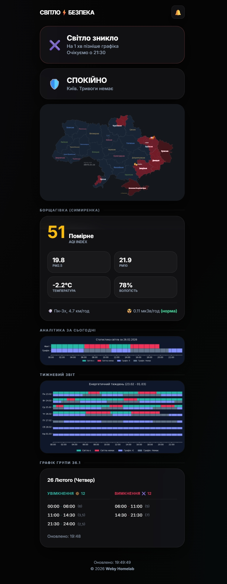
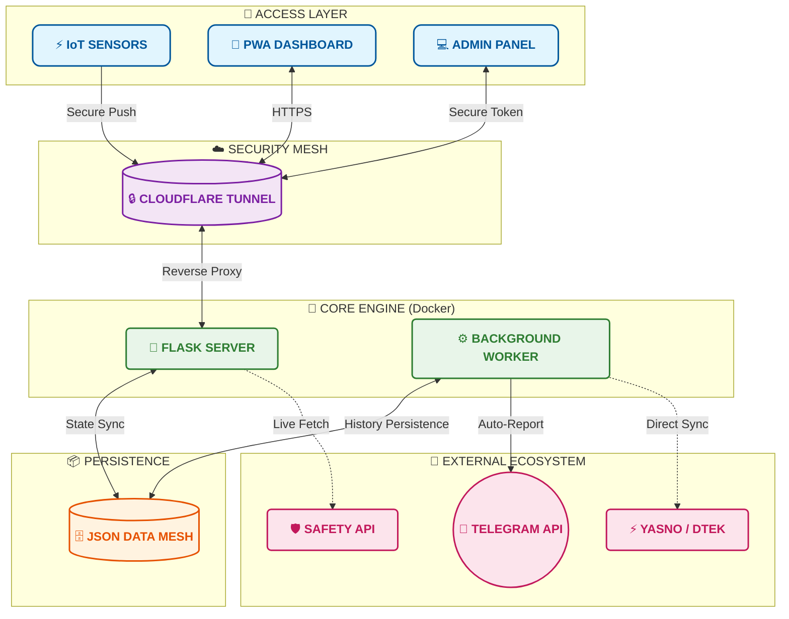

# СВІТЛО⚡️ БЕЗПЕКА (FLASH MONITOR KYIV) 

# LIGHT⚡️ SAFETY  DOCKER Edition

  
  
  
  

---

**Flash Monitor Kyiv** is a professional, autonomous monitoring system for critical infrastructure and environmental safety in Kyiv. The project provides real-time power monitoring, air raid alerts tracking, air quality index (AQI), and radiation background levels.

> **Project Status:** Stable v2.4.7
> **Architecture:** Python Flask + Background Workers + JSON Flat-DB
> **Brand:** Weby Homelab

---

## 🚀 Core Innovations (v2.0+)

### 1. "Quiet Mode" (Information Peace)
A unique algorithm that minimizes "information noise." The system automatically enters a quiet state if:
*   There have been **no outages** in the past **24 hours**.
*   There are **no planned outages** in the schedule for the next **24 hours**.
In this mode, Telegram notifications about connection loss are first sent to the administrator for confirmation, preventing false alarms due to technical hardware glitches.

### 2. Safety Net
An interactive rapid response mechanism:
*   If the heart-beat signal (Push) is delayed for more than **35 seconds**, the administrator receives a Telegram prompt with action buttons: `🔴 Power Down`, `🛠 Technical Failure`, `🤷‍♂️ Don't Know`.
*   This allows the system to record an outage instantly without waiting for the standard 3-minute hard timeout.

### 3. "False Always Wins" Logic (Protected Merging)
A hybrid schedule processing system (DTEK + Yasno):
*   **Outage Priority:** If at least one source indicates an outage (`False`), the system displays it as the priority state.
*   **Protective History Merge:** When updating data, old outage records are never overwritten by new "all-clear" plans. Historical accuracy is paramount.

---

## 📊 Dashboard Features (PWA)

Modern **Glassmorphism** interface, fully mobile-optimized:
*   **Live Status:** Real-time "Pulse" visualization (Power ON! / Power OFF!).
*   **Environmental Monitoring:** Temperature, Humidity, PM2.5/PM10 (via OpenMeteo/SaveEcoBot), and Radiation with interactive 24-hour history graphs.
*   **Schedule Bar:** A compact 24-hour visualization of planned outages.
*   **Analytics:** Automatic generation of daily and weekly graphical reports sent directly to Telegram and the web dashboard.

---

## 🏗 Architecture

---

## 🛠 Tech Stack
- **Backend:** Python 3.12, Flask, Gunicorn.
- **Analytics:** Matplotlib, BeautifulSoup4.
- **Infra:** Docker & Docker Compose, Cloudflare Tunnel.

---

## 📜 License
Distributed under the **MIT** license.

© 2026 Weby Homelab.
