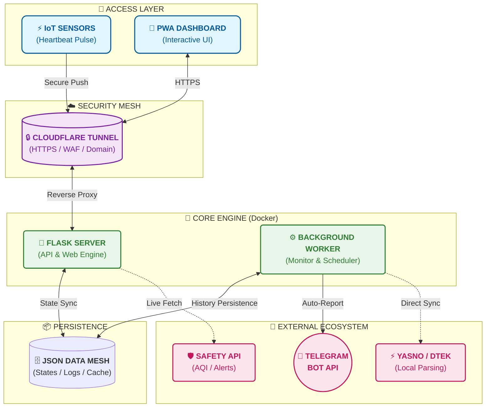

<p align="center">
  <a href="README_ENG.md">
    
  </a>
  <a href="README.md">
    
  </a>
</p>

<br>

# СВІТЛО⚡БЕЗПЕКА (Light & Safety) [](https://github.com/weby-homelab/flash-monitor-kyiv/releases/latest) DOCKER Edition

<p align="center">
  <a href="https://hub.docker.com/r/webyhomelab/flash-monitor-kyiv"></a>
  <a href="https://hub.docker.com/r/webyhomelab/flash-monitor-kyiv"></a>
  <a href="https://github.com/weby-homelab/flash-monitor-kyiv/commits/main"></a>
  <a href="https://github.com/weby-homelab/flash-monitor-kyiv/issues"></a>
  <a href="https://github.com/weby-homelab/flash-monitor-kyiv/blob/main/LICENSE"></a>
  
  
</p>

<p align="center">
  
</p>

**Autonomous Docker-based Power & Safety Monitoring System for Kyiv.**

**This project provides** full control over the energy and security situation by analyzing real network data and official DTEK/Yasno schedules locally.

🔗 **Live Dashboard:** [flash.srvrs.top](https://flash.srvrs.top/)

## 📚 Project Documentation
| File | Description |
| :--- | :--- |
| 📖 **[Installation and Setup Guide](INSTRUCTIONS_INSTALL_ENG.md)** | Main guide for deploying the system (Docker, environment variables, API). |
| 🔌 **[IoT Devices Setup](INSTRUCTIONS_ENG.md)** | Sketches and instructions for ESP8266/ESP32 microcontrollers (physical power presence sensors). |
| 🛠️ **[Development Guide](DEVELOPMENT_ENG.md)** | Architectural rules, security protocols, and code deployment instructions. |

---

## 🚀 Key Features

### 💡 Smart Power Monitoring
- **Smart Bootstrap:** Automatic deployment of current planned schedules for your specific group and region upon first launch.
- **Heartbeat Tracking & Manual Trigger:** Real-time power monitoring via IoT signals (`/api/push`) and instant manual status control (`/api/down`).
- **API Resilience:** Reliable local caching of schedules, protecting against DTEK/Yasno server downtimes.
- **"Plan vs Fact" Analytics:** Automatic comparison of actual outages with planned schedules directly on the dashboard.
- **Schedule Accuracy:** Calculation of deviations (late or early power restoration/outage) for every event.
- **Visualization:** Generation of daily and weekly analytical charts in a signature style.
- **UI/UX Design:** "Black-and-White" Glassmorphism theme with monospace fonts for clear, tabular reports.

### 🛡️ Safety & Environment
- **Air Raid Alerts:** Instant Telegram notifications about the start and end of air raid alerts in Kyiv.
- **Live Map:** Integrated interactive map of alerts for Kyiv and the region.
- **Air Quality (AQI):** Monitoring of PM2.5, PM10, and radiation background (location: Symyrenka).
- **Weather:** Current temperature, humidity, and wind parameters.

### 🔔 Telegram Notifications
- **Intelligent Reports:** Text-based schedule lists with right-aligned duration times (tabular-nums).
- **Morning Report (06:00):** Comprehensive overview of the situation for today and tomorrow (if available).
- **Evening/Instant Update:** Automatic dispatch of tomorrow's schedule immediately after its publication by DTEK.
- **Smart Merge:** Correct merging and calculation of overnight power intervals.

---

## 🏗 System Architecture [](https://github.com/weby-homelab/flash-monitor-kyiv/releases/latest)



---

## 🐳 Quick Start via Docker

**Official Image:** `webyhomelab/flash-monitor-kyiv:latest`

### Docker Compose
```yaml
services:
  web:
    image: webyhomelab/flash-monitor-kyiv:latest
    container_name: flash-monitor-web
    ports: ["5050:5050"]
    volumes: ["./data:/app/data"]
    environment:
      - TELEGRAM_BOT_TOKEN=your_token
      - TELEGRAM_CHANNEL_ID=your_channel_id
      - DATA_DIR=/app/data

  worker:
    image: webyhomelab/flash-monitor-kyiv:latest
    container_name: flash-monitor-worker
    command: python run_background.py
    volumes: ["./data:/app/data"]
    environment:
      - TELEGRAM_BOT_TOKEN=your_token
      - TELEGRAM_CHANNEL_ID=your_channel_id
      - DATA_DIR=/app/data
```

---

## 💡 Tip for IoT Sensors (Heartbeat)

For sending Push signals, it is highly recommended to use the **HTTPS address of your domain** (e.g., via Cloudflare Tunnel) instead of a direct IP address:

*   **🛡️ Security:** HTTPS encrypts your secret key during transmission.
*   **🧩 Flexibility:** If you change servers, you won't need to reflash your hardware sensors — simply update the tunnel settings.

**Example:** `https://flash.srvrs.top/api/push/your_secret_key`

---

## 🛠 Tech Stack
- **Backend:** Python 3.11, Flask, Gunicorn.
- **Analytics:** Matplotlib, BeautifulSoup4.
- **Infra:** Docker, PWA (Progressive Web App).

---

## 📜 License
Distributed under the **MIT** License.

<p align="center">
  ✦ 2026 Weby Homelab ✦<br>
  Made with ❤️ in Kyiv under air raid sirens and blackouts
</p>

---
