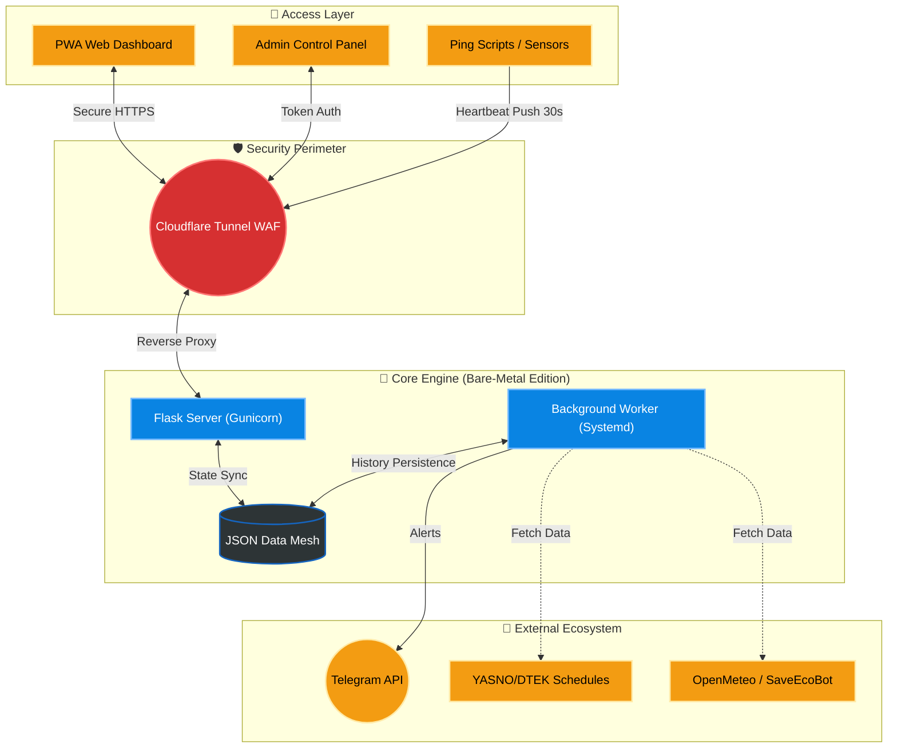

<p align="center">
  <a href="README_ENG.md">
    
  </a>
  <a href="README.md">
    
  </a>
</p>

<br>

<p align="center">
  
  
</p>

<p align="center">
  
</p>

# СВІТЛО⚡️ БЕЗПЕКА (FLASH MONITOR KYIV) - Bare-Metal Edition [](https://github.com/weby-homelab/flash-monitor-kyiv/releases/latest)

**Flash Monitor Kyiv** is a professional, autonomous monitoring system for critical infrastructure and environmental safety. The project provides real-time power monitoring, air raid alerts tracking, air quality index (AQI), and radiation background levels.

This branch (`classic`) contains the **Bare-Metal Edition** of the project, designed to run directly on the host system (e.g., via `systemd`), without Docker.

> **Project Status:** Stable v3.2.3 (Security Patch, Silent Alerts & Stability)
> **Architecture:** Python Flask + Background Workers + JSON Flat-DB + Systemd
> **Brand:** Weby Homelab

---

## 🛡 What's New in v3.2.3
*   **Security (LFI/SSRF Fix):** Addressed critical Path Traversal vulnerabilities in static file serving and restricted SSRF risks in `custom_url` by forcing HTTP/HTTPS protocols.
*   **Timing Attack Protection:** API routes (`push_api`, `down_api`, `admin_data`) now securely validate authorization keys using `secrets.compare_digest()`.
*   **Race Conditions Prevented:** Safely wrapped competitive requests from Telegram Webhooks and APIs in transaction-like contexts to prevent data corruption.
*   **SSE Memory Leak Fix:** Handled inactive connections logic for `/api/status/stream` to prevent background ghost connections.
*   **Air Raid Configuration Fix:** The default for air alerts is now muted in JSON, and parsing for false-boolean strings has been fixed.

## 🚀 Core Innovations (v3.0+)

### 🎛 Admin Control Panel
A fully autonomous Glassmorphism web interface to manage all aspects of the system without the need to edit configuration files via SSH.

<p align="center">
  
  
  
</p>

*   **Smart Backups:** Create manual and automatic restore points for your configuration. Instant one-click recovery with automatic service restart.
*   **Flexible Source Management:** Change priority between Yasno, GitHub, or connect your own Custom JSON URL. Includes a manual force-sync button.
*   **Complete Geo-Adaptation:** Set coordinates (Lat/Lon) for accurate weather, SaveEcoBot station ID, and toggle widget visibility on the main dashboard for any region.
*   **Template Editor:** Full control over Telegram notification texts, prefixes, and status icons directly in the UI.
*   **Security:** Instant regeneration of API keys and administrator tokens with secure redirection.

### 🤫 "Quiet Mode" (Information Peace)
A unique algorithm that minimizes "information noise." The system automatically enters a quiet state if there have been no outages in the past 24 hours, and there are no planned outages in the schedule for the next 24 hours.

### 🚨 Safety Net
An interactive rapid response mechanism: if the heart-beat signal (Push) is delayed for more than 35 seconds, the administrator receives a Telegram prompt with action buttons (`🔴 Power Down`, `🛠 Technical Failure`, `🤷‍♂️ Don't Know`).

### ⚖️ "False Always Wins" Logic
A hybrid schedule processing system. If at least one source indicates an outage (`False`), the system displays it as the priority state. Old outage records are never overwritten by new "all-clear" plans.

---

## 📱 Real Telegram Message Examples

*   📊 **[Daily "Plan vs Fact" Report (Smart Daily Report)](https://t.me/svitlobot_Symyrenka22B/1230)**
*   📈 **[Weekly Analytics Summary](https://t.me/svitlobot_Symyrenka22B/1192)**
*   🔴 **[Power Outage Alert with Schedule Accuracy](https://t.me/svitlobot_Symyrenka22B/1209)**
*   🟢 **[Power Restoration Alert with Schedule Accuracy](https://t.me/svitlobot_Symyrenka22B/1212)**
*   ⚠️ **[Instant Alert on DTEK Schedule Change](https://t.me/svitlobot_Symyrenka22B/1222)**
*   📋 **[DTEK and YASNO Schedules Publication](https://t.me/svitlobot_Symyrenka22B/1219)**
*   🚨 **[Air Raid Alert Notification in Kyiv](https://t.me/svitlobot_Symyrenka22B/1196)**
*   ✅ **[Air Raid All-Clear Notification](https://t.me/svitlobot_Symyrenka22B/1197)**

---

## 📊 Dashboard Features (PWA)

Modern **Glassmorphism** interface, fully mobile-optimized:
*   **Live Status:** Real-time "Pulse" visualization (Power ON! / Power OFF!).
*   **Environmental Monitoring:** Temperature, Humidity, PM2.5/PM10 (via OpenMeteo/SaveEcoBot), and Radiation with interactive 24-hour history graphs.
*   **Schedule Bar:** A compact 24-hour visualization of planned outages.
*   **Analytics:** Automatic generation of daily and weekly graphical reports sent directly to Telegram and the web dashboard.

---

## 🏗 System Architecture



---

## 🛠 Tech Stack (Bare-Metal Edition)
- **Backend:** Python 3.12, **Flask**, Gunicorn.
- **Analytics:** Matplotlib, BeautifulSoup4.
- **Infra:** Systemd, Nginx / Cloudflare Tunnel.

### 💡 Why Flask and Sync I/O? (Classic Branch Architecture)
At the core of the project lies the **JSON Data Mesh** — a lightweight flat-file database. In a traditional Bare-Metal deployment, we have the luxury of relying on robust OS-level file locking mechanisms and process managers like **Systemd**.
The synchronous **Flask + Gunicorn** stack is perfectly suited for this environment:
1. If the Background Script holds a lock on a file for writing, other Gunicorn worker processes continue to smoothly serve web clients.
2. It avoids the severe multi-threading bottlenecks often encountered in resource-constrained Docker containers.
*(For isolated **Docker** environments, where synchronous file access can lead to hard Deadlocks, we engineered a fully asynchronous version powered by FastAPI — available in the `main` branch).*

---

## 📥 Installation & Setup

The project has two main branches:

1.  **`main` (Docker Edition):** Recommended for a quick start.
    ```bash
    # Download and run via Docker Compose
    docker-compose up -d
    ```
2.  **`classic` (Bare-Metal Edition):** For stable operation directly on the system via **Systemd**.

📖 **Installation Guides:**
*   👉 [**Step-by-Step Guide for Bare-Metal (Systemd)**](INSTRUCTIONS_INSTALL_ENG.md)
*   [Detailed Configuration Setup](INSTRUCTIONS_ENG.md)
*   [Development Rules & Guidelines](DEVELOPMENT_ENG.md)

### Quick Start (Smart Bootstrap):
The system automatically initializes on the first run:
1.  Generates a unique `SECRET_KEY` and `ADMIN_TOKEN`.
2.  Creates the directory structure in `data/` with default v3 settings.
3.  Downloads up-to-date schedules for your power group.

---

## 📜 License
Distributed under the **MIT** license.

© 2026 Weby Homelab.