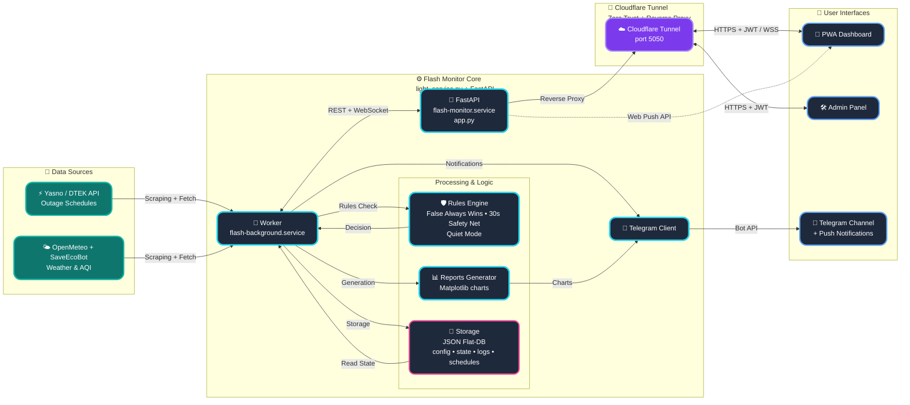

<p align="center">
  <a href="README_ENG.md">
    
  </a>
  <a href="README.md">
    
  </a>
</p>

<br>

<p align="center">
  
  
</p>

<p align="center">
  
</p>

# POWER⚡️ SAFETY (FLASH MONITOR KYIV) - Bare-metal Edition [](https://github.com/weby-homelab/flash-monitor-kyiv/releases/latest)

**Flash Monitor Kyiv** is a professional autonomous monitoring system for critical infrastructure and environmental safety. The project provides real-time electricity monitoring, air raid alerts tracking, air quality (AQI), and radiation background levels.

This branch (`classic`) contains the **Bare-metal Edition** of the project, designed for running as a systemd service.

> **Project Status:** Stable v3.3.8 (Stable & Test-Covered)
> **Architecture:** Python FastAPI + Background Workers + JSON Flat-DB + Bare Metal / systemd
> **Brand:** Weby Homelab

---

## Project History
For a complete history of updates, changes, and bug fixes, please refer to the [CHANGELOG.md](docs/CHANGELOG.md).

## 🚀 Core Innovations (v3.2+)

### 🎛 Admin Control Panel
A fully autonomous Glassmorphism web interface to manage all aspects of the system without the need to edit configuration files via SSH.

<p align="center">
  
  
  
</p>

*   **Asynchronous Performance:** The new async caching mechanism (FastAPI) completely eliminates deadlocks when multiple background workers write data simultaneously.
*   **Smart Backups:** Create manual and automatic restore points for your configuration. Instant one-click recovery with automatic service restart.
*   **Flexible Source Management:** Change priority between Yasno, GitHub, or connect your own Custom JSON URL. Includes a manual force-sync button.
*   **Complete Geo-Adaptation:** Set coordinates (Lat/Lon) for accurate weather, SaveEcoBot station ID, and toggle widget visibility.
*   **Security (Zero-Trust):** Fixed LFI (Path Traversal) vulnerabilities by implementing strict path validation. Access keys are safely generated during bootstrap.

---

---

## 🚀 Core Innovations (v3.2+)

### 🎛 Admin Control Panel
A fully autonomous **Glassmorphism** web interface to manage all aspects of the system without the need to edit configuration files via SSH.

<p align="center">
  
  
  
</p>

*   **Asynchronous Performance:** The new async caching mechanism (FastAPI) eliminates deadlocks and "freezes" during simultaneous data writes by background workers.
*   **Smart Backups:** Create manual and automatic restore points for your configuration. Instant one-click recovery with automatic service restart.
*   **Flexible Source Management:** Change priority between Yasno, GitHub, or connect your own Custom JSON URL. Manual force-sync button for schedules.
*   **Complete Geo-Adaptation:** Set coordinates (Lat/Lon) for accurate weather, SaveEcoBot station ID, and toggle widget visibility.
*   **Security (Zero-Trust):** Fixed LFI (Path Traversal) vulnerabilities with strict path validation. Access keys are safely generated during the first bootstrap.

### 🤫 «Quiet Mode» (Information Calm)
A unique algorithm that minimizes "information noise." The system automatically enters a calm state if there were no outages in the last 24 hours and no restrictions are planned for tomorrow. Ideal for stable periods of the power grid.

### 🚨 Safety Net
An interactive rapid response mechanism: if the Push signal is delayed for more than 35 seconds, the administrator receives a request in Telegram with action options (`🔴 Power is out`, `🛠 Technical glitch`, `🤷‍♂️ I don't know`). This prevents false alarms in the public channel.

### ⚖️ «False Always Wins» Logic
A hybrid schedule processing system. If at least one source indicates an outage, the system displays it as a priority. Old outage records are never overwritten by "clean" plans, ensuring an honest event history.

---

## 📱 Real-world Telegram Notification Examples

*   📊 **[Daily "Plan vs Fact" Chart (Smart Daily Report)](https://t.me/svitlobot_Symyrenka22B/1230)**
*   📈 **[Weekly Outage Analytics](https://t.me/svitlobot_Symyrenka22B/1192)**
*   🔴 **[Outage notification with schedule precision](https://t.me/svitlobot_Symyrenka22B/1209)**
*   🟢 **[Power restoration notification with schedule precision](https://t.me/svitlobot_Symyrenka22B/1212)**
*   ⚠️ **[Instant alert about schedule changes from DTEK](https://t.me/svitlobot_Symyrenka22B/1222)**
*   🚨 **[Air raid alert in the city](https://t.me/svitlobot_Symyrenka22B/1196)**

---

## 📊 Dashboard Capabilities (PWA)

A modern **Glassmorphism** interface optimized for mobile devices:
*   **Live Status:** Visualizing the system "Pulse" (Power is ON! / Power is OUT!).
*   **Environmental Monitoring:** Temperature, humidity, PM2.5/PM10 (OpenMeteo/SaveEcoBot), and radiation with interactive charts for the last 24 hours.
*   **Schedule Bar:** A compact 24-hour scale of planned outages.

---

## 🏗️ System Architecture

Flash Monitor is a power outage monitoring system with automatic notifications.



---

## 📥 Installation & Setup

The project has two main branches:

1.  **`main` (Docker Edition):** Recommended for a quick start.
    ```bash
    # 1. Download docker-compose.yml
    curl -O https://raw.githubusercontent.com/weby-homelab/flash-monitor-kyiv/main/docker-compose.yml

    # 2. Run the system (images are pulled automatically from Docker Hub)
    docker-compose up -d
    ```
2.  **`classic` (Bare-Metal Edition):** For running directly on the host system via `systemd`.

📖 **Complete Documentation:**
*   [Installation Guide (Step-by-Step)](docs/INSTRUCTIONS_INSTALL_ENG.md)
*   [Detailed Configuration Setup](docs/INSTRUCTIONS_ENG.md)
*   [Development Rules & Guidelines](docs/DEVELOPMENT_ENG.md)
