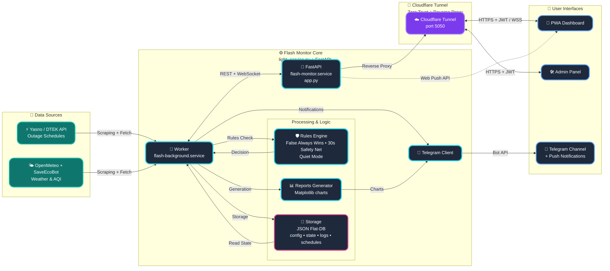

<p align="center">
  <a href="README_ENG.md">
    
  </a>
  <a href="README.md">
    
  </a>
</p>

<br>

<p align="center">
  
  
  
  
</p>

<p align="center">
  
</p>

# POWER⚡️ SAFETY (FLASH MONITOR KYIV) - Docker Edition [](https://github.com/weby-homelab/flash-monitor-kyiv/releases/latest)

**Flash Monitor Kyiv** is a professional autonomous monitoring system for critical infrastructure and environmental safety. The project provides real-time electricity monitoring, air raid alerts tracking, air quality (AQI), and radiation background levels.

This branch (`main`) contains the **Docker Edition** of the project, which is recommended for quick deployment and dependency isolation.

> **Project Status:** Stable v3.4.0 (Docker Optimized)
> **Architecture:** FastAPI + Background Workers + Docker Compose + JSON Flat-DB
> **Brand:** Weby Homelab

## 📜 Key Features
- **Containerized:** Full isolation via Docker.
- **Admin Panel:** Glassmorphism-style web interface.
- **Quiet Mode:** Intelligent notification suppression.
- **Safety Net:** Connection loss protection.
- **Analytics:** Automated graphical reports (Matplotlib).

---

## 🚀 Core Innovations (v3.2+)

### 🎛 Admin Control Panel
A fully autonomous **Glassmorphism** web interface to manage all aspects of the system without the need to edit configuration files via SSH.

<p align="center">
  
  
  
</p>

*   **Asynchronous Performance:** The new async caching mechanism (FastAPI) eliminates deadlocks and "freezes" during simultaneous data writes by background workers.
*   **Smart Backups:** Create manual and automatic restore points for your configuration. Instant one-click recovery with automatic service restart.
*   **Flexible Source Management:** Change priority between Yasno, GitHub, or connect your own Custom JSON URL. Manual force-sync button for schedules.
*   **Complete Geo-Adaptation:** Set coordinates (Lat/Lon) for accurate weather, SaveEcoBot station ID, and toggle widget visibility.
*   **Security (Zero-Trust):** Fixed LFI (Path Traversal) vulnerabilities with strict path validation.

---

## 📱 Real-world Telegram Notification Examples

*   📊 **[Daily "Plan vs Fact" Chart (Smart Daily Report)](https://t.me/svitlobot_Symyrenka22B/1230)**
*   📈 **[Weekly Outage Analytics](https://t.me/svitlobot_Symyrenka22B/1192)**
*   🔴 **[Outage notification with schedule precision](https://t.me/svitlobot_Symyrenka22B/1209)**

---

## 📊 Dashboard Capabilities (PWA)

A modern **Glassmorphism** interface optimized for mobile devices:
*   **Live Status:** Visualizing the system "Pulse" (Power is ON! / Power is OUT!).
*   **Environmental Monitoring:** Temperature, humidity, PM2.5/PM10, and radiation.

---

## 🏗️ System Architecture



---

## 📥 Quick Start (Docker)

1. **Download docker-compose.yml:**
```bash
curl -O https://raw.githubusercontent.com/weby-homelab/flash-monitor-kyiv/main/docker-compose.yml
```

2. **Start the system:**
```bash
docker-compose up -d
```

3. **Configuration:**
Open the web interface (port 5050 by default) and complete the initial setup via the Admin Panel.

📖 **Complete Documentation:**
* [Docker Installation Guide](docs/INSTRUCTIONS_INSTALL_ENG.md)
* [Telegram Bot Setup](docs/INSTRUCTIONS_ENG.md)

---
**✦ 2026 Weby Homelab ✦**
