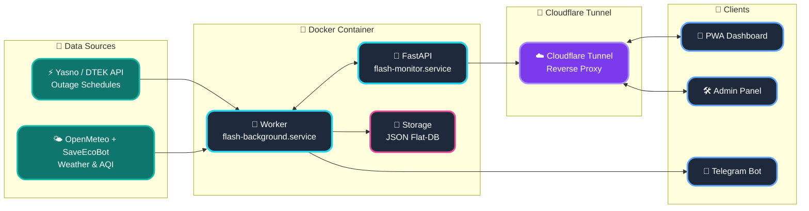

<p align="center">
  <a href="README_ENG.md">
    
  </a>
  <a href="README.md">
    
  </a>
</p>

<br>

<p align="center">
  
  
  
  
</p>

<p align="center">
  
</p>

# POWER⚡️ SAFETY (FLASH MONITOR KYIV) - Docker Edition [](https://github.com/weby-homelab/flash-monitor-kyiv/releases/latest)

**Flash Monitor Kyiv** is a professional autonomous monitoring system for critical infrastructure and environmental safety. The project provides precision real-time electricity monitoring, intelligent outage schedule processing (DTEK/Yasno), air raid alert tracking, air quality (AQI), and radiation background levels.

This branch (`main`) contains the **Docker Edition** of the project — a fully containerized version optimized for rapid, one-step deployment in any environment.

> **Project Status:** Stable v3.4.0 (Docker Optimized)
> **Architecture:** Asynchronous FastAPI + Docker Compose + JSON Flat-DB
> **Brand:** Weby Homelab

---

## 🛠 Technology Stack (Docker Edition)
- **Runtime:** Python 3.12 (slim-bookworm) inside a container.
- **Web-Core:** FastAPI with WebSocket and SSE support.
- **Containerization:** Docker Compose with automatic volume mounting for state preservation (`data/`).
- **CI/CD:** Multi-arch builds (`amd64`/`arm64`) supporting Raspberry Pi and Cloud servers.

---

## 🚀 Core Innovations & Algorithms

...
  
  
  
</p>

*   **Asynchronous Performance:** A new async caching mechanism eliminates deadlocks between the background worker and user requests.
*   **Smart Backups:** Instant one-click system recovery with automatic service restarts.
*   **Security (Zero-Trust):** Implements strict Path Traversal protection and secure path validation.

### 🤫 «Quiet Mode» (Information Calm)
A unique algorithm that minimizes "information noise." The system automatically enters a calm state if no outages occurred in the last 24 hours and no restrictions are planned for the upcoming day.

### ⚖️ «False Always Wins» Logic
A hybrid schedule processing system. If at least one source indicates an outage, the system prioritizes it. Historical records are never overwritten by "clean" plans.

---

## 🏗️ System Architecture



---

## 📥 Installation (Docker Edition)

### 1. Download Configuration
```bash
curl -O https://raw.githubusercontent.com/weby-homelab/flash-monitor-kyiv/main/docker-compose.yml
```

### 2. Start
```bash
docker-compose up -d
```

### 3. Configuration
Once running, open your browser at `http://localhost:5050`. The system will guide you through setting up `TELEGRAM_BOT_TOKEN` and `TELEGRAM_CHANNEL_ID` via the web UI (or you can pre-configure a `.env` file).

🔑 **Accessing the Admin Panel:**
```bash
docker exec -it flash-monitor-kyiv cat data/power_monitor_state.json | grep admin_token
```

---

💡 **Need maximum control?** Check out the [Bare-metal Edition (classic branch)](https://github.com/weby-homelab/flash-monitor-kyiv/tree/classic).

📖 **Documentation:**
* [Full Docker Guide](docs/INSTRUCTIONS_INSTALL_ENG.md)
* [Change History (CHANGELOG.md)](docs/CHANGELOG.md)

---
**✦ 2026 Weby Homelab ✦**
