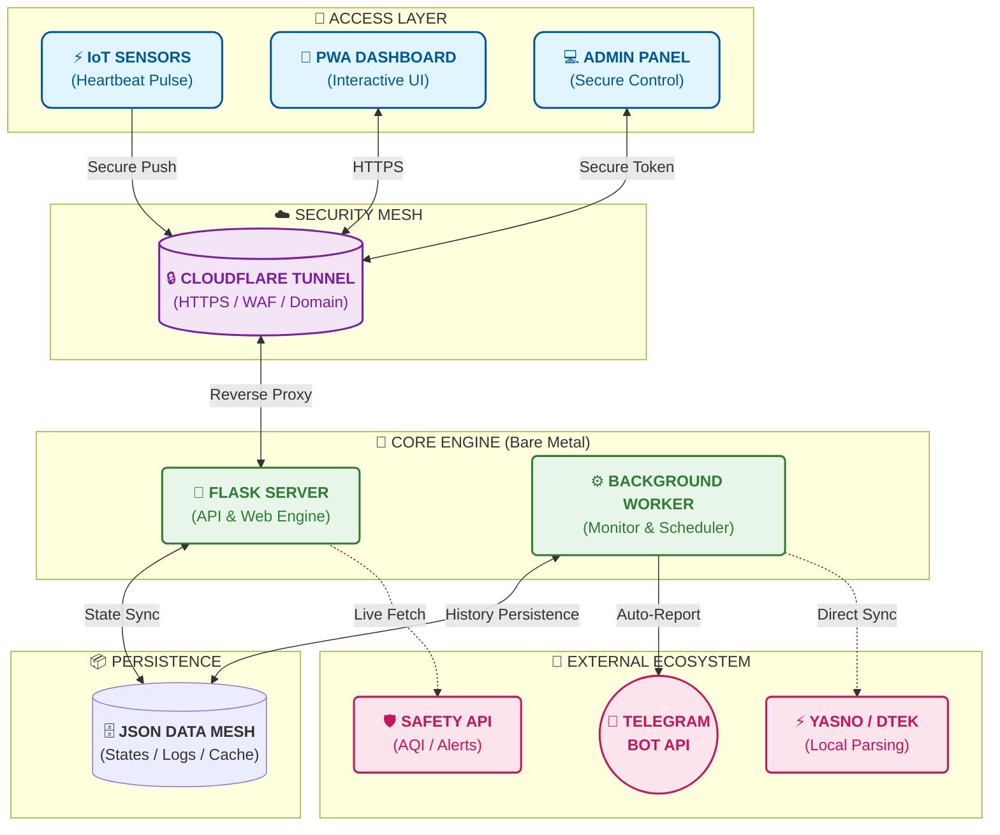

<p align="center">
  <a href="README_ENG.md">
    
  </a>
  <a href="README.md">
    
  </a>
</p>

<br>

# СВІТЛО⚡️ БЕЗПЕКА (Light & Safety) [](https://github.com/weby-homelab/flash-monitor-kyiv/releases/latest) DOCKER Edition

<p align="center">
  <a href="https://hub.docker.com/r/webyhomelab/flash-monitor-kyiv"></a>
  <a href="https://hub.docker.com/r/webyhomelab/flash-monitor-kyiv"></a>
  <a href="https://github.com/weby-homelab/flash-monitor-kyiv/commits/main"></a>
  <a href="https://github.com/weby-homelab/flash-monitor-kyiv/issues"></a>
  <a href="https://github.com/weby-homelab/flash-monitor-kyiv/blob/main/LICENSE"></a>
  
  
</p>

<p align="center">
  
</p>

<<<<<<< HEAD
**Autonomous Docker-based Power & Safety Monitoring System for Kyiv.**
=======
**Autonomous power & safety monitoring system for Kyiv.**
>>>>>>> classic

The project provides full control over the energy and security situation by analyzing real network data and official Yasno/DTEK schedules locally.

🔗 **Live monitoring:** [flash.srvrs.top](https://flash.srvrs.top/)

## 📚 Project Documentation
| File | Description |
| :--- | :--- |
| 📖 **[Installation and Setup](INSTRUCTIONS_INSTALL_ENG.md)** | Main guide for system deployment (Docker, variables, API). |
| 🔌 **[IoT Device Guides](INSTRUCTIONS_ENG.md)** | Sketches and instructions for ESP8266/ESP32 microcontrollers (physical light sensors). |
| 🛠️ **[Developer Guide](DEVELOPMENT_ENG.md)** | Architectural rules, security protocols, and code deployment instructions. |

---

## 🚀 Main Features

### 💡 Smart Power Monitoring
- **Smart Bootstrap:** Automatic deployment of current planned schedules for your group and region upon first launch.
- **Heartbeat Tracking & Manual Trigger:** Real-time light monitoring via IoT signals (`/api/push`) and instant manual status control (`/api/down`).
- **API Resilience:** Reliable local caching of schedules, protecting against DTEK/Yasno server failures.
- **"Plan vs Fact" Analytics:** Automatic comparison of real outages with planned schedules directly on the dashboard.
- **Schedule Accuracy:** Calculation of deviations (delay or early restoration) for each event.
- **Visualization:** Generation of daily and weekly charts in a signature style.
- **UI/UX Design:** "Black-and-White" theme with Glassmorphism effect and monospace fonts for clear reports.

### 🛡️ Safety & Ecology
- **Air Raid Alerts:** Instant status and Telegram notifications about the start and end of alerts in Kyiv.
- **Live Map:** Integrated map of alerts for Kyiv and the region.
- **Air Quality (AQI):** Monitoring of PM2.5, PM10, and radiation background (Location: Symyrenka).
- **Weather:** Current temperature, humidity, and wind parameters.

### 🔔 Telegram Notifications
- **Intelligent Reports:** Text charts with right-aligned duration (tabular-nums).
- **Morning Report (06:00):** Full overview of the situation for today and tomorrow (if available).
- **Evening/Instant Update:** Automatic dispatch of tomorrow's schedule immediately after its publication by DTEK.
- **Smart Merge:** Correct merging of overnight intervals.

### 💻 Admin Panel
- **Secret URL:** Upon each startup, the system generates a unique random path for administration. It can be found in the service logs (`journalctl -u flash-monitor`).
- **Status Management:** Ability to instantly change the power status (On / Off / Unknown) manually if the automation fails.
- **Event Editing:** Full access to event history for correcting recorded intervals.

### 🔇 Information Silence (Quiet Mode)
- **24/24 Logic:** The system automatically enters "Quiet Mode" if there were no actual outages in the last **24 hours**, and none are planned for the next **24 hours**. This avoids unnecessary noise in Telegram when the power situation is stable.
- **Confirmation Safety Net:** If light disappears during Quiet Mode, the system will not send a notification to the channel immediately but will wait for your confirmation via private messages (Inline buttons).
- **Auto-Exit:** Quiet Mode is automatically disabled as soon as any restriction appears in the schedule or a confirmed outage is recorded.

#### 📱 Real message examples
- 📊 **[Daily "Plan vs Fact" Chart (Smart Daily Report)](https://t.me/svitlobot_Symyrenka22B/1230)**
- 📈 **[Weekly outage analytics](https://t.me/svitlobot_Symyrenka22B/1192)**
- 🔴 **[Outage notification with schedule accuracy](https://t.me/svitlobot_Symyrenka22B/1209)**
- 🟢 **[Restoration notification with schedule accuracy](https://t.me/svitlobot_Symyrenka22B/1212)**
- ⚠️ **[Instant alert about DTEK schedule change](https://t.me/svitlobot_Symyrenka22B/1222)**
- 📈 **[Publication of DTEK and YASNO schedules](https://t.me/svitlobot_Symyrenka22B/1219)**
- 🚨 **[Air raid alert in Kyiv](https://t.me/svitlobot_Symyrenka22B/1196)**
- ✅ **[Air raid all-clear notification](https://t.me/svitlobot_Symyrenka22B/1197)**

---

## 🏗 System Architecture [](https://github.com/weby-homelab/flash-monitor-kyiv/releases/latest)



---

## 🐳 Quick Start via Docker

**Official image:** `webyhomelab/flash-monitor-kyiv:latest`

### Docker Compose
```yaml
services:
  web:
    image: webyhomelab/flash-monitor-kyiv:latest
    container_name: flash-monitor-web
    ports: ["5050:5050"]
    volumes: ["./data:/app/data"]
    environment:
      - TELEGRAM_BOT_TOKEN=your_token
      - TELEGRAM_CHANNEL_ID=your_channel_id
      - DATA_DIR=/app/data

  worker:
    image: webyhomelab/flash-monitor-kyiv:latest
    container_name: flash-monitor-worker
    command: python run_background.py
    volumes: ["./data:/app/data"]
    environment:
      - TELEGRAM_BOT_TOKEN=your_token
      - TELEGRAM_CHANNEL_ID=your_channel_id
      - DATA_DIR=/app/data
```

---

## 💡 Tip for IoT sensors (Heartbeat)

To send Push signals, it is recommended to use the **HTTPS address of your domain** (for example, via Cloudflare Tunnel) instead of a direct IP address:

*   **🛡️ Security:** HTTPS encrypts your secret key during transmission.
*   **🧩 Flexibility:** If you change the server, you don't need to reflash the sensors — just change the tunnel settings.

**Example:** `https://flash.srvrs.top/api/push/your_key`

---

## 🛠 Tech Stack
- **Backend:** Python 3.11, Flask, Gunicorn.
- **Analytics:** Matplotlib, BeautifulSoup4.
- **Infra:** Systemd, PWA (Progressive Web App).

---

## 📝 Update History
- **v2.4.0**: Implemented Safety Net (push signal loss detection) with interactive Telegram buttons (Down / Technical Failure / Ignore) and auto-fallback. Added dynamic push interval configuration (20-60s) via Admin Panel. Completely redesigned Web Admin Panel UI: mobile-first Glassmorphism, improved responsiveness, touch-friendly buttons, and scrollable tables.
- **v2.3.2**: Protective History Merge in parser_service.py (preventing False to True overwrites in historical schedules).
- **v2.3.0**: UI Fix & Consolidation. Restored functional schedule layout, fixed scrolling, moved all dynamic state/config files to `data/`.
- **v2.2.0**: Security Hardening Release. Token-based auth, input validation, DOM safety.
- **v2.1.2**: Smart Deduplication v2 (hashing only slots with outages).
- **v2.1.1**: Optimization of graphical and text reports: auto-deletion of yesterday's graphical reports at 00:01, fix for text report deduplication, and hiding tomorrow's schedules until the evening slot.
- **v2.0.1**: Optimization of "Quiet Mode" logic (switch to 24/24 formula). Fixed minor errors in dashboard texts.
- **v2.0.0**: Major update: added a web control panel (Admin Panel) and intelligent "Quiet Mode" with secure outage confirmation.
- **v1.17.5**: Added "Holiday Mode", smart status display on the dashboard, and new report finalization logic at 00:01.
- **v1.17.4**: Dynamic Emergency status source attribution (DTEK, YASNO, or both). Intelligent source filtering in the footer.
- **v1.17.3**: Smart schedule source selection (Smart Fallback) and Emergency status support.
- **v1.17.2**: Updated air raid alert format.

## 📜 License
Distributed under the **MIT** license.

<p align="center">
  ✦ 2026 Weby Homelab ✦<br>
  Made with ❤️ in Kyiv under air raid sirens and blackouts
</p>

---
