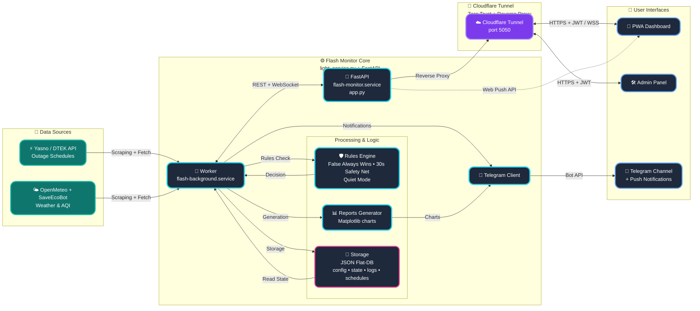

<p align="center">
  <a href="README_ENG.md">
    
  </a>
  <a href="README.md">
    
  </a>
</p>

<br>

<p align="center">
  
  
  
  
</p>

<p align="center">
  
</p>

# POWER⚡️ SAFETY (FLASH MONITOR KYIV) - Docker Edition [](https://github.com/weby-homelab/flash-monitor-kyiv/releases/latest)

**Flash Monitor Kyiv** is a professional autonomous monitoring system for critical infrastructure and environmental safety. The project provides precision real-time electricity monitoring, intelligent outage schedule processing (DTEK/Yasno), air raid alert tracking, air quality (AQI), and radiation levels.

This branch (`main`) contains the **Docker Edition** of the project — a fully containerized version optimized for rapid deployment and strict environment isolation.

> **Project Status:** Stable v3.4.0 (Docker Optimized)
> **Architecture:** Asynchronous FastAPI + Background Workers + Docker Compose + JSON Flat-DB
> **Brand:** Weby Homelab

---

## 🛠 Technology Stack (Docker Edition)
- **Runtime:** Python 3.12 (slim-bookworm) inside a container.
- **Web-Core:** FastAPI with native support for asynchronous WebSockets and Server-Sent Events (SSE).
- **Backend-Logic:** Modular architecture with clean separation between the API service and background monitoring workers (Light Service).
- **Data Persistence:** Docker Volumes ensure all state (`data/`), configurations, and event history are preserved during container updates or restarts.
- **CI/CD:** Multi-platform builds for `linux/amd64` and `linux/arm64` (Raspberry Pi, Apple Silicon, Cloud Servers).

---

## 🚀 Core Innovations & Algorithms

### 🎛 Admin Control Panel
A fully autonomous **Glassmorphism** web interface to manage all system aspects without the need for SSH or direct configuration file editing.
<p align="center">
  
  
  
</p>

*   **Asynchronous Performance:** A new async caching mechanism eliminates deadlocks and "freezes" during simultaneous data writes by background workers and user interactions.
*   **Smart Backups:** Create manual and automatic restoration points. Instant one-click recovery with automatic internal service restarts.
*   **Flexible Source Management:** Toggle priority between Yasno, GitHub, or connect your own Custom JSON URL. Includes a manual force-sync button for immediate Telegram report updates.
*   **Complete Geo-Adaptation:** Set precise Lat/Lon coordinates for accurate local weather, SaveEcoBot station ID, and selective widget visibility management.
*   **Security (Zero-Trust):** Implements strict Path Traversal protection and secure Access Key generation during initial bootstrap.

### 🤫 «Quiet Mode» (Information Calm)
A unique algorithm that minimizes "information noise" during stable grid periods. The system automatically enters a calm state if no outages occurred in the last 24 hours and no restrictions are planned for the upcoming day. This keeps your channel clean from redundant daily reports when everything is normal.

### 🚨 Safety Net
An interactive rapid response mechanism for monitoring device connection loss. If the incoming Push signal is delayed by more than 35 seconds, the administrator receives a Telegram request with interactive action buttons (`🔴 Power is out`, `🛠 Technical glitch`, `🤷‍♂️ I don't know`). This prevents false alarms from being published to the public channel.

### ⚖️ «False Always Wins» Logic
A hybrid schedule processing system. If at least one source (Yasno or GitHub mirror) indicates a probable outage, the system prioritizes it. Historical outage records are never overwritten by new "clean" plans, ensuring 100% data integrity and honest event history.

---

## 📱 Real-world Telegram Notification Examples

*   📊 **[Smart Daily Report (Plan vs Fact)](https://t.me/svitlobot_Symyrenka22B/1230)** — visualizes grid reality against planned schedules.
*   📈 **[Weekly Outage Analytics](https://t.me/svitlobot_Symyrenka22B/1192)** — automated data aggregation of outage duration and frequency.
*   🔴 **[Power Outage Alerts](https://t.me/svitlobot_Symyrenka22B/1209)** — instant notifications with schedule-aligned precision.
*   🟢 **[Power Restoration Alerts](https://t.me/svitlobot_Symyrenka22B/1212)** — confirmation of voltage stabilization.
*   ⚠️ **[Schedule Change Alerts](https://t.me/svitlobot_Symyrenka22B/1222)** — instant alerts when DTEK/Yasno databases are updated.
*   🚨 **[Air Raid Alerts](https://t.me/svitlobot_Symyrenka22B/1196)** — integration with official civil defense sources.

---

## 📊 Dashboard Capabilities (PWA)

A modern **Glassmorphism** interface optimized for mobile devices:
*   **Live Status:** Real-time system "Pulse" visualization (Power ON / Power OUT).
*   **Environmental Monitoring:** Temperature, humidity, PM2.5/PM10 (OpenMeteo/SaveEcoBot), and radiation levels with interactive charts.
*   **Schedule Bar:** A compact 24-hour visual scale of planned outages for efficient day planning.

---

## 🏗️ System Architecture



---

## 📥 Quick Start (Docker)

1. **Download configuration:**
```bash
curl -O https://raw.githubusercontent.com/weby-homelab/flash-monitor-kyiv/main/docker-compose.yml
```

2. **Start containers:**
```bash
docker-compose up -d
```

3. **Verification:**
The system will be available at `http://localhost:5050`. The initial admin password is automatically generated in the logs during the first startup.

📖 **Complete Documentation:**
* [Detailed Docker Guide](docs/INSTRUCTIONS_INSTALL_ENG.md)
* [Change History (CHANGELOG.md)](docs/CHANGELOG.md)

---
**✦ 2026 Weby Homelab ✦**
