<p align="center">
  <a href="README_ENG.md">
    
  </a>
  <a href="README.md">
    
  </a>
</p>

<br>

<p align="center">
  
  
  
  
</p>

<p align="center">
  
</p>

# POWER⚡️ SAFETY (FLASH MONITOR KYIV) - Bare-metal Edition [](https://github.com/weby-homelab/flash-monitor-kyiv/releases/latest)

**Flash Monitor Kyiv** is a professional autonomous monitoring system for critical infrastructure and environmental safety. The project provides real-time electricity monitoring, air raid alerts tracking, air quality (AQI), and radiation background levels.

This branch (`classic`) contains the **Bare-metal Edition** of the project, designed for direct installation on a server (Ubuntu/Debian) using `systemd`.

> **Project Status:** Stable v3.4.0 (Bare-metal Optimized)
> **Architecture:** Python FastAPI + systemd services + venv + JSON Flat-DB
> **Brand:** Weby Homelab

## 📜 Key Features
- **High Performance:** Direct access to OS resources.
- **Admin Panel:** Glassmorphism-style web interface.
- **Quiet Mode:** Intelligent notification suppression.
- **Safety Net:** Connection loss protection.
- **Analytics:** Automated graphical reports (Matplotlib).

---

## 🚀 Core Innovations (v3.2+)

### 🎛 Admin Control Panel
A fully autonomous **Glassmorphism** web interface to manage all aspects of the system without the need to edit configuration files via SSH.

<p align="center">
  
  
  
</p>

*   **Asynchronous Performance:** The new async caching mechanism (FastAPI) eliminates deadlocks and "freezes" during simultaneous data writes by background workers.
*   **Smart Backups:** Create manual and automatic restore points for your configuration. Instant one-click recovery with automatic service restart.
*   **Flexible Source Management:** Change priority between Yasno, GitHub, or connect your own Custom JSON URL. Manual force-sync button for schedules.
*   **Complete Geo-Adaptation:** Set coordinates (Lat/Lon) for accurate weather, SaveEcoBot station ID, and toggle widget visibility.
*   **Security (Zero-Trust):** Fixed LFI (Path Traversal) vulnerabilities with strict path validation.

---

## 🏗️ System Architecture (Bare-metal Pipeline)

```mermaid
flowchart LR
    classDef external fill:#0f766e,stroke:#14b8a6,stroke-width:3px,color:#fff,rx:16px,ry:16px
    classDef core fill:#1e293b,stroke:#22d3ee,stroke-width:3.5px,color:#fff,rx:14px,ry:14px
    classDef gateway fill:#7c3aed,stroke:#a78bfa,stroke-width:3px,color:#fff,rx:16px,ry:16px
    classDef client fill:#1e293b,stroke:#60a5fa,stroke-width:3px,color:#fff,rx:16px,ry:16px
    classDef db fill:#1e293b,stroke:#ec4899,stroke-width:3px,color:#fff,rx:12px,ry:12px

    subgraph External ["🔌 Data Sources"]
        direction TB
        Energy["⚡ Yasno / DTEK API"]:::external
        Meteo["🌤️ OpenMeteo + SaveEcoBot"]:::external
    end

    subgraph Host ["💻 Linux Host OS (systemd)"]
        direction TB
        Worker["🔄 flash-background.service"]:::core
        API["🔌 flash-monitor.service"]:::core
        Storage["💾 Local Storage: /data"]:::db
    end

    subgraph Gateway ["🔐 Cloudflare Tunnel"]
        CF["☁️ cloudflared service"]:::gateway
    end

    subgraph Clients ["👥 User Interfaces"]
        direction TB
        PWA["📱 PWA Dashboard"]:::client
        Admin["🛠️ Admin Panel"]:::client
        Telegram["📨 Telegram Bot"]:::client
    end

    External --> Host
    Host <--> Gateway
    Gateway <--> Clients
```



---

## 📥 Installation (Bare-metal)

1. **Clone the repository and switch to classic branch:**
```bash
git clone https://github.com/weby-homelab/flash-monitor-kyiv.git
cd flash-monitor-kyiv
git checkout classic
```

2. **Create virtual environment and install dependencies:**
```bash
python3 -m venv venv
source venv/bin/activate
pip install -r requirements.txt
```

3. **Setup systemd services:**
The project comes with ready-to-use `.service` files. Use the guide below to activate them.

📖 **Documentation:**
* [Step-by-Step Linux Installation Guide](docs/INSTRUCTIONS_INSTALL_ENG.md)
* [Detailed Configuration Guide](docs/INSTRUCTIONS_ENG.md)
* [Development Rules (v3.2+)](docs/DEVELOPMENT_ENG.md)

---
**✦ 2026 Weby Homelab ✦**
