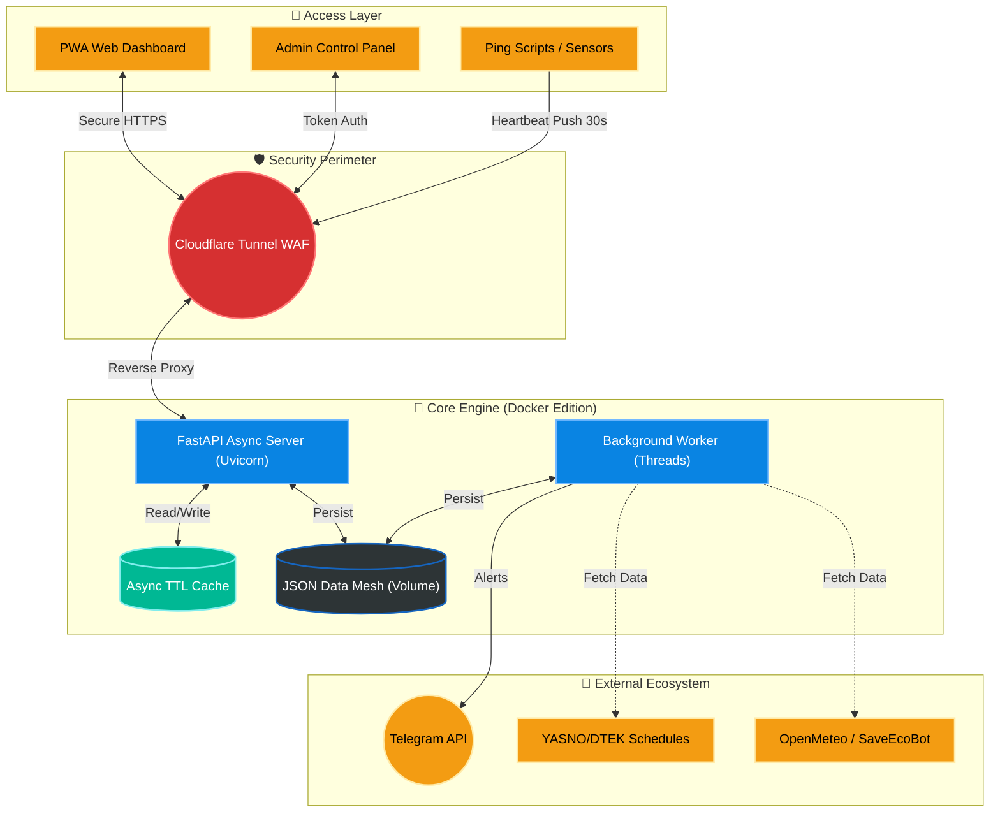

<p align="center">
  <a href="README_ENG.md">
    
  </a>
  <a href="README.md">
    
  </a>
</p>

<br>

<p align="center">
  
  
</p>

<p align="center">
  
</p>

# СВІТЛО⚡️ БЕЗПЕКА (FLASH MONITOR KYIV) - Docker Edition [](https://github.com/weby-homelab/flash-monitor-kyiv/releases/latest)

**Flash Monitor Kyiv** is a professional, autonomous monitoring system for critical infrastructure and environmental safety. The project provides real-time power monitoring, air raid alerts tracking, air quality index (AQI), and radiation background levels.

This branch (`main`) contains the **Docker Edition** of the project, designed for fast, portable, and isolated deployment in any environment. If you need a bare-metal installation directly on the host system via `systemd`, use the `classic` branch.

> **Project Status:** Stable v3.2.4 (Reliability & Resilience Update)
> **Architecture:** Python FastAPI + Background Workers + JSON Flat-DB + Docker / Docker Compose
> **Brand:** Weby Homelab

---

## 🛡 Update v3.2.4
*   **Auto-Confirmation (Safety Net):** Automatically confirms power outages after 5 minutes if the administrator does not respond to the Safety Net prompt. This prevents the system from being locked in a "pending confirmation" state during Quiet Mode.
*   **Resilient Updates:** If a Telegram message is manually deleted, the bot now automatically sends a new message instead of failing to edit the non-existent one.
*   **Quiet Mode Cleanup:** Entering "Information Peace" (Quiet Mode) now automatically triggers a cleanup of active reports from the Telegram channel. Conversely, receiving a new schedule with planned outages instantly wakes the system into Active Mode.
*   **UI Consistency:** The `Github` data source is now consistently displayed as `ДТЕК` in Telegram reports for better user clarity.

## 🚀 Core Innovations (v3.2+)

### 🎛 Admin Control Panel
A fully autonomous Glassmorphism web interface to manage all aspects of the system without the need to edit configuration files via SSH.

<p align="center">
  
  
  
</p>

*   **Asynchronous Performance:** The new async caching mechanism (FastAPI) completely eliminates deadlocks when multiple background workers write data simultaneously.
*   **Smart Backups:** Create manual and automatic restore points for your configuration. Instant one-click recovery with automatic service restart.
*   **Flexible Source Management:** Change priority between Yasno, GitHub, or connect your own Custom JSON URL. Includes a manual force-sync button.
*   **Complete Geo-Adaptation:** Set coordinates (Lat/Lon) for accurate weather, SaveEcoBot station ID, and toggle widget visibility.
*   **Security (Zero-Trust):** Fixed LFI (Path Traversal) vulnerabilities by implementing strict path validation. Access keys are safely generated during bootstrap.

### 🤫 "Quiet Mode" (Information Peace)
A unique algorithm that minimizes "information noise." The system automatically enters a quiet state if there have been no outages in the past 24 hours, and there are no planned outages in the schedule for the next 24 hours.

### 🚨 Safety Net
An interactive rapid response mechanism: if the heart-beat signal (Push) is delayed for more than 35 seconds, the administrator receives a Telegram prompt with action buttons (`🔴 Power Down`, `🛠 Technical Failure`, `🤷‍♂️ Don't Know`).

### ⚖️ "False Always Wins" Logic
A hybrid schedule processing system. If at least one source indicates an outage (`False`), the system displays it as the priority state. Old outage records are never overwritten by new "all-clear" plans.

---

## 📱 Real Telegram Message Examples

*   📊 **[Daily "Plan vs Fact" Report (Smart Daily Report)](https://t.me/svitlobot_Symyrenka22B/1230)**
*   📈 **[Weekly Analytics Summary](https://t.me/svitlobot_Symyrenka22B/1192)**
*   🔴 **[Power Outage Alert with Schedule Accuracy](https://t.me/svitlobot_Symyrenka22B/1209)**
*   🟢 **[Power Restoration Alert with Schedule Accuracy](https://t.me/svitlobot_Symyrenka22B/1212)**
*   ⚠️ **[Instant Alert on DTEK Schedule Change](https://t.me/svitlobot_Symyrenka22B/1222)**
*   🚨 **[Air Raid Alert Notification in Kyiv](https://t.me/svitlobot_Symyrenka22B/1196)**

---

## 📊 Dashboard Features (PWA)

Modern **Glassmorphism** interface, fully mobile-optimized:
*   **Live Status:** Real-time "Pulse" visualization (Power ON! / Power OFF!).
*   **Environmental Monitoring:** Temperature, Humidity, PM2.5/PM10 (via OpenMeteo/SaveEcoBot), and Radiation with interactive 24-hour history graphs.
*   **Schedule Bar:** A compact 24-hour visualization of planned outages.

---

## 🏗 System Architecture



---

## 🛠 Tech Stack (Docker Edition)
- **Backend:** Python 3.12, **FastAPI**, Uvicorn (Async Stack).
- **Analytics:** Matplotlib, BeautifulSoup4.
- **Infra:** Docker & Docker Compose.

### 💡 Why FastAPI and Asynchronous Logic? (Main Branch Evolution)
The project's architecture is built on a **JSON Data Mesh** (using flat files instead of an SQL database for maximum portability). In Docker environments, simultaneous access to these files by the Web Server and the Background Worker caused severe I/O bottlenecks and Deadlocks.
To resolve this, the `main` branch was completely rewritten from Flask to **FastAPI**:
1. We implemented `asyncio.to_thread` — file writing no longer blocks the Event Loop, ensuring instant API responses even under heavy load.
2. Data is now cached in an **Async TTL Cache** (RAM), minimizing disk I/O operations inside the container.
3. Strict data validation via **Pydantic Models** was added to prevent JSON corruption during sudden server power losses.
*(For Bare-Metal deployments, where OS-level locking via Systemd + Gunicorn is preferred, we maintain the synchronous `classic` branch).*

---

## 📥 Installation & Setup

The project has two main branches:

1.  **`main` (Docker Edition):** Recommended for a quick start.
    ```bash
    # 1. Download docker-compose.yml
    curl -O https://raw.githubusercontent.com/weby-homelab/flash-monitor-kyiv/main/docker-compose.yml

    # 2. Run the system (images are pulled automatically from Docker Hub)
    docker-compose up -d
    ```
2.  **`classic` (Bare-Metal Edition):** For running directly on the host system via `systemd`.

📖 **Complete Documentation:**
*   [Installation Guide (Step-by-Step)](INSTRUCTIONS_INSTALL_ENG.md)
*   [Detailed Configuration Setup](INSTRUCTIONS_ENG.md)
*   [Development Rules & Guidelines](DEVELOPMENT_ENG.md)

### Quick Start (Smart Bootstrap):
The system automatically initializes on the first run:
1.  Generates a unique `SECRET_KEY` and `ADMIN_TOKEN`.
2.  Creates the directory structure in `/app/data` (mounted in Docker Volume) with default v3 settings.
3.  Downloads up-to-date schedules for your power group.

---

## 📜 License
Distributed under the **MIT** license.

© 2026 Weby Homelab.
