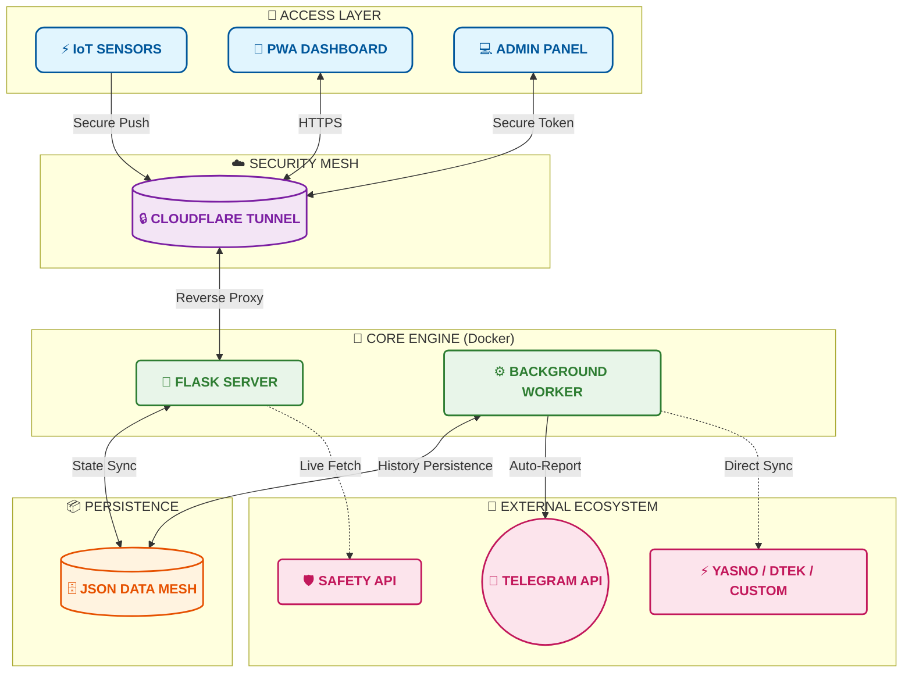

  
  

 

  
  

  

# СВІТЛО⚡️ БЕЗПЕКА (FLASH MONITOR KYIV) 

**Flash Monitor Kyiv** is a professional, autonomous monitoring system for critical infrastructure and environmental safety. The project provides real-time power monitoring, air raid alerts tracking, air quality index (AQI), and radiation background levels.

> **Project Status:** Stable v3.0.3 (Total Control & Safety Edition)
> **Architecture:** Python Flask + Background Workers + JSON Flat-DB
> **Brand:** Weby Homelab

---

## 🚀 Core Innovations (v3.0+)

### 🎛 Admin Control Panel
A fully autonomous Glassmorphism web interface to manage all aspects of the system without the need to edit configuration files via SSH.

  
  
  

*   **Smart Backups:** Create manual and automatic restore points for your configuration. Instant one-click recovery with automatic service restart.
*   **Flexible Source Management:** Change priority between Yasno, GitHub, or connect your own Custom JSON URL. Includes a manual force-sync button.
*   **Complete Geo-Adaptation:** Set coordinates (Lat/Lon) for accurate weather, SaveEcoBot station ID, and toggle widget visibility on the main dashboard for any region.
*   **Template Editor:** Full control over Telegram notification texts, prefixes, and status icons directly in the UI.
*   **Security:** Instant regeneration of API keys and administrator tokens with secure redirection.

### 🤫 "Quiet Mode" (Information Peace)
A unique algorithm that minimizes "information noise." The system automatically enters a quiet state if there have been no outages in the past 24 hours, and there are no planned outages in the schedule for the next 24 hours.

### 🚨 Safety Net
An interactive rapid response mechanism: if the heart-beat signal (Push) is delayed for more than 35 seconds, the administrator receives a Telegram prompt with action buttons (`🔴 Power Down`, `🛠 Technical Failure`, `🤷‍♂️ Don't Know`).

### ⚖️ "False Always Wins" Logic
A hybrid schedule processing system. If at least one source indicates an outage (`False`), the system displays it as the priority state. Old outage records are never overwritten by new "all-clear" plans.

---

## 📱 Real Telegram Message Examples

*   📊 **[Daily "Plan vs Fact" Report (Smart Daily Report)](https://t.me/svitlobot_Symyrenka22B/1230)**
*   📈 **[Weekly Analytics Summary](https://t.me/svitlobot_Symyrenka22B/1192)**
*   🔴 **[Power Outage Alert with Schedule Accuracy](https://t.me/svitlobot_Symyrenka22B/1209)**
*   🟢 **[Power Restoration Alert with Schedule Accuracy](https://t.me/svitlobot_Symyrenka22B/1212)**
*   ⚠️ **[Instant Alert on DTEK Schedule Change](https://t.me/svitlobot_Symyrenka22B/1222)**
*   📋 **[DTEK and YASNO Schedules Publication](https://t.me/svitlobot_Symyrenka22B/1219)**
*   🚨 **[Air Raid Alert Notification in Kyiv](https://t.me/svitlobot_Symyrenka22B/1196)**
*   ✅ **[Air Raid All-Clear Notification](https://t.me/svitlobot_Symyrenka22B/1197)**

---

## 📊 Dashboard Features (PWA)

Modern **Glassmorphism** interface, fully mobile-optimized:
*   **Live Status:** Real-time "Pulse" visualization (Power ON! / Power OFF!).
*   **Environmental Monitoring:** Temperature, Humidity, PM2.5/PM10 (via OpenMeteo/SaveEcoBot), and Radiation with interactive 24-hour history graphs.
*   **Schedule Bar:** A compact 24-hour visualization of planned outages.
*   **Analytics:** Automatic generation of daily and weekly graphical reports sent directly to Telegram and the web dashboard.

---

## 🏗 System Architecture

---

## 🛠 Tech Stack
- **Backend:** Python 3.12, Flask, Gunicorn.
- **Analytics:** Matplotlib, BeautifulSoup4.
- **Infra:** Docker & Docker Compose, Cloudflare Tunnel.

---

## 📜 License
Distributed under the **MIT** license.

© 2026 Weby Homelab.